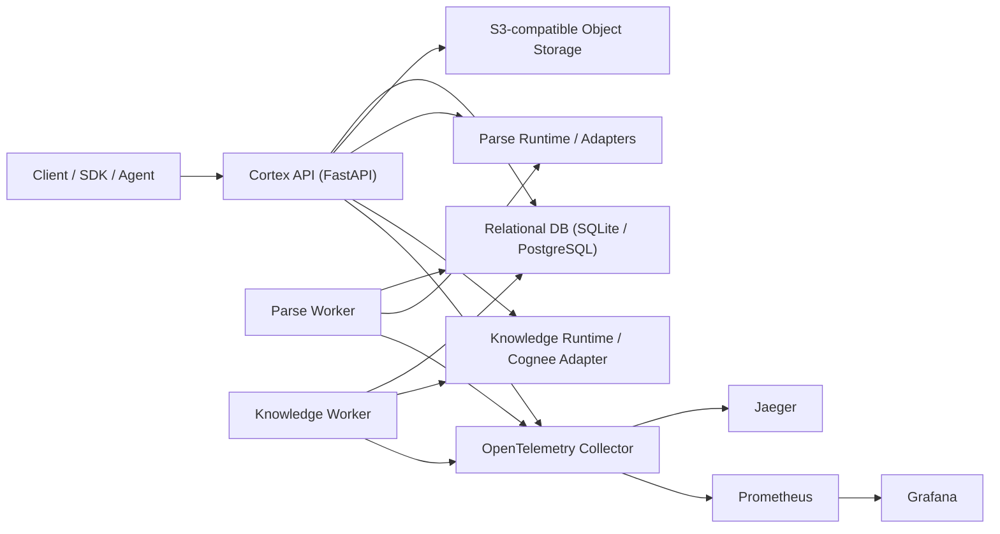

# Cortex

面向内容解析、对象存储与知识流水线的一套厂商中立 RESTful API 平台。

Cortex 基于 Python 3.12、`uv workspace`、FastAPI、标准 SQL、S3 兼容对象存储与 OpenTelemetry 构建，目标是把以下三类能力收敛到同一套控制面中：

- Parse API：把网页 URL、对象文件或外部 URI 解析为 LLM-ready Markdown、标准化元数据和可选产物
- Storage API：把任意文件上传到 S3 兼容对象存储，并在关系型数据库中维护对象元数据、版本与审计信息
- Knowledge API：围绕 Cognee 风格的 Add / Cognify / Memify / Search 形成可扩展知识流水线

当前仓库已经包含：

- OpenAPI 3.1 合同：[specs/cortex-api.yaml](specs/cortex-api.yaml)
- 数据流设计：[specs/cortex-dfd.md](specs/cortex-dfd.md)
- 技术设计：[specs/cortex-tech.md](specs/cortex-tech.md)
- 数据库初始化与迁移基线：[specs/cortex-init.sql](specs/cortex-init.sql)
- 任务台账与问题日志：[specs/cortex-tasks.md](specs/cortex-tasks.md)、[specs/cortex-log.md](specs/cortex-log.md)

## 1. 核心特性

### 1.1 Parse API

- 支持同步解析与异步解析作业
- 解析结果统一收敛为 Markdown、结构化元数据、诊断信息和 provenance
- 通过可插拔 adapter 适配多种解析引擎：
  - Crawl4AI
  - Jina Reader
  - LlamaParse（云 API 模式）
  - MarkItDown
  - Docling
- 对外采用极简 `source + engine_id (+ scene)` 契约，内部通过请求编译器自动绑定 scene preset、parser profile、回退策略和引擎默认配置

### 1.2 Storage API

- 基于 S3 兼容接口提供单段上传、多段上传和下载 URL 签发
- 元数据落标准 SQL，可运行于 SQLite、PostgreSQL 等关系型数据库
- 对象元数据、版本、标签、访问策略、校验和和审计字段统一管理
- 上传、下载、元数据读取均具备功能权限和数据权限校验

### 1.3 Knowledge API

- 支持数据集创建与读取
- 支持 Add / Cognify / Memify / Search 四类操作
- 长任务通过作业表和 Worker 执行，保持 REST 契约稳定
- Search 返回 answer、context items、graph paths、citation 与请求审计
- Knowledge runtime 通过统一抽象屏蔽底层 Cognee / 图库 / 向量库细节

### 1.4 权限治理

- 认证兼容 OAuth 2.0 / OIDC
- 支持 `dev`、`jwt`、`introspection`、`hybrid` 四种认证模式
- 功能权限通过 scope 表达
- 数据权限通过租户边界、`access_level`、角色绑定和资源策略综合裁决
- 授权决策持久化审计，支持 `decision_id`、`request_id`、`trace_id` 关联

### 1.5 可观测性

- 所有 API 对齐 OpenTelemetry 标准
- 支持 `traceparent`、`tracestate`、`baggage`
- API 暴露 Prometheus 兼容的 `/metrics`
- 可直接接入 Jaeger、Prometheus、Grafana
- 已补齐 live probe，可验证 `OTLP -> Collector -> Jaeger / Prometheus` 全链路

## 2. 已实现 API

### 2.1 健康检查与可观测性

| 方法 | 路径 | 说明 |
| --- | --- | --- |
| `GET` | `/v1/health/live` | 存活检查 |
| `GET` | `/v1/health/ready` | 就绪检查 |
| `GET` | `/metrics` | Prometheus 指标 |

### 2.2 Jobs

| 方法 | 路径 | 说明 |
| --- | --- | --- |
| `GET` | `/v1/jobs/{jobId}` | 查询作业状态 |
| `GET` | `/v1/jobs/{jobId}/events` | 查询作业事件轨迹 |
| `POST` | `/v1/jobs/{jobId}/cancel` | 取消作业 |

### 2.3 Parse

| 方法 | 路径 | 说明 |
| --- | --- | --- |
| `GET` | `/v1/parse/engines` | 查询解析引擎目录 |
| `GET` | `/v1/parse/profiles` | 查询 parser profile |
| `POST` | `/v1/parse/sync` | 同步解析 |
| `POST` | `/v1/parse/jobs` | 提交异步解析作业 |
| `GET` | `/v1/parse/jobs/{jobId}/result` | 轮询解析结果 |

### 2.4 Storage

| 方法 | 路径 | 说明 |
| --- | --- | --- |
| `POST` | `/v1/storage/uploads` | 创建上传会话 |
| `POST` | `/v1/storage/uploads/{uploadId}/complete` | 完成上传 |
| `GET` | `/v1/storage/objects/{objectId}` | 读取对象元数据 |
| `GET` | `/v1/storage/objects/{objectId}/download-url` | 生成下载 URL |

### 2.5 Knowledge

| 方法 | 路径 | 说明 |
| --- | --- | --- |
| `POST` | `/v1/knowledge/datasets` | 创建数据集 |
| `GET` | `/v1/knowledge/datasets/{datasetId}` | 查询数据集 |
| `POST` | `/v1/knowledge/add/jobs` | 提交 Add 作业 |
| `POST` | `/v1/knowledge/cognify/jobs` | 提交 Cognify 作业 |
| `POST` | `/v1/knowledge/memify/jobs` | 提交 Memify 作业 |
| `POST` | `/v1/knowledge/search` | 执行知识检索 |

静态合同在 [specs/cortex-api.yaml](specs/cortex-api.yaml)，运行态文档在：

- `http://127.0.0.1:8080/docs`
- `http://127.0.0.1:8080/redoc`
- `http://127.0.0.1:8080/openapi.json`

## 3. 架构总览



## 4. 仓库结构

| 路径 | 说明 |
| --- | --- |
| `apps/api` | FastAPI 控制面应用 |
| `workers/parse-worker` | Parse Worker |
| `workers/knowledge-worker` | Knowledge Worker |
| `packages/common` | settings、异常、ID、runtime config 等共享基础设施 |
| `packages/contracts` | Pydantic DTO / OpenAPI 对应模型 |
| `packages/domain` | 领域模型 |
| `packages/db` | SQLAlchemy、Alembic、repository、unit-of-work |
| `packages/auth` | 认证、scope、RBAC/ABAC、审计 |
| `packages/storage` | S3 兼容存储 facade 与服务 |
| `packages/parse` | 解析抽象、profile、adapter、parse 服务 |
| `packages/knowledge` | 数据集、Cognee runtime 抽象、搜索与作业服务 |
| `packages/observability` | OTel bootstrap、trace、metrics、日志关联 |
| `configs` | 统一运行时配置及 local/staging/prod overlay |
| `scripts/dev` | 本地启动、栈管理、探针、PowerShell 辅助脚本 |
| `scripts/ci` | 跨平台校验入口 |
| `tests` | contract / unit / integration 测试 |
| `specs` | API、架构、schema、任务、问题日志等设计文档 |

## 5. 运行环境要求

建议环境：

- Python `3.12`
- [uv](https://docs.astral.sh/uv/)（依赖管理与 workspace 安装）
- PowerShell 7（Windows 下建议）
- Docker / Docker Compose（需要完整本地依赖栈时）

可选依赖：

- MinIO 或任意 S3 兼容对象存储
- PostgreSQL
- OpenTelemetry Collector
- Jaeger
- Prometheus
- Grafana
- 各解析/知识引擎对应的 provider 凭据

## 6. 配置模型

### 6.1 `.env`

根目录 `.env` 负责非结构化运行参数和密钥注入，模板见 [.env.example](.env.example)。

最重要的环境变量如下：

| 变量 | 说明 |
| --- | --- |
| `CORTEX_DB_DSN` | 主业务数据库 DSN，支持 SQLite / PostgreSQL |
| `CORTEX_S3_ENDPOINT` | S3 兼容存储端点 |
| `CORTEX_S3_BUCKET` | 默认 bucket |
| `CORTEX_AUTH_MODE` | `dev` / `jwt` / `introspection` / `hybrid` |
| `CORTEX_AUTH_JWT_SHARED_SECRET` | `jwt` / `hybrid` 模式下验证与签发 JWT 的共享密钥 |
| `CORTEX_AUTH_INTROSPECTION_URL` | `introspection` / `hybrid` 模式下的外部 token introspection 地址 |
| `CORTEX_AUTH_INTROSPECTION_CLIENT_ID` / `CORTEX_AUTH_INTROSPECTION_CLIENT_SECRET` | 调用 introspection 端点所需的客户端凭据 |
| `CORTEX_AUTH_TOKEN_ISSUER_ENABLED` | 是否启用 Cortex 内建 bootstrap token issuer |
| `CORTEX_AUTH_TOKEN_ISSUER_BOOTSTRAP_SECRET` | 调用 `/v1/auth/token` 时必须提供的 bootstrap secret |
| `CORTEX_RUNTIME_CONFIG_PATH` | 指向统一 runtime config 文件 |
| `CORTEX_OTEL_ENABLED` | 是否开启 OTel |
| `CORTEX_OTEL_EXPORTER_OTLP_ENDPOINT` | OTLP HTTP 导出地址 |
| `JINA_API_KEY` | Jina Reader API Key |
| `LLAMA_CLOUD_API_KEY` | LlamaParse 云 API Key |
| `OPENAI_API_KEY` | Cognee LLM / Embedding 所需 |
| `COGNEE_*` | Cognee 外部图库/向量库/关系库配置 |

### 6.2 统一 runtime config

运行时的结构化配置收敛在 `configs/` 目录：

| 文件 | 用途 |
| --- | --- |
| `configs/cortex.runtime.yaml` | 基线默认值 |
| `configs/cortex.runtime.local.yaml` | 本地开发 / 本地集成验证 |
| `configs/cortex.runtime.staging.yaml` | 预发环境 |
| `configs/cortex.runtime.prod.yaml` | 生产环境 |

切换方式：

```bash
export CORTEX_RUNTIME_CONFIG_PATH=configs/cortex.runtime.prod.yaml
```

或在 PowerShell 中：

```powershell
$env:CORTEX_RUNTIME_CONFIG_PATH = "configs/cortex.runtime.prod.yaml"
```

### 6.3 runtime config 中的引用规则

统一 runtime config 支持以下引用方式：

- `env:NAME`：从环境变量读取
- `file:relative/or/absolute/path`：读取文件内容
- `path:relative/or/absolute/path`：解析成绝对路径
- `literal:value`：直接使用字面量

例如：

```yaml
parse:
  engines:
    jina_reader:
      api_key_ref: env:JINA_API_KEY
knowledge:
  cognee:
    vector_db:
      vector_db_url_ref: env:COGNEE_VECTOR_DB_URL
```

### 6.4 Parse 引擎与 Knowledge Provider

当前 runtime config 已内置以下槽位：

- Parse engines
  - `crawl4ai`
  - `jina_reader`
  - `llama_parse`
  - `markitdown`
  - `docling`
- Knowledge provider
  - `cognee`

内置 parse scene profile 位于：

- `packages/parse/src/cortex_parse/profiles/crawl4ai_balanced.yaml`
- `packages/parse/src/cortex_parse/profiles/crawl4ai_deep_web.yaml`
- `packages/parse/src/cortex_parse/profiles/crawl4ai_authenticated_web.yaml`
- `packages/parse/src/cortex_parse/profiles/jina_reader_balanced.yaml`
- `packages/parse/src/cortex_parse/profiles/jina_reader_fast_extract.yaml`
- `packages/parse/src/cortex_parse/profiles/llama_parse_document_fidelity.yaml`
- `packages/parse/src/cortex_parse/profiles/markitdown_lightweight.yaml`
- `packages/parse/src/cortex_parse/profiles/docling_document_ai.yaml`

## 7. 权限模型

### 7.0 鉴权模式与 token 来源

当前实现支持 4 种模式，但 token 来源并不相同：

| 模式 | Cortex 如何验 token | token 从哪里来 | 需要哪些密钥 / 凭据 |
| --- | --- | --- | --- |
| `dev` | 解析 `dev:` payload | 本地手工构造，或调用 `/v1/auth/token` | 可选 `CORTEX_AUTH_TOKEN_ISSUER_BOOTSTRAP_SECRET`（仅在启用内建 issuer 时） |
| `jwt` | 使用 `CORTEX_AUTH_JWT_SHARED_SECRET` 校验共享密钥 JWT | 外部系统自签发，或调用 `/v1/auth/token` | `CORTEX_AUTH_JWT_SHARED_SECRET` |
| `introspection` | 调用外部 introspection 端点验 opaque token | 必须由外部授权服务器签发 | `CORTEX_AUTH_INTROSPECTION_URL`、`...CLIENT_ID`、`...CLIENT_SECRET` |
| `hybrid` | 先尝试 JWT，再回退 introspection | JWT 可由外部系统或 `/v1/auth/token` 签发；opaque token 必须来自外部授权服务器 | `CORTEX_AUTH_JWT_SHARED_SECRET` + introspection 客户端凭据 |

有一个关键边界：

- Cortex 本质上仍然是资源服务器，不默认充当完整的 OAuth 2.0 / OIDC 授权服务器。
- `/v1/auth/token` 是一个可选的 bootstrap issuance 接口，适合本地、自托管、运维或测试场景。
- 真正的浏览器登录、授权码流程、用户目录、MFA、账号生命周期，仍建议交给外部 IdP。

### 7.1 功能权限 scope

当前 API 使用的核心 scope：

| Scope | 说明 |
| --- | --- |
| `health:read` | 读取健康检查 |
| `parse:read` | 查询 parse 引擎、profile、结果 |
| `parse:write` | 发起同步/异步解析 |
| `storage:write` | 创建与完成上传 |
| `storage:read` | 读取对象元数据 |
| `storage:download` | 生成下载 URL |
| `knowledge:read` | 查询数据集与搜索 |
| `knowledge:write` | 创建数据集、提交 Add/Cognify/Memify |
| `jobs:read` | 查询作业状态与事件 |
| `jobs:cancel` | 取消作业 |

### 7.2 数据权限

除 scope 之外，Cortex 还会对资源做二次授权判断：

- 租户边界
- `access_level`
  - `tenant_private`
  - `tenant_shared`
- 资源 owner
- 角色绑定
- 资源策略中的 allow / deny actor、role、标签、用途约束

### 7.3 内建 token issuer

当你需要在 `dev` / `jwt` / `hybrid` 模式下为不同主体快速生成 token，而又暂时没有外部 IdP 时，可以启用：

- `POST /v1/auth/token`
- 请求头：`X-Cortex-Issuer-Secret`
- 请求体：主体、租户、scope、roles、groups、TTL 等

返回规则：

- `dev` 模式返回 `dev:` token
- `jwt` / `hybrid` 模式返回共享密钥签名的 JWT
- `introspection` 模式不会提供本地签发

如果你通过本地 Swagger UI (`/docs`) 调试受保护接口，不要再手工填写某个 `authorization` 参数。
请使用右上角的 `Authorize` 按钮，并填入 `/v1/auth/token` 返回的 `access_token`。
Swagger UI 会自动补上 `Authorization: Bearer ...` 请求头。

示例：

```powershell
$headers = @{ "X-Cortex-Issuer-Secret" = "replace-with-bootstrap-secret" }
$body = @{
  subject = "alice"
  tenant_id = "tenant-demo"
  scopes = @("health:read", "parse:write")
  roles = @("tenant_admin")
} | ConvertTo-Json

Invoke-RestMethod `
  -Method Post `
  -Uri http://127.0.0.1:8080/v1/auth/token `
  -Headers $headers `
  -ContentType "application/json" `
  -Body $body
```

## 8. 本地启动

### 8.0 推荐先使用仓库自带 uv wrapper

为了把 uv 的托管 Python 固定在仓库内，并避免再次落到用户目录的全局安装路径，建议优先使用以下 wrapper，而不是直接裸跑 `uv`：

当前仓库的 `.python-version` 已固定为 `3.12.12`，wrapper 会把该版本的托管 Python 安装到仓库内的 `.uv-python/`，并把项目虚拟环境固定到 `.venv/`。

不要在运行这些 wrapper 之前手工执行：

- Git Bash: `source .venv/Scripts/activate`
- PowerShell: `.\.venv\Scripts\Activate.ps1`

原因很简单：这些 wrapper 自己负责检查和修复 `.venv`。如果你先激活了目标 `.venv`，Windows 很容易把 `.venv\Scripts` 锁住，后续 `uv sync` / `repair-venv` 就会报 `os error 32`。

同样地，如果你正在运行：

- `cortex-api`
- `cortex-parse-worker`
- `cortex-knowledge-worker`
- 任何仍然绑定到仓库 `.venv` 的 `python` / `uv` 进程

也请先停掉它们，再执行 `repair-venv`。

PowerShell：

```powershell
powershell -ExecutionPolicy Bypass -File scripts\dev\uv.ps1 sync --all-packages --all-groups
```

Git Bash：

```bash
bash scripts/dev/uv.sh sync --all-packages --all-groups
```

这两个 wrapper 会统一注入：

- `UV_PYTHON_INSTALL_DIR=<repo>/.uv-python`
- `UV_PROJECT_ENVIRONMENT=<repo>/.venv`

请不要在 Git Bash 里直接粘贴 PowerShell 语法，例如：

```powershell
while ($true) { uv run --package cortex-worker-parse cortex-parse-worker }
```

这类命令只适用于 PowerShell；在 Git Bash 中请使用上面的 `bash scripts/dev/*.sh` 启动脚本。

如果你怀疑 `.venv` 已损坏，可直接执行：

PowerShell：

```powershell
powershell -ExecutionPolicy Bypass -File scripts\dev\repair-venv.ps1
```

强制重建：

```powershell
powershell -ExecutionPolicy Bypass -File scripts\dev\repair-venv.ps1 -ForceRecreate
```

Git Bash：

```bash
bash scripts/dev/repair-venv.sh
```

强制重建：

```bash
bash scripts/dev/repair-venv.sh --force-recreate
```

### 8.1 最小启动模式

适用于先验证 API 控制面、SQLite、URL 解析和基础鉴权，不依赖完整 Docker 栈。

1. 准备配置

```powershell
Copy-Item .env.example .env
```

2. 安装依赖并建立规范 `.venv`

```powershell
powershell -ExecutionPolicy Bypass -File scripts\dev\bootstrap.ps1
```

Git Bash：

```bash
bash scripts/dev/uv.sh sync --all-packages --all-groups
```

或直接裸跑：

```powershell
uv sync --all-packages --all-groups
```

3. 执行数据库迁移

```powershell
uv run --package cortex-db cortex-db-migrate upgrade head
```

4. 启动 API

```powershell
uv run --package cortex-api cortex-api
```

5. 在新终端启动 Worker

注意：当前 Worker 入口是单次 `run_once()` 轮询，不是内建常驻进程。请优先使用仓库自带启动脚本，它们会先检查/修复 `.venv`，然后直接运行 `.venv` 内生成的 worker 可执行文件，避免在死循环里反复触发 `uv run`。

Parse Worker，PowerShell：

```powershell
powershell -ExecutionPolicy Bypass -File scripts\dev\run-parse-worker.ps1
```

Parse Worker，Git Bash：

```bash
bash scripts/dev/run-parse-worker.sh
```

Knowledge Worker，PowerShell：

```powershell
powershell -ExecutionPolicy Bypass -File scripts\dev\run-knowledge-worker.ps1
```

Knowledge Worker，Git Bash：

```bash
bash scripts/dev/run-knowledge-worker.sh
```

单次执行模式：

PowerShell：

```powershell
powershell -ExecutionPolicy Bypass -File scripts\dev\run-parse-worker.ps1 -Once
powershell -ExecutionPolicy Bypass -File scripts\dev\run-knowledge-worker.ps1 -Once
```

Git Bash：

```bash
bash scripts/dev/run-parse-worker.sh --once
bash scripts/dev/run-knowledge-worker.sh --once
```

启动后访问：

- Swagger UI: `http://127.0.0.1:8080/docs`
- ReDoc: `http://127.0.0.1:8080/redoc`
- OpenAPI JSON: `http://127.0.0.1:8080/openapi.json`

### 8.2 完整本地依赖栈模式

适用于验证 PostgreSQL、MinIO、OTel、Jaeger、Prometheus、Grafana 与 runtime-stack 集成测试。

1. 启动依赖栈

```powershell
powershell -ExecutionPolicy Bypass -File scripts\dev\stack.ps1 up
```

2. 查看栈状态

```powershell
powershell -ExecutionPolicy Bypass -File scripts\dev\stack.ps1 ps
```

3. 查看日志

```powershell
powershell -ExecutionPolicy Bypass -File scripts\dev\stack.ps1 logs -Follow
```

4. 关闭依赖栈

```powershell
powershell -ExecutionPolicy Bypass -File scripts\dev\stack.ps1 down
```

默认暴露端口：

| 组件 | 地址 |
| --- | --- |
| PostgreSQL | `127.0.0.1:5432` |
| MinIO API | `http://127.0.0.1:9000` |
| MinIO Console | `http://127.0.0.1:9001` |
| Redis | `127.0.0.1:6379` |
| Jaeger | `http://127.0.0.1:16686` |
| OTel Collector Health | `http://127.0.0.1:13133` |
| Collector Prometheus Exporter | `http://127.0.0.1:8889/metrics` |
| Prometheus | `http://127.0.0.1:9090` |
| Grafana | `http://127.0.0.1:3000` |

## 9. 快速验证样例

以下示例默认：

- API 地址为 `http://127.0.0.1:8080`
- 认证模式为 `dev`
- 已完成迁移并启动 API

### 9.1 生成 dev token

```bash
python - <<'PY'
import base64, json
claims = {
    "sub": "alice",
    "tenant_id": "tenant_demo",
    "actor_id": "alice",
    "actor_ref": "alice@example.com",
    "scope": "health:read parse:read parse:write storage:write storage:read storage:download knowledge:read knowledge:write jobs:read jobs:cancel"
}
payload = base64.urlsafe_b64encode(
    json.dumps(claims, separators=(",", ":")).encode("utf-8")
).decode("ascii").rstrip("=")
print(f"Bearer dev:{payload}")
PY
```

把输出保存到 `TOKEN` 环境变量后，即可调用 API。

### 9.2 健康检查

```bash
curl -H "Authorization: $TOKEN" http://127.0.0.1:8080/v1/health/live
curl -H "Authorization: $TOKEN" http://127.0.0.1:8080/v1/health/ready
curl http://127.0.0.1:8080/metrics
```

### 9.3 同步 Parse

```bash
curl -X POST http://127.0.0.1:8080/v1/parse/sync \
  -H "Authorization: $TOKEN" \
  -H "Content-Type: application/json" \
  -d '{
    "source": {
      "uri": "https://example.com",
      "mime_type": "text/html"
    },
    "engine_id": "crawl4ai"
  }'
```

返回结果中可看到：

- `document.markdown`
- `document.metadata`
- `diagnostics.selected_engine_key`
- `job_id`
- `x-request-id`
- `x-trace-id`

### 9.4 异步 Parse 作业

提交作业：

```bash
curl -X POST http://127.0.0.1:8080/v1/parse/jobs \
  -H "Authorization: $TOKEN" \
  -H "Idempotency-Key: parse-demo-001" \
  -H "Content-Type: application/json" \
  -d '{
    "source": {
      "uri": "https://example.com",
      "mime_type": "text/html"
    },
    "engine_id": "crawl4ai",
    "scene": "deep_web",
    "priority": 5
  }'
```

轮询结果：

```bash
curl -H "Authorization: $TOKEN" \
  http://127.0.0.1:8080/v1/parse/jobs/<job_id>/result
```

查询作业轨迹：

```bash
curl -H "Authorization: $TOKEN" \
  http://127.0.0.1:8080/v1/jobs/<job_id>/events
```

### 9.5 Storage 上传与下载

1. 创建上传会话

```bash
curl -X POST http://127.0.0.1:8080/v1/storage/uploads \
  -H "Authorization: $TOKEN" \
  -H "Content-Type: application/json" \
  -d '{
    "filename": "sample.md",
    "content_type": "text/markdown",
    "size_bytes": 1024,
    "metadata": {"source": "demo"},
    "tags": ["docs"],
    "access_policy": {"access_level": "tenant_shared"}
  }'
```

2. 使用响应中的 `single_part.url` 执行 `PUT` 上传；如果是 `multipart`，则依次调用返回的 `multipart_parts`

3. 完成上传

```bash
curl -X POST http://127.0.0.1:8080/v1/storage/uploads/<upload_id>/complete \
  -H "Authorization: $TOKEN" \
  -H "Content-Type: application/json" \
  -d '{}'
```

4. 获取对象和下载 URL

```bash
curl -H "Authorization: $TOKEN" \
  http://127.0.0.1:8080/v1/storage/objects/<object_id>

curl -H "Authorization: $TOKEN" \
  "http://127.0.0.1:8080/v1/storage/objects/<object_id>/download-url?ttl_seconds=300&disposition=attachment"
```

### 9.6 Knowledge 数据集、Add、Search

创建数据集：

```bash
curl -X POST http://127.0.0.1:8080/v1/knowledge/datasets \
  -H "Authorization: $TOKEN" \
  -H "Content-Type: application/json" \
  -d '{
    "dataset_key": "product_docs",
    "display_name": "Product Docs",
    "description": "Primary product knowledge base.",
    "tags": ["docs", "product"],
    "metadata": {"domain": "product"},
    "access_policy": {"access_level": "tenant_shared"}
  }'
```

提交 Add 作业：

```bash
curl -X POST http://127.0.0.1:8080/v1/knowledge/add/jobs \
  -H "Authorization: $TOKEN" \
  -H "Idempotency-Key: add-demo-001" \
  -H "Content-Type: application/json" \
  -d '{
    "dataset_id": "<dataset_id>",
    "inputs": [
      {"input_type": "object_id", "object_id": "<object_id>", "label": "Uploaded object"},
      {"input_type": "document_id", "document_id": "<document_id>", "label": "Parsed document"}
    ]
  }'
```

执行 Search：

```bash
curl -X POST http://127.0.0.1:8080/v1/knowledge/search \
  -H "Authorization: $TOKEN" \
  -H "Content-Type: application/json" \
  -d '{
    "query_text": "What does the guide say about Cortex workflows?",
    "dataset_ids": ["<dataset_id>"],
    "search_type": "GRAPH_COMPLETION",
    "include_graph_paths": true
  }'
```

## 10. 测试与校验

### 10.1 全量校验

```powershell
uv run --all-packages --all-groups python scripts/ci/check.py
```

该命令会依次执行：

- YAML / OpenAPI 校验
- Ruff
- Pyright
- pytest

### 10.2 常用定向校验

OpenAPI 与 YAML：

```powershell
uv run --all-packages --all-groups python scripts/ci/validate_yaml.py
```

主链路 E2E：

```powershell
uv run --all-packages --group test pytest tests/integration/test_api_e2e.py
```

运行时栈验证：

```powershell
powershell -ExecutionPolicy Bypass -File scripts\dev\check-runtime-stack.ps1
```

可观测性 live probe：

```powershell
$env:CORTEX_RUNTIME_STACK = "1"
uv run --all-packages --group test pytest tests/integration/test_runtime_observability_stack.py
```

### 10.3 已覆盖的测试层级

| 测试层级 | 说明 |
| --- | --- |
| `tests/contract` | OpenAPI 合同与 DTO 结构 |
| `tests/unit` | 纯服务逻辑、runtime config、auth、storage client 等 |
| `tests/integration` | API、Worker、DB、runtime stack、observability、主链路 E2E |

## 11. 可观测性与效果验证

### 11.1 本地观测入口

- Jaeger：`http://127.0.0.1:16686`
- Prometheus：`http://127.0.0.1:9090`
- Grafana：`http://127.0.0.1:3000`
- API Metrics：`http://127.0.0.1:8080/metrics`
- Collector Metrics：`http://127.0.0.1:8889/metrics`

### 11.2 验证建议

1. 先调用一次 `/v1/parse/sync` 或提交流水线作业
2. 在 Jaeger 中查找 `cortex-api`
3. 在 Prometheus 中查询：

```text
cortex_parse_requests_total
up{job="otel-collector"}
```

4. 在 Grafana 中查看 Prometheus 与 Jaeger 数据源是否健康

### 11.3 本仓库已具备的可观测性保证

- API 响应头携带 `x-request-id` 和 `x-trace-id`
- `/metrics` 暴露 Prometheus 文本格式指标
- `scripts/dev/live_observability_probe.py` 会自动验证：
  - Collector 健康检查
  - Jaeger trace 可见
  - Collector Prometheus 导出中可见 `cortex_parse_requests`
  - Prometheus 中指标名可发现

## 12. 线上部署方式

## 12.1 方案一：虚拟机 / 裸机 / ECS 进程部署

这是当前仓库最直接、最厂商中立的部署方式。

推荐外部依赖：

| 组件 | 推荐实现 |
| --- | --- |
| 关系库 | PostgreSQL |
| 对象存储 | AWS S3 / MinIO / 其他 S3 兼容实现 |
| 遥测 | OpenTelemetry Collector |
| Trace | Jaeger |
| Metrics | Prometheus |
| Dashboard | Grafana |
| 图库/向量库 | 由 `configs/cortex.runtime.prod.yaml` 中的 Cognee 配置决定 |

部署步骤：

1. 准备代码与配置

```bash
uv sync --all-packages --all-groups --frozen
export CORTEX_ENV=prod
export CORTEX_DB_DSN='postgresql+asyncpg://...'
export CORTEX_S3_ENDPOINT='https://s3.example.com'
export CORTEX_RUNTIME_CONFIG_PATH='configs/cortex.runtime.prod.yaml'
```

2. 执行迁移

```bash
uv run --package cortex-db cortex-db-migrate upgrade head
```

3. 启动 API

```bash
uv run --package cortex-api cortex-api
```

4. 启动 Worker

```bash
while true; do
  uv run --package cortex-worker-parse cortex-parse-worker
  sleep 1
done
```

```bash
while true; do
  uv run --package cortex-worker-knowledge cortex-knowledge-worker
  sleep 1
done
```

5. 把 API、Parse Worker、Knowledge Worker 分别交给 systemd、supervisord、PM2、Nomad 或任意进程守护器管理

推荐 systemd 拆分：

- `cortex-api.service`
- `cortex-parse-worker.service`
- `cortex-knowledge-worker.service`

健康检查与探针：

- liveness: `/v1/health/live`
- readiness: `/v1/health/ready`
- metrics: `/metrics`

## 12.2 方案二：容器平台 / Kubernetes / 云原生 PaaS

当前仓库已经明确了容器化后的入口命令，但尚未内置生产 Dockerfile。若部署到 Kubernetes、阿里云 SAE、AWS ECS/Fargate、Azure Container Apps、Render、Fly.io 等平台，建议保持以下拆分：

- `api`：对外提供 REST API
- `parse-worker`：消费 Parse 作业
- `knowledge-worker`：消费 Knowledge 作业
- `otel-collector`：独立 sidecar 或独立 Deployment

容器入口命令建议直接使用当前 workspace 脚本：

| 组件 | 启动命令 |
| --- | --- |
| API | `uv run --package cortex-api cortex-api` |
| Parse Worker | `uv run --package cortex-worker-parse cortex-parse-worker` |
| Knowledge Worker | `uv run --package cortex-worker-knowledge cortex-knowledge-worker` |

Kubernetes 推荐映射：

- `ConfigMap`：`configs/cortex.runtime.prod.yaml`
- `Secret`：`.env` 中的敏感变量
- `Deployment`：API、Parse Worker、Knowledge Worker 各自独立
- `Service` / `Ingress`：仅 API 对外暴露
- `HorizontalPodAutoscaler`：根据 CPU、内存或请求速率扩缩容
- `ServiceMonitor` / `PodMonitor`：抓取 `/metrics`

如果使用云原生对象存储与数据库：

- S3 兼容对象存储直接替换 `CORTEX_S3_ENDPOINT`
- PostgreSQL 直接替换 `CORTEX_DB_DSN`
- OTel Collector 改为云上托管 Collector 或独立 Deployment
- Cognee 的图库 / 向量库通过 `configs/cortex.runtime.prod.yaml` 与 Secret 注入切换

## 13. 生产部署建议

- API 与 Worker 分开扩容，不要混布在同一进程中
- 生产环境优先使用 PostgreSQL，不建议继续使用 SQLite
- 对象存储优先使用云厂商托管 S3 兼容服务
- OTel Collector 建议独立部署，避免与 API 共享故障域
- 把 `configs/cortex.runtime.prod.yaml` 纳入配置发布流程，避免 provider 参数散落在环境变量与代码中
- 若需要蓝绿、金丝雀、A/B 测试，优先以 API Deployment 和 Worker Deployment 为粒度进行发布切换，并通过 telemetry 标签区分版本

## 14. 常用命令清单

安装依赖：

```powershell
uv sync --all-packages --all-groups
```

推荐：

```powershell
powershell -ExecutionPolicy Bypass -File scripts\dev\uv.ps1 sync --all-packages --all-groups
```

迁移数据库：

```powershell
uv run --package cortex-db cortex-db-migrate upgrade head
```

启动 API：

```powershell
uv run --package cortex-api cortex-api
```

启动 Parse Worker 单次轮询：

```powershell
powershell -ExecutionPolicy Bypass -File scripts\dev\run-parse-worker.ps1 -Once
```

启动 Knowledge Worker 单次轮询：

```powershell
powershell -ExecutionPolicy Bypass -File scripts\dev\run-knowledge-worker.ps1 -Once
```

全量校验：

```powershell
uv run --all-packages --all-groups python scripts/ci/check.py
```

启动本地依赖栈：

```powershell
powershell -ExecutionPolicy Bypass -File scripts\dev\stack.ps1 up
```

## 15. 设计文档索引

| 文档 | 说明 |
| --- | --- |
| `specs/cortex-api.yaml` | OpenAPI 3.1 合同 |
| `specs/cortex-dfd.md` | 数据流设计 |
| `specs/cortex-prd.md` | 产品文档 |
| `specs/cortex-schema.md` | Schema 设计 |
| `specs/cortex-tech.md` | 技术设计与代码模型 |
| `specs/cortex-init.sql` | 初始化 SQL 基线 |
| `specs/cortex-tasks.md` | 开发任务时间轴 |
| `specs/cortex-log.md` | 问题与修复日志 |

## 16. 当前实现说明

- REST 契约、核心服务、Worker、集成测试和 OpenTelemetry 联调已经到位
- 本地依赖栈脚本 `scripts/dev/stack.ps1` 已可作为标准入口
- Worker 当前是单次轮询模型，适合由 loop 或外部 supervisor 托管
- 运行时配置已经集中到 `configs/cortex.runtime*.yaml`
- 线上部署推荐按 API / Parse Worker / Knowledge Worker 拆分为三个独立运行单元
