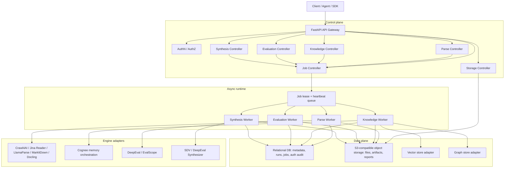

Cortex separates control-plane decisions from data-plane artifacts. Metadata, job state, authorization decisions, and audit records live in SQL. Large content and generated artifacts live in object storage. Vector and graph data are delegated to adapter-backed stores.

## Optimized system architecture

Cortex keeps the API process thin and moves heavyweight runtime dependencies into workers. The API compiles requests, signs storage access, records job intent, and exposes polling/result endpoints. Workers own long-running execution, lease refresh, engine-specific artifacts, and final persistence. This lets Parse, Knowledge, Evaluation, Synthesis, and Storage scale separately while sharing one job, auth, and observability model.

## Module technology stack

| Module | Runtime responsibility | Key dependencies | Official links |
| --- | --- | --- | --- |
| Parse | Source resolution, parser routing, engine fallback, normalization, document/chunk persistence, and async parse execution. | `httpx`, `PyYAML`, Crawl4AI, Jina Reader API, LlamaParse, MarkItDown, Docling, Playwright-backed browser runtime. | [Crawl4AI](https://docs.crawl4ai.com/), [Jina Reader](https://jina.ai/en-US/reader/), [LlamaParse](https://docs.cloud.llamaindex.ai/llamaparse), [MarkItDown](https://github.com/microsoft/markitdown), [Docling](https://docling-project.github.io/docling/), [HTTPX](https://www.python-httpx.org/), [Playwright](https://playwright.dev/python/) |
| Knowledge | Dataset ingestion, parsed-document hydration, graph/vector memory construction, and search orchestration. | Cognee runtime, Kuzu graph backend, LanceDB vector backend, SQLite-backed Cognee metadata, OpenAI-compatible LLM and embedding slots. | [Cognee](https://docs.cognee.ai/), [Kuzu](https://docs.kuzudb.com/), [LanceDB](https://docs.lancedb.com/), [SQLite](https://www.sqlite.org/docs.html) |
| Evaluation | Metric catalog, evaluation job hydration, model/judge execution, performance testing, and report persistence. | DeepEval, EvalScope, `httpx`, `pydantic`, FastAPI/Uvicorn/SSE runtime for self-hosted EvalScope service mode. | [DeepEval](https://deepeval.com/docs/introduction), [EvalScope](https://evalscope.readthedocs.io/en/latest/get_started/introduction.html), [Pydantic](https://docs.pydantic.dev/), [FastAPI](https://fastapi.tiangolo.com/), [Uvicorn](https://www.uvicorn.org/) |
| Synthesis | Structured, relational, RAG golden, QA, conversation, and agent-trajectory data generation. | SDV for structured synthetic data, DeepEval Synthesizer for LLM-backed goldens, OpenAI-compatible provider slots. | [SDV](https://docs.sdv.dev/), [DeepEval](https://deepeval.com/docs/introduction) |
| Storage | Upload sessions, direct small-file uploads, multipart upload completion, signed downloads, artifact writes, and metadata projection. | boto3, botocore, Amazon S3 API semantics, MinIO/S3-compatible object stores, SQL metadata records. | [Boto3 S3](https://docs.aws.amazon.com/boto3/latest/reference/services/s3.html), [Amazon S3 API](https://docs.aws.amazon.com/AmazonS3/latest/API/Type_API_Reference.html), [MinIO](https://min.io/docs/minio/linux/index.html) |

## Control plane

The control plane owns:

- API request validation and OpenAPI contract alignment.
- Authentication and scope checks.
- Resource authorization and audit decisions.
- Job creation, status transitions, cancellation, and event streams.
- Engine catalog and profile selection.
- Runtime configuration resolution.

## Data plane

The data plane owns large or engine-specific artifacts:

- Original uploaded files.
- Parsed Markdown, HTML, screenshots, PDFs, SSL summaries, and other parse artifacts.
- Evaluation reports.
- Synthesis outputs.
- Optional exported graph visualizations.

The relational database stores references and summaries, not large payloads.

## Schema domains

| Domain | Important tables |
| --- | --- |
| Tenancy and identity | `tenants`, `actors` |
| Storage | `storage_buckets`, `objects`, `object_versions` |
| Parser control | `parser_engines`, `parser_profiles`, `parse_run_attempts` |
| Documents | `documents`, `document_artifacts`, `document_chunks`, `document_tags` |
| Knowledge | `datasets`, `dataset_items`, `knowledge_runs` |
| Jobs | `jobs`, `job_events`, `parse_runs` |
| Governance | `permissions`, `roles`, `role_permissions`, `authorization_policies`, `authorization_decisions` |
| Search audit | `search_requests`, `search_hits` |
| Evaluation and synthesis | `eval_runs`, `synthesis_runs`, report/output object references |

## Parser routing

Cortex uses a layered parse model:

1. Public request: `sources`, `engine_id`, optional `scene`.
2. Request compiler: resolves source type, MIME, object references, and scene intent.
3. Engine registry: lists capabilities such as interactive web, OCR, structured output, local document parsing, and remote parsing.
4. Profile registry: maps scenes to presets, allowed engines, normalization, and fallback behavior.
5. Adapter: calls Crawl4AI, Jina Reader, LlamaParse, MarkItDown, Docling, or future engines.
6. Normalizer: returns a consistent Markdown and metadata shape.

## Authorization

Cortex supports a local development token issuer and production-oriented OAuth2/OIDC, JWT/JWKS, or introspection modes. Authorization is layered:

- Function scopes such as `parse:write`, `storage:download`, `knowledge:read`, `eval:write`, and `jobs:cancel`.
- Tenant isolation.
- Resource-level policies for objects, documents, datasets, jobs, and search results.
- Deny-by-default behavior for cross-tenant access.
- Auditable authorization decisions with actor, resource, reason code, and trace ID.

## Observability

All API and worker paths align to OpenTelemetry. The local stack includes OTLP collection, Jaeger traces, Prometheus metrics, and Grafana dashboards. Evaluation and synthesis runs emit domain spans such as `cortex.eval.run` and `cortex.synthesis.run`.

## Reliability rules

- Long-running model and parsing calls should run through async jobs.
- Workers use leases and heartbeats so stale jobs can be recovered.
- Large artifacts are persisted to object storage and linked back to run rows.
- Pending job result polling returns a non-success state until the final result is available.
- Provider settings are resolved as complete slots: base URL, API key, model ID, and embedding metadata move together.
