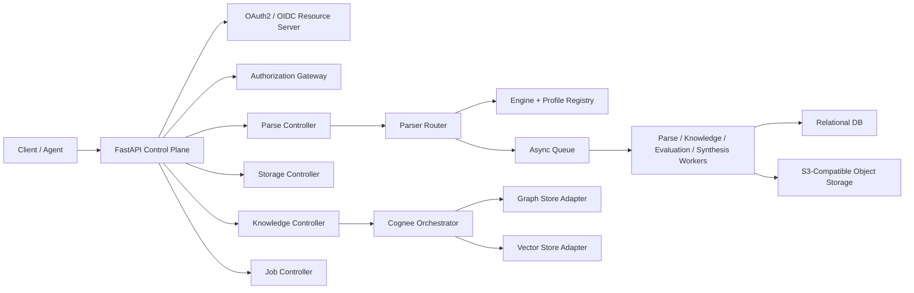

Cortex separates control-plane decisions from data-plane artifacts. Metadata, job state, authorization decisions, and audit records live in SQL. Large content and generated artifacts live in object storage. Vector and graph data are delegated to adapter-backed stores.

## System shape

## Control plane

The control plane owns:

- API request validation and OpenAPI contract alignment.
- Authentication and scope checks.
- Resource authorization and audit decisions.
- Job creation, status transitions, cancellation, and event streams.
- Engine catalog and profile selection.
- Runtime configuration resolution.

## Data plane

The data plane owns large or engine-specific artifacts:

- Original uploaded files.
- Parsed Markdown, HTML, screenshots, PDFs, SSL summaries, and other parse artifacts.
- Evaluation reports.
- Synthesis outputs.
- Optional exported graph visualizations.

The relational database stores references and summaries, not large payloads.

## Schema domains

| Domain | Important tables |
| --- | --- |
| Tenancy and identity | `tenants`, `actors` |
| Storage | `storage_buckets`, `objects`, `object_versions` |
| Parser control | `parser_engines`, `parser_profiles`, `parse_run_attempts` |
| Documents | `documents`, `document_artifacts`, `document_chunks`, `document_tags` |
| Knowledge | `datasets`, `dataset_items`, `knowledge_runs` |
| Jobs | `jobs`, `job_events`, `parse_runs` |
| Governance | `permissions`, `roles`, `role_permissions`, `authorization_policies`, `authorization_decisions` |
| Search audit | `search_requests`, `search_hits` |
| Evaluation and synthesis | `eval_runs`, `synthesis_runs`, report/output object references |

## Parser routing

Cortex uses a layered parse model:

1. Public request: `sources`, `engine_id`, optional `scene`.
2. Request compiler: resolves source type, MIME, object references, and scene intent.
3. Engine registry: lists capabilities such as interactive web, OCR, structured output, local document parsing, and remote parsing.
4. Profile registry: maps scenes to presets, allowed engines, normalization, and fallback behavior.
5. Adapter: calls Crawl4AI, Jina Reader, LlamaParse, MarkItDown, Docling, or future engines.
6. Normalizer: returns a consistent Markdown and metadata shape.

## Authorization

Cortex supports a local development token issuer and production-oriented OAuth2/OIDC, JWT/JWKS, or introspection modes. Authorization is layered:

- Function scopes such as `parse:write`, `storage:download`, `knowledge:read`, `eval:write`, and `jobs:cancel`.
- Tenant isolation.
- Resource-level policies for objects, documents, datasets, jobs, and search results.
- Deny-by-default behavior for cross-tenant access.
- Auditable authorization decisions with actor, resource, reason code, and trace ID.

## Observability

All API and worker paths align to OpenTelemetry. The local stack includes OTLP collection, Jaeger traces, Prometheus metrics, and Grafana dashboards. Evaluation and synthesis runs emit domain spans such as `cortex.eval.run` and `cortex.synthesis.run`.

## Reliability rules

- Long-running model and parsing calls should run through async jobs.
- Workers use leases and heartbeats so stale jobs can be recovered.
- Large artifacts are persisted to object storage and linked back to run rows.
- Pending job result polling returns a non-success state until the final result is available.
- Provider settings are resolved as complete slots: base URL, API key, model ID, and embedding metadata move together.

