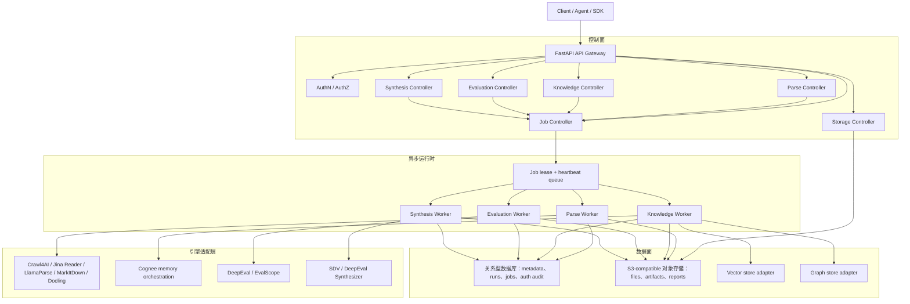

Cortex 将控制面决策和数据面产物分离。元数据、作业状态、授权决策和审计记录保存在 SQL 中；大体量内容和生成产物保存在对象存储中；向量和图数据交给适配器背后的专用存储。

## 优化后的系统架构

Cortex 让 API 进程保持轻量，把重型运行时依赖放进 Worker。API 负责编译请求、签发存储访问、记录作业意图，并暴露轮询与结果接口；Worker 负责长耗时执行、lease 刷新、引擎特定产物和最终持久化。这样 Parse、Knowledge、Evaluation、Synthesis 与 Storage 可以独立扩缩容，同时共享同一套 Job、Auth 和 Observability 模型。

## 模块技术栈与官方地址

| 模块 | 运行职责 | 重点依赖 | 官方地址 |
| --- | --- | --- | --- |
| Parse | 来源解析、解析器路由、引擎 fallback、标准化、document/chunk 持久化和异步解析执行。 | `httpx`、`PyYAML`、Crawl4AI、Jina Reader API、LlamaParse、MarkItDown、Docling、基于 Playwright 的浏览器运行时。 | [Crawl4AI](https://docs.crawl4ai.com/)、[Jina Reader](https://jina.ai/en-US/reader/)、[LlamaParse](https://docs.cloud.llamaindex.ai/llamaparse)、[MarkItDown](https://github.com/microsoft/markitdown)、[Docling](https://docling-project.github.io/docling/)、[HTTPX](https://www.python-httpx.org/)、[Playwright](https://playwright.dev/python/) |
| Knowledge | 数据集摄入、解析文档水合、图/向量记忆构建和搜索编排。 | Cognee runtime、Kuzu graph backend、LanceDB vector backend、SQLite-backed Cognee metadata、OpenAI-compatible LLM 与 embedding 槽位。 | [Cognee](https://docs.cognee.ai/)、[Kuzu](https://docs.kuzudb.com/)、[LanceDB](https://docs.lancedb.com/)、[SQLite](https://www.sqlite.org/docs.html) |
| Evaluation | 指标目录、评测作业水合、模型/裁判执行、性能压测和报告持久化。 | DeepEval、EvalScope、`httpx`、`pydantic`、用于 EvalScope self-hosted service mode 的 FastAPI/Uvicorn/SSE runtime。 | [DeepEval](https://deepeval.com/docs/introduction)、[EvalScope](https://evalscope.readthedocs.io/en/latest/get_started/introduction.html)、[Pydantic](https://docs.pydantic.dev/)、[FastAPI](https://fastapi.tiangolo.com/)、[Uvicorn](https://www.uvicorn.org/) |
| Synthesis | 结构化、关系型、RAG golden、QA、conversation 与 agent trajectory 数据生成。 | SDV 用于结构化合成数据，DeepEval Synthesizer 用于 LLM-backed goldens，OpenAI-compatible provider 槽位。 | [SDV](https://docs.sdv.dev/)、[DeepEval](https://deepeval.com/docs/introduction) |
| Storage | 上传会话、小文件直传、分片上传完成、签名下载、artifact 写入和元数据投影。 | boto3、botocore、Amazon S3 API 语义、MinIO/S3-compatible 对象存储、SQL metadata records。 | [Boto3 S3](https://docs.aws.amazon.com/boto3/latest/reference/services/s3.html)、[Amazon S3 API](https://docs.aws.amazon.com/AmazonS3/latest/API/Type_API_Reference.html)、[MinIO](https://min.io/docs/minio/linux/index.html) |

## 控制面

控制面负责：

- API 请求校验和 OpenAPI 契约对齐。
- 认证与 scope 检查。
- 资源授权和审计决策。
- Job 创建、状态流转、取消和事件流。
- 引擎目录与 profile 选择。
- 运行时配置解析。

## 数据面

数据面承载大对象和引擎相关产物：

- 原始上传文件。
- 解析后的 Markdown、HTML、截图、PDF、SSL 摘要等产物。
- Evaluation 报告。
- Synthesis 输出。
- 可选的知识图谱可视化导出。

关系型数据库只存引用和摘要，不存大 payload。

## Schema 逻辑域

| 逻辑域 | 关键表 |
| --- | --- |
| 租户与身份 | `tenants`, `actors` |
| 对象存储 | `storage_buckets`, `objects`, `object_versions` |
| 解析器控制 | `parser_engines`, `parser_profiles`, `parse_run_attempts` |
| 文档语义 | `documents`, `document_artifacts`, `document_chunks`, `document_tags` |
| 知识域 | `datasets`, `dataset_items`, `knowledge_runs` |
| 任务编排 | `jobs`, `job_events`, `parse_runs` |
| 权限治理 | `permissions`, `roles`, `role_permissions`, `authorization_policies`, `authorization_decisions` |
| 搜索审计 | `search_requests`, `search_hits` |
| 评测与合成 | `eval_runs`, `synthesis_runs`, 报告/输出对象引用 |

## 解析路由

Cortex 的解析模型分层运行：

1. 公开请求：`sources`、`engine_id`、可选 `scene`。
2. 请求编译器：解析来源类型、MIME、对象引用和场景意图。
3. 引擎注册表：列出 interactive web、OCR、结构化输出、本地文档解析、远程解析等能力。
4. Profile 注册表：把 scene 映射到 preset、允许的引擎、标准化和 fallback。
5. Adapter：调用 Crawl4AI、Jina Reader、LlamaParse、MarkItDown、Docling 或未来引擎。
6. Normalizer：输出统一 Markdown 和元数据。

## 授权

Cortex 支持本地开发 token issuer，也支持生产环境的 OAuth2/OIDC、JWT/JWKS 或 introspection。授权分层：

- 功能 scope，如 `parse:write`、`storage:download`、`knowledge:read`、`eval:write`、`jobs:cancel`。
- 租户隔离。
- object、document、dataset、job 和 search result 的资源级策略。
- 跨租户访问默认拒绝。
- 授权决策记录 actor、resource、reason code 和 trace ID。

## 可观测性

所有 API 和 Worker 链路都对齐 OpenTelemetry。本地栈包含 OTLP Collector、Jaeger、Prometheus 和 Grafana。Evaluation 与 Synthesis 会产出 `cortex.eval.run`、`cortex.synthesis.run` 等领域 span。

## 可靠性规则

- 长耗时模型调用和解析调用应走异步 Job。
- Worker 通过 lease 和 heartbeat 恢复 stale job。
- 大型产物落对象存储，再回写运行记录中的对象引用。
- Job 结果轮询在未完成时返回非成功状态，完成后返回最终结果。
- 供应商配置按完整槽位解析：base URL、API key、model ID 和 embedding 元数据必须一起移动。
