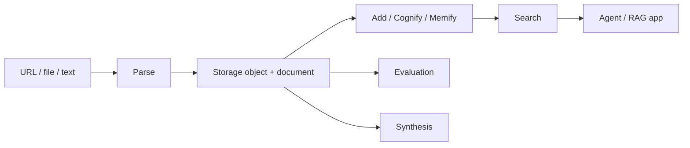

Cortex is an API platform for AI-native applications. It gives teams one control plane for parsing web pages and files, storing source objects, building knowledge graphs, searching knowledge, running evaluations, and generating synthetic data.

The project is designed around portable infrastructure: Python 3.12, FastAPI, SQLAlchemy, S3-compatible object storage, standard SQL metadata, OpenTelemetry, and pluggable adapters for parsing, knowledge, evaluation, and synthesis engines.

## What Cortex provides

| Domain | What it does | Primary endpoints |
| --- | --- | --- |
| Parse | Converts URLs, object-store files, and URIs into LLM-ready Markdown plus normalized metadata. | `/v1/parse/sync`, `/v1/parse/jobs` |
| Storage | Manages S3-backed objects, upload sessions, small-file uploads, metadata, and download URLs. | `/v1/storage/uploads`, `/v1/storage/files`, `/v1/storage/objects/{objectId}` |
| Knowledge | Creates datasets, ingests content, builds graphs, enriches memory, and runs semantic or hybrid search. | `/v1/knowledge/datasets`, `/v1/knowledge/add/jobs`, `/v1/knowledge/search` |
| Evaluation | Runs RAG, agentic, multi-turn, performance, and custom evaluations through normalized metric catalogs. | `/v1/eval/sync`, `/v1/eval/jobs` |
| Synthesis | Generates structured tables, RAG goldens, QA pairs, conversations, and agent trajectories. | `/v1/synthesis/sync`, `/v1/synthesis/jobs` |

## Core concepts

### Object

An object is the storage-level abstraction for any original or derived file. Objects are backed by S3-compatible storage and tracked in relational metadata tables with versions, checksums, access controls, and audit fields.

### Document

A document is normalized content that can be consumed by LLMs and knowledge pipelines. Parse jobs produce documents with Markdown, source metadata, artifacts, chunks, and provenance.

### Dataset

A dataset is a knowledge boundary. It scopes Cognee Add, Cognify, Memify, and Search operations, and it carries retention, access policy, index, and graph metadata.

### Job

A job is the unified envelope for long-running work. Parse, Knowledge, Evaluation, and Synthesis all share job status, events, cancellation, result polling, idempotency, and telemetry patterns.

## Engine model

Cortex keeps public API requests small and stable. Callers normally provide:

- `sources`: one or more URLs, `cortex://objects/{object_id}` locators, S3 URIs, or file URIs.
- `engine_id`: an explicit engine such as `crawl4ai`, `jina_reader`, `llama_parse`, `markitdown`, `docling`, or `auto`.
- `scene`: an optional high-level intent such as `deep_web` or `document_ai`.

Internal profiles, fallback rules, browser options, retries, provider credentials, and normalization choices are compiled by Cortex from runtime configuration.

## Typical workflow

1. Upload or reference content through Storage or Parse.
2. Convert it into LLM-ready Markdown and normalized metadata.
3. Ingest the parsed content into a dataset.
4. Build and enrich the knowledge graph.
5. Search the dataset from an agent, RAG service, or workflow.
6. Evaluate results or synthesize new data using the same object and dataset references.

## Local entry points

The local Compose stack exposes:

| Service | URL |
| --- | --- |
| Swagger UI | `http://127.0.0.1:8080/docs` |
| MinIO S3 API | `http://127.0.0.1:9000` |
| MinIO Console | `http://127.0.0.1:9001` |
| Jaeger | `http://127.0.0.1:16686` |
| Prometheus | `http://127.0.0.1:9090` |
| Grafana | `http://127.0.0.1:3000` |

Use the API reference for request shapes and the examples section for runnable flows.

