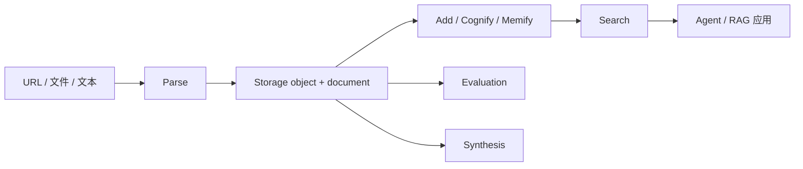

Cortex 是一套面向 AI 原生应用的 API 平台。它把网页/文件解析、对象存储、知识图谱、知识检索、评测验证与数据合成统一到同一个控制面中。

项目按可迁移基础设施设计：Python 3.12、FastAPI、SQLAlchemy、S3-compatible 对象存储、标准 SQL 元数据、OpenTelemetry，以及解析、知识、评测、合成各域的可插拔适配器。

## Cortex 提供什么

| 领域 | 能力 | 主要接口 |
| --- | --- | --- |
| Parse | 将 URL、对象存储文件和 URI 转为 LLM-ready Markdown 与标准化元数据。 | `/v1/parse/sync`, `/v1/parse/jobs` |
| Storage | 管理 S3 对象、上传会话、小文件上传、元数据和下载链接。 | `/v1/storage/uploads`, `/v1/storage/files`, `/v1/storage/objects/{objectId}` |
| Knowledge | 创建数据集、摄入内容、构建图谱、增强记忆，并执行语义或混合检索。 | `/v1/knowledge/datasets`, `/v1/knowledge/add/jobs`, `/v1/knowledge/search` |
| Evaluation | 通过统一指标目录运行 RAG、Agent、多轮、性能和自定义评测。 | `/v1/eval/sync`, `/v1/eval/jobs` |
| Synthesis | 生成结构化表、RAG goldens、问答对、对话样本和 Agent 轨迹。 | `/v1/synthesis/sync`, `/v1/synthesis/jobs` |

## 核心概念

### Object

Object 是任意原始文件或衍生文件的统一存储抽象。文件本体放在 S3-compatible 存储里，关系型数据库记录版本、校验和、权限和审计字段。

### Document

Document 是可被 LLM 和知识流水线消费的标准化内容实体。Parse 作业会产出 Markdown、来源元数据、产物、分块和 provenance。

### Dataset

Dataset 是知识边界。Cognee Add、Cognify、Memify 和 Search 都在数据集范围内运行，并继承数据保留、权限、索引和图谱元数据。

### Job

Job 是所有长任务的统一外壳。Parse、Knowledge、Evaluation 和 Synthesis 共享状态查询、事件、取消、结果轮询、幂等和遥测模式。

## 引擎模型

Cortex 让公开请求保持小而稳定。调用方通常只需要提供：

- `sources`：一个或多个 URL、`cortex://objects/{object_id}`、S3 URI 或文件 URI。
- `engine_id`：显式引擎，如 `crawl4ai`、`jina_reader`、`llama_parse`、`markitdown`、`docling`，或使用 `auto`。
- `scene`：可选的高层场景意图，如 `deep_web` 或 `document_ai`。

内部 profile、fallback、浏览器参数、重试、供应商凭据和标准化策略由 Cortex 根据运行时配置编译。

## 典型流程

1. 通过 Storage 或 Parse 上传、引用内容。
2. 将内容转成 LLM-ready Markdown 和标准化元数据。
3. 把解析结果摄入数据集。
4. 构建并增强知识图谱。
5. 让 Agent、RAG 服务或工作流检索数据集。
6. 复用同一批对象和数据集引用做评测或合成。

## 本地入口

本地 Compose 栈暴露：

| 服务 | 地址 |
| --- | --- |
| Swagger UI | `http://127.0.0.1:8080/docs` |
| MinIO S3 API | `http://127.0.0.1:9000` |
| MinIO Console | `http://127.0.0.1:9001` |
| Jaeger | `http://127.0.0.1:16686` |
| Prometheus | `http://127.0.0.1:9090` |
| Grafana | `http://127.0.0.1:3000` |

请求结构请看 API Reference，可运行流程请看样例。

