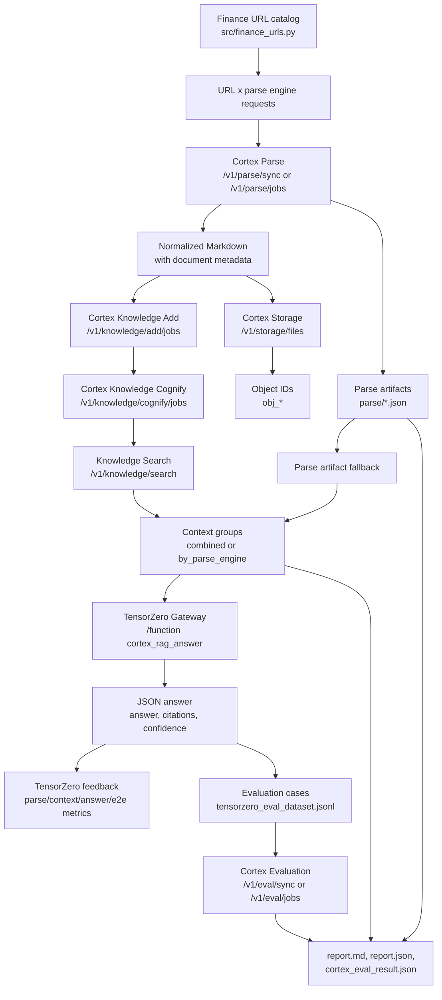

The `examples/tensorzero-cortex` project is the best end-to-end demo for Cortex because it turns one research question into a reproducible matrix:

- the same source URLs are parsed by multiple Cortex Parse engines;
- each parsed Markdown artifact is persisted through Cortex Storage;
- Cortex Knowledge tries to build searchable graph/vector context;
- TensorZero runs one or more model variants against each context group;
- Cortex Evaluation scores the generated answers as RAG and custom quality cases.

Use this page when you want to present Cortex, understand the example code, or find a concrete contribution point.

## What the matrix compares

The experiment has four independent axes. The full offline matrix is:

```text
selected URLs x parse engines x context groups x TensorZero variants x evaluation metrics
```

In `exhaustive` mode, the number of TensorZero inference calls is roughly:

```text
context_group_count x variant_count
```

For example, the reference artifact `examples/tensorzero-cortex/artifacts/tzcx_20260509_090446_65440870` produced 5 context groups and used one `openrouter` variant, so it produced 5 TensorZero inferences.

| Axis | Config or code | What it changes |
| --- | --- | --- |
| Source set | `src/finance_urls.py`, `--max-urls` | Which finance, macro, policy, PDF, HTML, JSON, or CSV sources enter the run. |
| Parse engine | `PARSE_ENGINES`, `--parse-engines` | Whether the same URL is converted by `auto`, `crawl4ai`, `jina_reader`, `markitdown`, `llama_parse`, or `docling`. |
| Context grouping | `TENSORZERO_CONTEXT_GROUPING`, `--context-grouping` | Whether the RAG context is combined, grouped by parse engine, or taken from Knowledge when available. |
| TensorZero variant | `TENSORZERO_VARIANTS`, `tensorzero/tensorzero.toml.tpl` | Which model provider slots answer the same question. |
| Evaluation profile | `CORTEX_EVAL_TYPES`, `CORTEX_EVAL_METRIC_PROFILE` | Which Cortex Evaluation metrics score the generated answers. |

## End-to-end data flow



The important design detail is the fallback path. The pipeline still produces a useful demo when Knowledge Search is unavailable: it groups the parsed Markdown excerpts directly and marks the report with `context_source=parse_artifact_fallback`.

## Code map

| File | Role |
| --- | --- |
| `src/cli.py` | CLI entrypoint for `render-config`, `run`, `serve`, `list-urls`, and `visualize-knowledge`. |
| `src/main.py` | FastAPI demo server with `/experiments/run`, `/cortex/status`, `/tensorzero/status`, and Swagger examples. |
| `src/pipeline.py` | Orchestrates Parse, Storage, Knowledge, TensorZero inference, feedback, Evaluation, and report writing. |
| `src/cortex_client.py` | Thin HTTP client for Cortex Parse, Storage, Knowledge, Jobs, and Evaluation APIs. |
| `src/tensorzero_client.py` | Thin HTTP client for TensorZero `/status`, `/inference`, and `/feedback`. |
| `src/models.py` | Pydantic request, option, artifact, inference, evaluation case, and report schemas. |
| `src/scoring.py` | Lightweight local scoring used for TensorZero feedback before Cortex Evaluation runs. |
| `src/finance_urls.py` | Built-in source catalog and expected keyword hints. |
| `tensorzero/tensorzero.toml.tpl` | TensorZero model slots, variants, JSON output schema, adaptive experiment, and feedback metrics. |
| `tensorzero/templates/rag_system.minijinja` | System prompt for the financial RAG answer function. |

## Stage-by-stage input and output

| Stage | Input | Output | Where to inspect |
| --- | --- | --- | --- |
| Select sources | `FINANCE_URLS[:max_urls]` and the user `query`. | URL records with `name`, `url`, `format_hint`, and `expected_keywords`. | `src/finance_urls.py` |
| Parse | One URL plus one `engine_id`. Docling is forced to async by default through `engine_modes={"docling": "async"}`. | A normalized Cortex document with Markdown, metadata, `document_id`, optional `job_id`, and heuristic `parse_score`. | `artifacts/{run_id}/parse/*.json` |
| Store | Markdown wrapped with front matter containing source, engine, document, and title metadata. | A Cortex Storage object such as `obj_80a8ae6ade3e457e9fb54a27`, tagged with `tensorzero`, `finance`, `parsed-markdown`, and the engine. | `parse/*.json` under the `storage` key |
| Build Knowledge | Parsed text snippets, source labels, object IDs, document IDs, and parse scores. | Dataset, Add job, Cognify job, optional `knowledge_graph.html`, then Knowledge Search results. | `report.json`, `raw_search_result.json`, `knowledge_graph.html` |
| Group context | Knowledge Search result or parse artifact fallback plus `TENSORZERO_CONTEXT_GROUPING`. | `ContextGroup` rows such as `parse_engine:auto` with `context_score`, `context_chars`, object IDs, and text previews. | `report.json.context_groups` |
| Run TensorZero | Question, one context group, requested variant, and run metadata. | Strict JSON answer shaped by `rag_answer.schema.json`, plus `inference_id`, `episode_id`, token usage, and local scores. | `raw_tensorzero_result.json` |
| Send feedback | Local scores: `parse_markdown_quality`, `rag_context_quality`, `llm_answer_quality`, `rag_end_to_end_pass`. | TensorZero metric feedback attached to each `inference_id`; adaptive mode uses `rag_end_to_end_pass` as its optimization metric. | TensorZero UI at `http://127.0.0.1:4000` |
| Build eval dataset | TensorZero answer, expected keywords, retrieval context, run metadata, and local scores. | JSONL cases that can be submitted to Cortex Evaluation. | `tensorzero_eval_dataset.jsonl` |
| Run Cortex Eval | Inline test cases, eval type, metric profile, and engine ID. | RAG or custom evaluation job result, summary, metric scores, and persisted report object IDs. | `cortex_eval_result.json` |
| Report | All artifacts above. | Human-readable and structured scorecards. | `report.md`, `report.json` |

## Prepare Cortex

Start Cortex from the repository root:

```bash
cd /path/to/cortex
test -f .env || cp .env.local.example .env

docker compose --env-file .env -p cortex-local -f compose.local.yaml \
  --profile docling \
  --profile eval-runtime \
  --profile synthesis-runtime \
  up -d --build
```

When you only changed runtime config and want to recreate the services used by the full example:

```bash
docker compose --env-file .env -p cortex-local -f compose.local.yaml \
  --profile docling \
  --profile eval-runtime \
  --profile synthesis-runtime \
  up -d --no-build --force-recreate \
  cortex-api \
  cortex-parse-worker-docling \
  cortex-knowledge-worker \
  cortex-evaluation-worker-runtime \
  cortex-synthesis-worker-runtime
```

Useful local endpoints:

| Service | URL |
| --- | --- |
| Cortex Swagger | `http://127.0.0.1:8080/docs` |
| TensorZero Gateway | `http://127.0.0.1:3002` |
| TensorZero UI | `http://127.0.0.1:4000` |
| FastAPI example app | `http://127.0.0.1:8090/docs` |

## Configure the example

```bash
cd /path/to/cortex/examples/tensorzero-cortex
test -f .env || cp .env.example .env
uv sync
```

Fill the provider keys you plan to test:

```text
OPENAI_API_KEY=...
GEMINI_API_KEY=...
KIMI_API_KEY=...
OPENROUTER_API_KEY=...
```

Recommended matrix settings for a live demo:

```text
PARSE_ENGINES=auto,crawl4ai,jina_reader,markitdown,llama_parse,docling
TENSORZERO_STRATEGY=exhaustive
TENSORZERO_VARIANTS=openai,gemini,kimi
TENSORZERO_CONTEXT_GROUPING=by_parse_engine
SUBMIT_CORTEX_EVAL=true
CORTEX_EVAL_MODE=async
CORTEX_EVAL_TYPES=rag,custom
CORTEX_EVAL_METRIC_PROFILE=deepeval_rag_core
CORTEX_EVAL_MAX_CASES=3
CORTEX_EVAL_MAX_CONTEXT_CHARS_PER_CASE=4000
KNOWLEDGE_GRAPH_VISUALIZATION=true
```

Render TensorZero configuration and start the TensorZero stack:

```bash
uv run tensorzero-cortex render-config
docker compose --env-file .env -f tensorzero/docker-compose.tensorzero.yaml up -d
```

The render step fills `tensorzero/tensorzero.toml` from `.env`. Restart the Gateway whenever you change `TENSORZERO_VARIANTS`, model IDs, API base URLs, or `tensorzero/tensorzero.toml.tpl`.

## Run a smoke test

Start with the shortest path:

```bash
uv run tensorzero-cortex run --max-urls 1 --parse-engines markitdown --skip-knowledge-jobs
```

This exercises Cortex Parse, Cortex Storage, TensorZero inference, TensorZero feedback, and report writing. It skips Knowledge and uses the parsed Markdown as direct RAG context.

## Run the full matrix

```bash
uv run tensorzero-cortex run \
  --max-urls 5 \
  --parse-engines auto,crawl4ai,jina_reader,markitdown,llama_parse,docling \
  --parse-mode sync \
  --tensorzero-strategy exhaustive \
  --tensorzero-variants openai,gemini,kimi \
  --context-grouping by_parse_engine \
  --submit-cortex-eval \
  --cortex-eval-mode async \
  --cortex-eval-types rag,custom \
  --query "What macroeconomic and financial stability risks are highlighted across these documents?"
```

Docling is worker-heavy. The example overrides `docling` to async mode even when the global parse mode is sync, so the request goes through `/v1/parse/jobs` and the dedicated Docling worker.

## Run through Swagger

You can also start the example app:

```bash
uv run tensorzero-cortex serve --host 127.0.0.1 --port 8090
```

Open `http://127.0.0.1:8090/docs` and use `POST /experiments/run`. The OpenAPI examples in `src/main.py` include:

| Example | Use it when |
| --- | --- |
| `full_matrix_async` | You want a realistic parse-engine x model-variant run with async Evaluation. |
| `ollama_local_smoke` | You want a small local model run with tight context and one eval case. |
| `adaptive_smoke` | You want TensorZero to choose a variant and test the adaptive feedback loop. |
| `legacy_compatible` | You want to use the older flat request fields. |

## Read the reference run

Use this artifact as a known-good shape for demos and debugging:

```text
examples/tensorzero-cortex/artifacts/tzcx_20260509_090446_65440870
```

The run used one source, the Federal Reserve FOMC calendar, across six parse engines. Five engines produced text context. Docling completed through the async path but returned no Markdown text in this run, so it was stored and scored but did not become a TensorZero context group.

| Signal | Value | Interpretation |
| --- | ---: | --- |
| Parse artifacts | 6 | One URL x six parse engines. |
| Parse successes | 6 | All parser calls returned successfully. |
| Context groups | 5 | `auto`, `crawl4ai`, `jina_reader`, `llama_parse`, and `markitdown`; no Docling context because Markdown was empty. |
| TensorZero inferences | 5 | Five context groups x one `openrouter` variant. |
| TensorZero errors | 0 | Every inference returned a structured answer. |
| Evaluation cases | 3 | The run limited Cortex Evaluation input to three cases. |
| Context source | `parse_artifact_fallback` | Knowledge build succeeded, but Knowledge Search failed and the pipeline fell back to parse artifacts. |
| Knowledge status | `built` | Dataset Add and Cognify jobs completed, and a graph HTML artifact was generated. |
| Cortex Eval mode | `async` | Evaluation was submitted through `/v1/eval/jobs`. |

Reference scorecard:

| Metric | Value | How to explain it |
| --- | ---: | --- |
| `parse_markdown_quality` | 0.7444 | Average heuristic parse quality across successful parse artifacts. |
| `rag_context_quality` | 0.9245 | The grouped contexts covered most expected FOMC and monetary policy keywords. |
| `llm_answer_quality` | 0.6893 | Answers usually cited the source and correctly noted that the calendar lacked risk discussion. |
| `rag_end_to_end_pass_rate` | 1.0 | Every TensorZero inference passed the local parse/context/answer gates. |

This reference run is especially useful for explaining resilience: `raw_search_result.json` says `knowledge_search_failed` with `Cognee runtime module is unavailable`, but the experiment still completed by using parse artifact fallback.

## Read individual artifacts

| Artifact | What to look for |
| --- | --- |
| `report.md` | The quickest narrative: scorecard, parse table, context table, TensorZero inference table, evaluation cases, artifact paths. |
| `report.json` | The full structured object that mirrors `ExperimentReport` in `src/models.py`. |
| `parse/Federal-Reserve-FOMC-calendar-jina_reader.json` | A compact example of parse output plus storage upload output. It has title `The Fed - Meeting calendars and information`, 1903 Markdown chars, and object `obj_80a8ae6ade3e457e9fb54a27`. |
| `raw_search_result.json` | Shows whether context came from Knowledge Search or fallback. In the reference run it contains five fallback results. |
| `raw_tensorzero_result.json` | Shows each `context_id`, `variant_name`, answer JSON, citations, confidence, token usage, local scores, and feedback errors. |
| `tensorzero_eval_dataset.jsonl` | The exact inline test cases submitted to Cortex Evaluation. Each line includes query, actual output, expected keywords, retrieval context, TensorZero IDs, and local scores. |
| `cortex_eval_result.json` | Async Cortex Evaluation results. In the reference run, RAG scored `0.8611` composite and custom quality scored `0.2`, which tells you the answers were grounded but incomplete for a broader risk-comparison question. |
| `knowledge_graph.html` | Optional Cognee graph visualization scoped to this dataset. Open it in a browser during demos when Knowledge Add/Cognify succeeds. |

## How TensorZero input becomes Evaluation input

TensorZero receives one user message containing:

```text
Question:
{query}

Cortex Knowledge context:
{context group text}

Metadata:
{run_id, dataset_key, parse_engines, parse_mode, object_ids, context_id, requested_variant}
```

TensorZero must return JSON that matches `tensorzero/schemas/rag_answer.schema.json`:

```json
{
  "answer": "Concise answer grounded in the supplied context.",
  "citations": ["source label, URL, or object ID"],
  "confidence": 0.3,
  "missing_evidence": ["what the context could not prove"]
}
```

The pipeline then turns the answer into a Cortex Evaluation case:

```json
{
  "query": "What macroeconomic and financial stability risks are highlighted?",
  "actual_output": "The generated TensorZero answer.",
  "expected_keywords": ["fomc", "federal reserve", "monetary policy"],
  "retrieval_contexts": ["Source: Federal Reserve FOMC calendar..."],
  "metadata": {
    "context_id": "parse_engine:jina_reader",
    "tensorzero_variant": "openrouter",
    "tensorzero_inference_id": "019e0bfd-2a70-7780-b31e-3a5a95e8deaa",
    "scores": {
      "parse_markdown_quality": 0.7444,
      "rag_context_quality": 0.6224,
      "llm_answer_quality": 0.82,
      "rag_end_to_end_pass": true
    }
  }
}
```

That is the bridge between TensorZero observability and Cortex Evaluation: TensorZero records the online-style inference and feedback events, while Cortex Evaluation turns the same records into repeatable judge-based reports.

## Score definitions

The local feedback metrics live in `src/scoring.py`:

| Metric | Local scoring behavior | Why it exists before Cortex Evaluation |
| --- | --- | --- |
| `parse_markdown_quality` | Combines Markdown length, visible structure, and expected keyword coverage. | Lets TensorZero correlate model outcomes with parser quality. |
| `rag_context_quality` | Scores keyword coverage and context density. | Helps compare `by_parse_engine` context groups. |
| `llm_answer_quality` | Scores keyword coverage, citation/source mention, and confidence. | Gives TensorZero immediate feedback for adaptive routing. |
| `rag_end_to_end_pass` | Requires parse score >= 0.45, context score >= 0.35, and answer score >= 0.45. | The boolean optimization metric in `tensorzero.toml.tpl`. |

Cortex Evaluation is the deeper judge layer. The default RAG profile sends metrics such as `rag.answer_relevance`, `rag.faithfulness`, `rag.contextual_precision`, `rag.contextual_recall`, and `rag.contextual_relevance`. Custom quality adds `quality.correctness`, `quality.completeness`, `quality.relevance`, and `custom.g_eval`.

## Contribution paths

| Goal | Start here | What to change |
| --- | --- | --- |
| Add a new source type | `src/finance_urls.py` | Add URL, format hint, and expected keywords; run with `--max-urls` high enough to include it. |
| Add or tune a parser comparison | `src/pipeline.py`, `.env` | Add an engine to `PARSE_ENGINES`, adjust `engine_modes`, or improve parse artifact scoring. |
| Add a model provider | `tensorzero/tensorzero.toml.tpl`, `.env.example` | Add a model slot, provider, and variant; rerender config and restart Gateway. |
| Change the RAG answer contract | `tensorzero/schemas/rag_answer.schema.json`, `tensorzero/templates/rag_system.minijinja` | Update the JSON schema and prompt together so model output remains parseable. |
| Add a local feedback metric | `src/scoring.py`, `src/pipeline.py`, `tensorzero/tensorzero.toml.tpl` | Compute the score, send it to TensorZero `/feedback`, and declare the metric. |
| Add Cortex Evaluation metrics | `src/pipeline.py` | Extend `_metrics_for_eval_type` or pass `metrics_by_type` in the request. |
| Improve API demo ergonomics | `src/main.py` | Add OpenAPI examples, health diagnostics, or narrower demo presets. |
| Improve Knowledge visualization | `src/knowledge_graph_visualization.py` | Tune dataset-scoped graph export and HTML rendering. |

## Add Synthesis after the run

The main example focuses on Parse, Storage, Knowledge, TensorZero, and Evaluation. To exercise the fifth Cortex domain, submit a Synthesis job from the same parsed content:

<ApiExampleTabs example="tensorzero-synthesis-job" />

Use the generated QA pairs as additional Evaluation cases, or persist them as reusable datasets for future TensorZero experiments.
