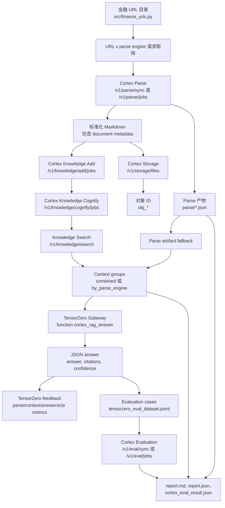

`examples/tensorzero-cortex` 是最适合演示 Cortex 端到端能力的样例。它把一个研究问题拆成可复现的评估矩阵：

- 同一批来源 URL 会被多个 Cortex Parse engine 解析；
- 每个解析出的 Markdown artifact 会写入 Cortex Storage；
- Cortex Knowledge 尝试构建可搜索的图/向量上下文；
- TensorZero 用一个或多个模型 variant 对每个 context group 作答；
- Cortex Evaluation 把生成答案作为 RAG 和 custom quality case 继续打分。

当你要演示 Cortex、理解样例代码，或者寻找贡献入口时，可以按这页来讲。

## 这个矩阵在比较什么

实验有四个独立轴。完整离线矩阵可以理解为：

```text
选中的 URL x parse engines x context groups x TensorZero variants x evaluation metrics
```

在 `exhaustive` 模式下，TensorZero inference 次数大致是：

```text
context_group_count x variant_count
```

例如参考产物 `examples/tensorzero-cortex/artifacts/tzcx_20260509_090446_65440870` 产生了 5 个 context group，并只使用一个 `openrouter` variant，所以一共产生 5 次 TensorZero inference。

| 轴 | 配置或代码 | 影响什么 |
| --- | --- | --- |
| 来源集合 | `src/finance_urls.py`, `--max-urls` | 哪些金融、宏观、政策、PDF、HTML、JSON 或 CSV 来源进入实验。 |
| Parse engine | `PARSE_ENGINES`, `--parse-engines` | 同一个 URL 由 `auto`、`crawl4ai`、`jina_reader`、`markitdown`、`llama_parse` 或 `docling` 转成 Markdown。 |
| Context grouping | `TENSORZERO_CONTEXT_GROUPING`, `--context-grouping` | RAG context 是合并、按 parse engine 分组，还是 Knowledge 可用时优先使用 Knowledge。 |
| TensorZero variant | `TENSORZERO_VARIANTS`, `tensorzero/tensorzero.toml.tpl` | 哪些模型供应商槽位回答同一个问题。 |
| Evaluation profile | `CORTEX_EVAL_TYPES`, `CORTEX_EVAL_METRIC_PROFILE` | Cortex Evaluation 使用哪些评测类型和指标。 |

## 端到端数据流



这里最重要的设计点是 fallback。即使 Knowledge Search 不可用，pipeline 仍会把已解析的 Markdown excerpt 分组后继续实验，并在报告中标记 `context_source=parse_artifact_fallback`。

## 代码地图

| 文件 | 作用 |
| --- | --- |
| `src/cli.py` | CLI 入口，支持 `render-config`、`run`、`serve`、`list-urls`、`visualize-knowledge`。 |
| `src/main.py` | FastAPI 样例服务，提供 `/experiments/run`、`/cortex/status`、`/tensorzero/status` 和 Swagger examples。 |
| `src/pipeline.py` | 编排 Parse、Storage、Knowledge、TensorZero inference、feedback、Evaluation 和报告写入。 |
| `src/cortex_client.py` | Cortex Parse、Storage、Knowledge、Jobs、Evaluation 的轻量 HTTP client。 |
| `src/tensorzero_client.py` | TensorZero `/status`、`/inference`、`/feedback` 的轻量 HTTP client。 |
| `src/models.py` | Pydantic 请求、配置、artifact、inference、evaluation case 和 report schema。 |
| `src/scoring.py` | 在 Cortex Evaluation 之前先给 TensorZero feedback 用的本地轻量评分。 |
| `src/finance_urls.py` | 内置来源目录和 expected keyword hints。 |
| `tensorzero/tensorzero.toml.tpl` | TensorZero 模型槽位、variants、JSON 输出 schema、adaptive experiment 和反馈指标。 |
| `tensorzero/templates/rag_system.minijinja` | 金融 RAG answer function 的 system prompt。 |

## 每个环节的输入输出

| 环节 | 输入 | 输出 | 去哪里看 |
| --- | --- | --- | --- |
| 选择来源 | `FINANCE_URLS[:max_urls]` 和用户 `query`。 | 包含 `name`、`url`、`format_hint`、`expected_keywords` 的 URL records。 | `src/finance_urls.py` |
| Parse | 一个 URL 加一个 `engine_id`。Docling 默认通过 `engine_modes={"docling": "async"}` 强制走异步。 | 标准化 Cortex document，包含 Markdown、metadata、`document_id`、可选 `job_id` 和启发式 `parse_score`。 | `artifacts/{run_id}/parse/*.json` |
| Storage | 带 front matter 的 Markdown，front matter 包含来源、engine、document、title 等 metadata。 | Cortex Storage object，例如 `obj_80a8ae6ade3e457e9fb54a27`，并打上 `tensorzero`、`finance`、`parsed-markdown`、engine 标签。 | `parse/*.json` 的 `storage` 字段 |
| 构建 Knowledge | 解析文本片段、source label、object ID、document ID 和 parse score。 | Dataset、Add job、Cognify job、可选 `knowledge_graph.html`，以及 Knowledge Search 结果。 | `report.json`、`raw_search_result.json`、`knowledge_graph.html` |
| 生成 context group | Knowledge Search 结果或 parse artifact fallback，加上 `TENSORZERO_CONTEXT_GROUPING`。 | `ContextGroup` 行，例如 `parse_engine:auto`，包含 `context_score`、`context_chars`、object IDs 和 text preview。 | `report.json.context_groups` |
| 运行 TensorZero | 问题、一个 context group、请求的 variant 和 run metadata。 | 符合 `rag_answer.schema.json` 的严格 JSON answer，以及 `inference_id`、`episode_id`、token usage、本地 scores。 | `raw_tensorzero_result.json` |
| 写入 feedback | 本地分数：`parse_markdown_quality`、`rag_context_quality`、`llm_answer_quality`、`rag_end_to_end_pass`。 | 绑定到每个 `inference_id` 的 TensorZero metric feedback；adaptive 模式用 `rag_end_to_end_pass` 优化路由。 | TensorZero UI: `http://127.0.0.1:4000` |
| 构建评测集 | TensorZero answer、expected keywords、retrieval context、run metadata、本地 scores。 | 可提交给 Cortex Evaluation 的 JSONL cases。 | `tensorzero_eval_dataset.jsonl` |
| 运行 Cortex Eval | Inline test cases、eval type、metric profile、engine ID。 | RAG 或 custom Evaluation job result、summary、metric scores 和持久化 report object IDs。 | `cortex_eval_result.json` |
| 生成报告 | 上面所有产物。 | 人类可读与结构化 scorecard。 | `report.md`、`report.json` |

## 准备 Cortex

在仓库根目录启动 Cortex：

```bash
cd /path/to/cortex
test -f .env || cp .env.local.example .env

docker compose --env-file .env -p cortex-local -f compose.local.yaml \
  --profile docling \
  --profile eval-runtime \
  --profile synthesis-runtime \
  up -d --build
```

如果只是修改运行时配置，可以只重启完整示例依赖的服务：

```bash
docker compose --env-file .env -p cortex-local -f compose.local.yaml \
  --profile docling \
  --profile eval-runtime \
  --profile synthesis-runtime \
  up -d --no-build --force-recreate \
  cortex-api \
  cortex-parse-worker-docling \
  cortex-knowledge-worker \
  cortex-evaluation-worker-runtime \
  cortex-synthesis-worker-runtime
```

常用本地入口：

| 服务 | 地址 |
| --- | --- |
| Cortex Swagger | `http://127.0.0.1:8080/docs` |
| TensorZero Gateway | `http://127.0.0.1:3002` |
| TensorZero UI | `http://127.0.0.1:4000` |
| FastAPI 样例应用 | `http://127.0.0.1:8090/docs` |

## 配置样例

```bash
cd /path/to/cortex/examples/tensorzero-cortex
test -f .env || cp .env.example .env
uv sync
```

填写你要测试的模型供应商密钥：

```text
OPENAI_API_KEY=...
GEMINI_API_KEY=...
KIMI_API_KEY=...
OPENROUTER_API_KEY=...
```

现场演示推荐使用：

```text
PARSE_ENGINES=auto,crawl4ai,jina_reader,markitdown,llama_parse,docling
TENSORZERO_STRATEGY=exhaustive
TENSORZERO_VARIANTS=openai,gemini,kimi
TENSORZERO_CONTEXT_GROUPING=by_parse_engine
SUBMIT_CORTEX_EVAL=true
CORTEX_EVAL_MODE=async
CORTEX_EVAL_TYPES=rag,custom
CORTEX_EVAL_METRIC_PROFILE=deepeval_rag_core
CORTEX_EVAL_MAX_CASES=3
CORTEX_EVAL_MAX_CONTEXT_CHARS_PER_CASE=4000
KNOWLEDGE_GRAPH_VISUALIZATION=true
```

渲染 TensorZero 配置并启动 TensorZero stack：

```bash
uv run tensorzero-cortex render-config
docker compose --env-file .env -f tensorzero/docker-compose.tensorzero.yaml up -d
```

渲染命令会用 `.env` 填充 `tensorzero/tensorzero.toml`。修改 `TENSORZERO_VARIANTS`、模型 ID、API base URL 或 `tensorzero/tensorzero.toml.tpl` 后，都要重新渲染并重启 Gateway。

## 先跑冒烟测试

先走最短链路：

```bash
uv run tensorzero-cortex run --max-urls 1 --parse-engines markitdown --skip-knowledge-jobs
```

这个命令会覆盖 Cortex Parse、Cortex Storage、TensorZero inference、TensorZero feedback 和报告生成。它跳过 Knowledge，并直接用解析出的 Markdown 作为 RAG context。

## 运行完整矩阵

```bash
uv run tensorzero-cortex run \
  --max-urls 5 \
  --parse-engines auto,crawl4ai,jina_reader,markitdown,llama_parse,docling \
  --parse-mode sync \
  --tensorzero-strategy exhaustive \
  --tensorzero-variants openai,gemini,kimi \
  --context-grouping by_parse_engine \
  --submit-cortex-eval \
  --cortex-eval-mode async \
  --cortex-eval-types rag,custom \
  --query "What macroeconomic and financial stability risks are highlighted across these documents?"
```

Docling 属于重型 worker。即使全局 parse mode 是 sync，样例也会把 `docling` 覆盖为 async，所以它会提交到 `/v1/parse/jobs`，再由专用 Docling worker 消费。

## 通过 Swagger 运行

也可以启动样例应用：

```bash
uv run tensorzero-cortex serve --host 127.0.0.1 --port 8090
```

打开 `http://127.0.0.1:8090/docs`，使用 `POST /experiments/run`。`src/main.py` 中内置了这些 OpenAPI examples：

| Example | 什么时候用 |
| --- | --- |
| `full_matrix_async` | 想跑接近真实的 parse-engine x model-variant 矩阵，并用异步 Evaluation。 |
| `ollama_local_smoke` | 想用本地模型小流量验证，限制 context 和 eval case 数量。 |
| `adaptive_smoke` | 想让 TensorZero 自动选择 variant，验证 adaptive feedback loop。 |
| `legacy_compatible` | 想使用旧版扁平请求字段快速测试。 |

## 读懂参考 run

演示和排障时可以先看这个已生成产物：

```text
examples/tensorzero-cortex/artifacts/tzcx_20260509_090446_65440870
```

这次 run 用一个来源 Federal Reserve FOMC calendar，对比了六个 parse engines。五个 engine 产生了可用于上下文的文本。Docling 通过异步链路完成并写入 Storage，但这次没有 Markdown 文本，所以它进入 parse scorecard，却没有成为 TensorZero context group。

| 信号 | 值 | 怎么解释 |
| --- | ---: | --- |
| Parse artifacts | 6 | 一个 URL x 六个 parse engines。 |
| Parse successes | 6 | 所有 parser 调用都成功返回。 |
| Context groups | 5 | `auto`、`crawl4ai`、`jina_reader`、`llama_parse`、`markitdown`；Docling 因 Markdown 为空没有上下文。 |
| TensorZero inferences | 5 | 五个 context groups x 一个 `openrouter` variant。 |
| TensorZero errors | 0 | 每次 inference 都返回了结构化 answer。 |
| Evaluation cases | 3 | 这次 run 把 Cortex Evaluation 输入限制为 3 个 case。 |
| Context source | `parse_artifact_fallback` | Knowledge build 成功，但 Knowledge Search 失败，pipeline 回退到 parse artifacts。 |
| Knowledge status | `built` | Dataset Add 和 Cognify job 完成，并生成了 graph HTML。 |
| Cortex Eval mode | `async` | Evaluation 通过 `/v1/eval/jobs` 提交。 |

参考 scorecard：

| Metric | Value | 如何讲 |
| --- | ---: | --- |
| `parse_markdown_quality` | 0.7444 | 所有成功 parse artifact 的平均启发式质量。 |
| `rag_context_quality` | 0.9245 | 分组后的 context 覆盖了大多数 FOMC 和 monetary policy 关键词。 |
| `llm_answer_quality` | 0.6893 | 答案通常引用了来源，并正确指出该日历页缺少风险讨论。 |
| `rag_end_to_end_pass_rate` | 1.0 | 每个 TensorZero inference 都通过了本地 parse/context/answer gate。 |

这个参考 run 很适合讲 Cortex 的韧性：`raw_search_result.json` 中记录了 `knowledge_search_failed`，错误是 `Cognee runtime module is unavailable`，但实验仍通过 parse artifact fallback 完整跑完。

## 读懂每个产物

| Artifact | 重点看什么 |
| --- | --- |
| `report.md` | 最快读懂全局：scorecard、parse 表、context 表、TensorZero inference 表、evaluation cases 和产物路径。 |
| `report.json` | 完整结构化对象，对应 `src/models.py` 里的 `ExperimentReport`。 |
| `parse/Federal-Reserve-FOMC-calendar-jina_reader.json` | 一个紧凑的 parse + storage 样例。它的 title 是 `The Fed - Meeting calendars and information`，Markdown 长度 1903，Storage object 是 `obj_80a8ae6ade3e457e9fb54a27`。 |
| `raw_search_result.json` | 判断 context 来自 Knowledge Search 还是 fallback。参考 run 里有 5 条 fallback results。 |
| `raw_tensorzero_result.json` | 每个 `context_id`、`variant_name`、answer JSON、citations、confidence、token usage、本地 scores 和 feedback errors。 |
| `tensorzero_eval_dataset.jsonl` | 实际提交给 Cortex Evaluation 的 inline test cases。每行包含 query、actual output、expected keywords、retrieval context、TensorZero IDs 和本地 scores。 |
| `cortex_eval_result.json` | 异步 Cortex Evaluation 结果。参考 run 中 RAG composite 是 `0.8611`，custom quality composite 是 `0.2`，说明答案具备上下文一致性，但对更宽泛的风险对比问题并不完整。 |
| `knowledge_graph.html` | 可选的 Cognee dataset-scoped graph visualization。Knowledge Add/Cognify 成功时，演示现场可以直接用浏览器打开。 |

## TensorZero 输入如何变成 Evaluation 输入

TensorZero 收到的是一个 user message：

```text
Question:
{query}

Cortex Knowledge context:
{context group text}

Metadata:
{run_id, dataset_key, parse_engines, parse_mode, object_ids, context_id, requested_variant}
```

TensorZero 必须返回符合 `tensorzero/schemas/rag_answer.schema.json` 的 JSON：

```json
{
  "answer": "Concise answer grounded in the supplied context.",
  "citations": ["source label, URL, or object ID"],
  "confidence": 0.3,
  "missing_evidence": ["what the context could not prove"]
}
```

Pipeline 会把这个 answer 转成 Cortex Evaluation case：

```json
{
  "query": "What macroeconomic and financial stability risks are highlighted?",
  "actual_output": "The generated TensorZero answer.",
  "expected_keywords": ["fomc", "federal reserve", "monetary policy"],
  "retrieval_contexts": ["Source: Federal Reserve FOMC calendar..."],
  "metadata": {
    "context_id": "parse_engine:jina_reader",
    "tensorzero_variant": "openrouter",
    "tensorzero_inference_id": "019e0bfd-2a70-7780-b31e-3a5a95e8deaa",
    "scores": {
      "parse_markdown_quality": 0.7444,
      "rag_context_quality": 0.6224,
      "llm_answer_quality": 0.82,
      "rag_end_to_end_pass": true
    }
  }
}
```

这就是 TensorZero observability 和 Cortex Evaluation 的连接点：TensorZero 记录在线风格的 inference 和 feedback，Cortex Evaluation 把同一批记录变成可重复的 judge-based reports。

## 分数怎么来

本地 feedback 指标在 `src/scoring.py`：

| Metric | 本地评分逻辑 | 为什么先于 Cortex Evaluation 存在 |
| --- | --- | --- |
| `parse_markdown_quality` | 结合 Markdown 长度、结构特征和 expected keyword 覆盖。 | 让 TensorZero 能把模型结果和 parser 质量关联起来。 |
| `rag_context_quality` | 评估 keyword 覆盖和 context 密度。 | 便于比较 `by_parse_engine` 分组后的上下文。 |
| `llm_answer_quality` | 评估 keyword 覆盖、引用/来源提及和 confidence。 | 给 TensorZero adaptive routing 提供即时反馈。 |
| `rag_end_to_end_pass` | 要求 parse score >= 0.45、context score >= 0.35、answer score >= 0.45。 | `tensorzero.toml.tpl` 中的 boolean 优化指标。 |

Cortex Evaluation 是更深一层的 judge。默认 RAG profile 会提交 `rag.answer_relevance`、`rag.faithfulness`、`rag.contextual_precision`、`rag.contextual_recall`、`rag.contextual_relevance`。Custom quality 会提交 `quality.correctness`、`quality.completeness`、`quality.relevance`、`custom.g_eval`。

## 贡献入口

| 目标 | 从哪里开始 | 改什么 |
| --- | --- | --- |
| 增加新的来源类型 | `src/finance_urls.py` | 添加 URL、format hint 和 expected keywords；运行时把 `--max-urls` 调到能覆盖它。 |
| 增加或调优 parser 对比 | `src/pipeline.py`, `.env` | 把 engine 加入 `PARSE_ENGINES`，调整 `engine_modes`，或改进 parse artifact scoring。 |
| 增加模型供应商 | `tensorzero/tensorzero.toml.tpl`, `.env.example` | 添加 model slot、provider 和 variant；重新 render config 并重启 Gateway。 |
| 改 RAG answer contract | `tensorzero/schemas/rag_answer.schema.json`, `tensorzero/templates/rag_system.minijinja` | 同步更新 JSON schema 和 prompt，保证模型输出仍可解析。 |
| 增加本地 feedback metric | `src/scoring.py`, `src/pipeline.py`, `tensorzero/tensorzero.toml.tpl` | 计算分数，写入 TensorZero `/feedback`，并声明 metric。 |
| 增加 Cortex Evaluation 指标 | `src/pipeline.py` | 扩展 `_metrics_for_eval_type`，或在请求里传 `metrics_by_type`。 |
| 改进 API 演示体验 | `src/main.py` | 增加 OpenAPI examples、health diagnostics 或更小的 demo presets。 |
| 改进 Knowledge 可视化 | `src/knowledge_graph_visualization.py` | 调整 dataset-scoped graph export 和 HTML rendering。 |

## 在 run 后补充 Synthesis

主样例重点覆盖 Parse、Storage、Knowledge、TensorZero 和 Evaluation。要覆盖第五类 Cortex API，可以基于同一批解析内容提交 Synthesis job：

<ApiExampleTabs example="tensorzero-synthesis-job" />

生成的 QA pairs 可以作为新的 Evaluation cases，也可以持久化成可复用数据集，供后续 TensorZero 实验使用。
