# Cortex Data Flow Design

## 1. 文档目标

本文定义 Cortex 的数据流、信任边界、关键数据存储与失败处理策略，覆盖三条主链路：

1. Parse：URL、对象文件或外部 URI 到 LLM-ready Markdown 与产物。
2. Storage：客户端到 S3 兼容对象存储的上传下载。
3. Cognee：Add / Cognify / Memify / Search 的知识流水线。

目标是同时满足：

- 厂商中立与无缝迁移
- 高性能与水平扩展
- 高可用、可重试、可审计
- 面向 AI 工作负载的原生数据结构

## 2. 参与者与外部系统

### 2.1 外部参与者

- `API Client`：业务系统、Agent、工作流平台、前端控制台。
- `Human Operator`：运维、审计、知识工程师。
- `Webhook Receiver`：任务完成后的回调接收方。

### 2.2 外部依赖

- `Identity / Auth Layer`：认证鉴权与租户边界。
- `Authorization Policy Engine / PDP`：角色绑定、资源策略和属性条件求值。
- `S3-Compatible Object Storage`：AWS S3、MinIO、R2 等。
- `Relational DB`：SQLite、PostgreSQL 等。
- `Queue / Broker`：Redis、RabbitMQ 或兼容队列。
- `Parser Engines`：Crawl4AI、Jina Reader、LlamaParse、MarkItDown、Docling 等解析引擎。
- `Cognee Runtime`：知识处理与搜索编排。
- `Vector Store Adapter` 与 `Graph Store Adapter`。
- `Cache / Session Store`：会话、搜索上下文、短期缓存。
- `OpenTelemetry Collector`：统一接收、处理和分发 trace / metric / log。
- `Jaeger`：链路追踪查询面。
- `Prometheus`：指标存储、规则与告警。
- `Grafana`：指标、链路与发布观测看板。

## 3. 信任边界

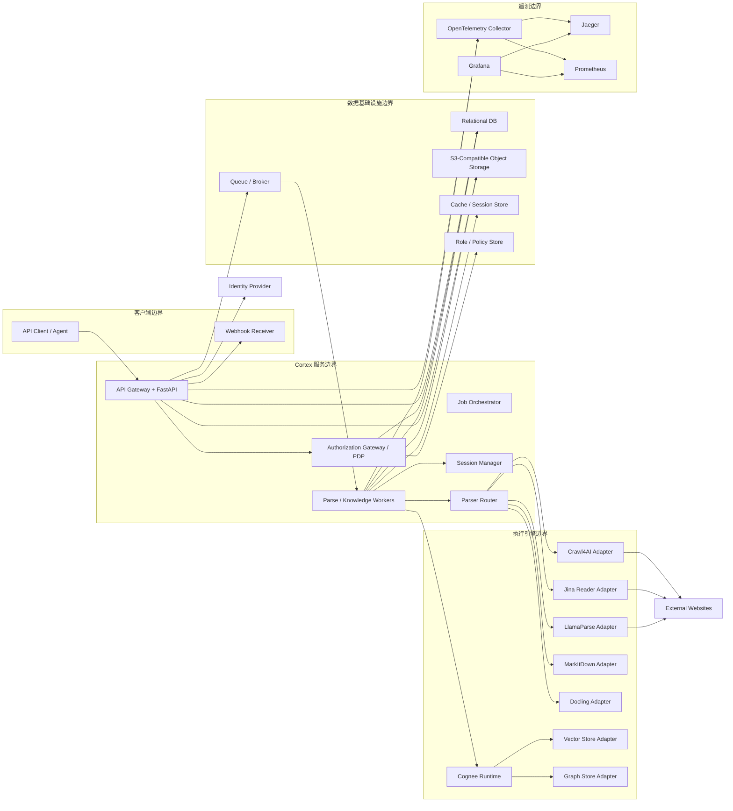

边界说明：

- 客户端永远不直接访问关系库。
- 大文件默认绕过 API 服务器，直接使用预签名 URL 与对象存储交互。
- 解析器执行态和知识引擎态与 API 控制面解耦，通过队列和数据库协调。
- 所有业务读写先过认证，再过功能权限和数据权限决策。
- 遥测信号与业务数据分流；应用只理解 OpenTelemetry，链路聚合与后端导出由 Collector 统一处理。

## 4. Level 0：系统上下文

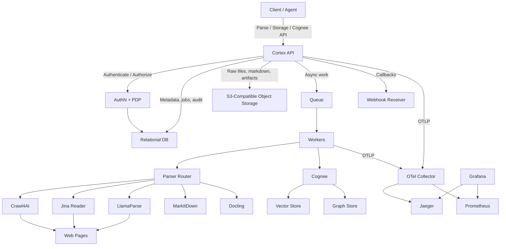

## 5. Level 1：模块级 DFD

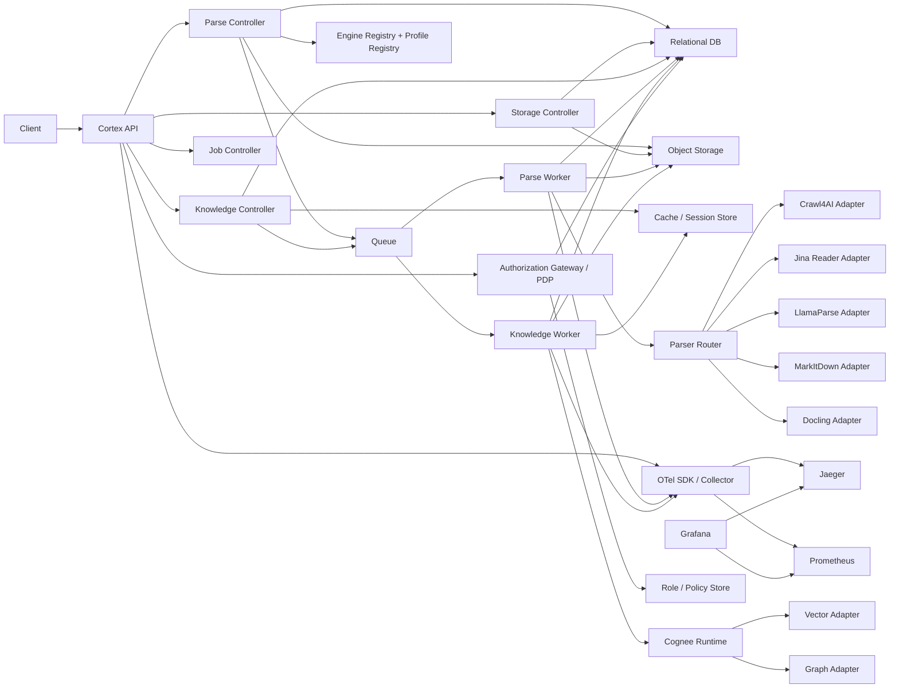

## 6. Parse 流程

### 6.1 关键能力

Parse 链路已经升级为多引擎平台，不再绑定单一解析器。其关键能力包括：

- URL、对象存储文件、外部 URI 的统一输入
- 极简公共 API：`sources + engine_id (+ scene)`
- `scene -> profile/preset` 的内部自动编译
- 引擎能力匹配与显式选引擎
- fallback 链路与多引擎回退
- 统一 Markdown 与结构化元数据标准化
- 引擎诊断、质量评估与审计轨迹

其中 Crawl4AI 负责交互网页、认证与反机器人场景；Jina Reader、LlamaParse、MarkItDown、Docling 负责不同成本、保真度和输入类型下的替代或首选路径。

### 6.2 数据流

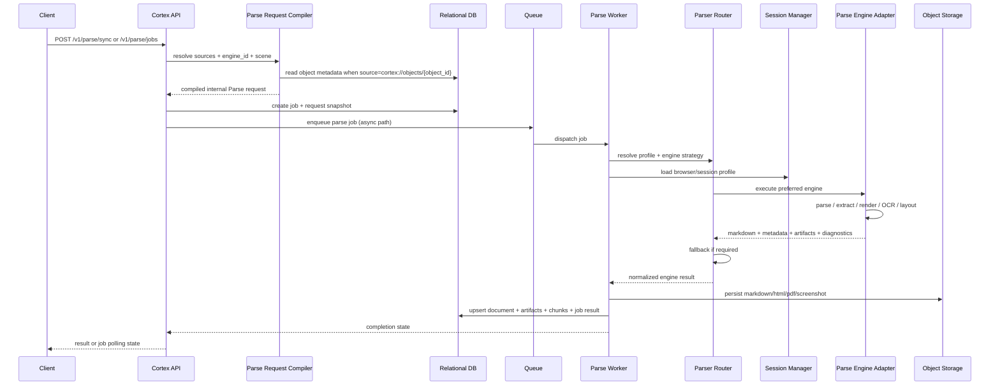

### 6.3 Parse 输入

公开输入最小化为：

- `sources`
- `engine_id`
- 可选 `scene`
- 异步作业下可选 `priority`
- 异步作业下可选 `webhook`

内部再编译为完整执行请求，包含：

- resolved source kind
- internal profile
- crawl / normalization / output / persistence defaults
- `traceparent` / `tracestate` / `baggage`

### 6.4 Parse 输出

- `Document`
- `DocumentArtifact`
- `DocumentChunk`
- `ParseRun`
- `ParseRunAttempt`
- `JobEvent`
- `trace_id` / `request_id`

### 6.5 Parse 失败模式

| 失败点 | 处理策略 |
| --- | --- |
| 首选引擎超时或失败 | 按 fallback policy 切换到下一个引擎，或终止作业 |
| 认证失效 | 标记为 `failed`，保留诊断和会话引用 |
| robots 不允许 | 明确记录合规拒绝，不再重试 |
| 反机器人阻断 | 记录当前策略，按配置升级到 stealth / undetected |
| 文件格式不支持 | 切换到支持该格式的文档解析引擎 |
| 对象存储写入失败 | 重试；若已生成文档但未持久化完成，作业保持 `running` 或转 `failed`，避免假成功 |

## 7. Storage 流程

### 7.1 设计原则

- 小文件支持单段上传。
- 大文件默认走 multipart + 预签名 URL。
- API 负责元数据与控制面，不做大文件中转。

### 7.2 数据流

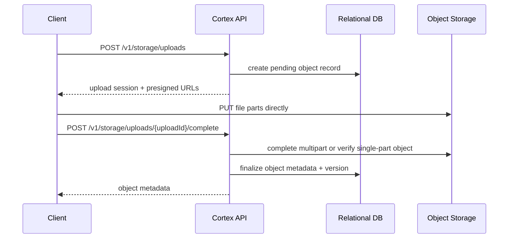

### 7.3 下载流

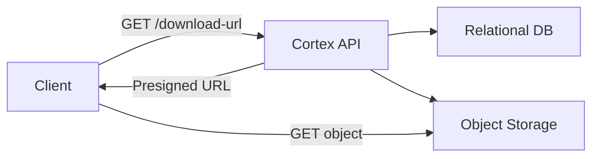

### 7.4 一致性要求

- 元数据先创建、对象后上传、完成接口最终提交。
- `objects.status = pending_upload` 时不可被下游知识流水线消费。
- `complete` 成功后才允许进入 `available`。
- 对象哈希校验失败必须拒绝提交。

## 8. Cognee 流程

### 8.1 Add

Add 负责把 `object`、`document`、`text`、`uri` 等输入归一化为可处理内容，并挂入数据集。

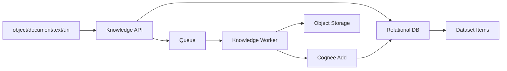

### 8.2 Cognify

依据 Cognee 的主流程，Cognify 处理顺序应为：

1. 文档分类
2. 权限检查
3. chunk 提取
4. graph 提取
5. summary 生成
6. data point / embedding 写入

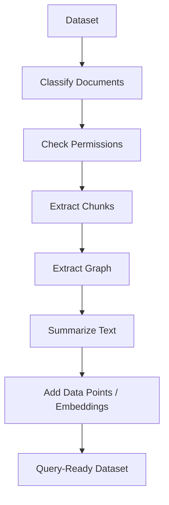

### 8.3 Memify

Memify 是在现有图谱上做 enrichment，而不是重新 ingest 原始数据。

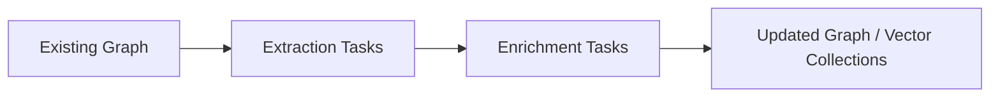

支持的内建管线应包括：

- `coding_rules`
- `triplet_embeddings`
- `session_persistence`
- `entity_consolidation`

### 8.4 Search

Search 统一封装：

- 向量语义检索
- 图遍历
- 混合召回
- 基于 session 的上下文延续

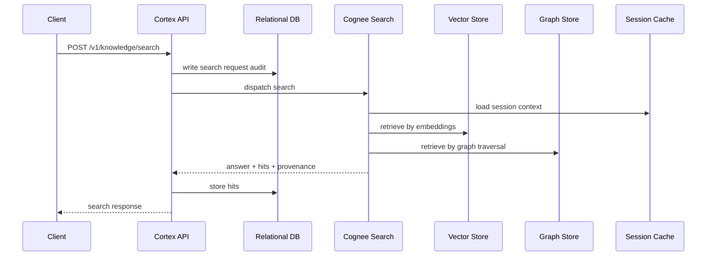

## 9. 数据存储责任划分

| 数据类型 | 存储位置 | 原因 |
| --- | --- | --- |
| 原始文件、HTML、Markdown、截图、PDF | 对象存储 | 容量弹性、低成本、迁移简单 |
| 元数据、状态、审计、引用关系 | 关系库 | 事务、一致性、可查询性 |
| embedding、向量索引 | 向量库 | 高维检索性能 |
| 图节点、边、路径 | 图数据库 | 图遍历与关系搜索 |
| 会话上下文、短期缓存 | Cache | 低延迟与 TTL 控制 |
| 链路、指标、日志 | Jaeger / Prometheus / 日志后端 | 业务面与遥测面解耦，便于独立伸缩 |
| 角色、权限、策略、授权审计 | 关系库 | 需要稳定查询、一致性和审计追溯 |

## 10. 身份认证与授权流

### 10.1 标准链路

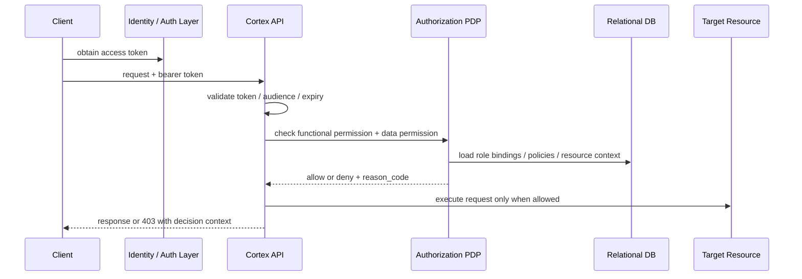

### 10.2 决策要点

- 第一步检查功能权限，例如 `parse:write`、`storage:download`、`knowledge:read`。
- 第二步检查数据权限，例如 tenant boundary、resource binding、`access_level`、`access_policy_json`。
- `Search` 和 `Download URL` 这类接口必须做资源级二次授权，不能只看功能 scope。
- 授权结果写入审计，同时把 `trace_id` 关联到遥测链路。

## 11. OpenTelemetry 遥测流

### 11.1 标准链路

所有 API 和异步任务都遵循同一条遥测路径：

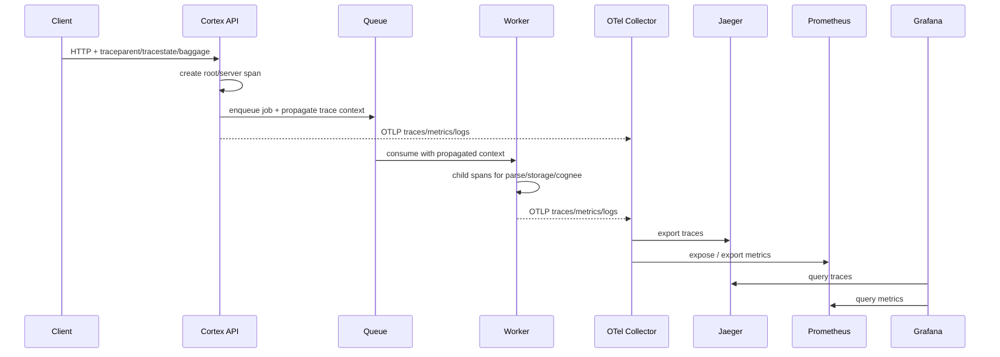

### 11.2 遥测上下文约定

- 入站请求必须接收并透传 `traceparent`、`tracestate` 与 `baggage`。
- 所有异步任务在入队时保存 trace context 快照，消费侧继续同一条 trace，而不是重新起根。
- 业务响应和错误响应都返回 `trace_id` / `request_id`，便于从 API 直接跳转到 Jaeger / Grafana。

### 11.3 发布与实验观测

- 蓝绿、金丝雀和 A/B 实验统一通过 `deployment.environment.name`、`service.version`、`cortex.deployment.ring`、`cortex.experiment.id`、`cortex.experiment.variant` 等属性落到 span 和 metric labels。
- Grafana Dashboard 以环境、版本、解析引擎、租户、实验桶为切片维度，比较错误率、延迟、fallback 率与搜索命中率。
- Prometheus 指标建议启用 exemplar，把高延迟与高错误请求关联回 Jaeger trace。

## 12. 高可用与恢复

### 12.1 幂等

- 所有创建型 API 支持 `Idempotency-Key`。
- 关键落库动作应以 `(tenant_id, endpoint_family, idempotency_key)` 去重。

### 12.2 重试

- 网络读取、对象存储写入、向量/图索引写入使用指数退避。
- webhook 投递采用独立重试队列，不阻塞主任务完成状态。

### 12.3 补偿

- 如果对象已上传但元数据提交失败，保留对象并生成未完成事件，等待补偿任务修正。
- 如果关系库已成功写入但下游索引失败，任务结果标记为 `failed`，对象和文档不回滚，方便重试。

## 13. 安全与审计

- 敏感凭据只保存引用，不落明文。
- 下载默认走短时预签名 URL。
- 所有任务状态变化写入 `job_events`。
- 搜索请求和命中保留审计轨迹，支持回答来源追溯。
- `baggage` 与日志标签中禁止放入明文凭据、PII 或对象正文。

## 14. 可扩展性结论

这套 DFD 的核心优点是：

1. Parse、Storage、Knowledge 三条链路共享统一元数据模型，但执行面彼此解耦。
2. 对象存储、关系库、向量库、图数据库都通过稳定抽象连接，迁移时不会牵动 API 语义。
3. 长任务全部走统一作业模型，便于扩展更多流水线而不改外部集成方式。
4. 遥测面独立于业务面，通过 OpenTelemetry 和 Collector 保持对 Jaeger、Prometheus、Grafana 的原生兼容。
