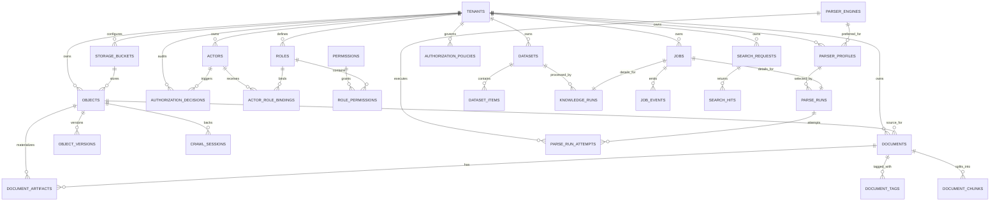

# Cortex Schema Design

## 1. 目标

`cortex-schema.md` 定义 Cortex 的规范化数据模型，作为以下内容之间的公共语义层：

1. `cortex-api.yaml` 的资源模型与字段契约。
2. `cortex-init.sql` 的关系型元数据表。
3. Parse / Storage / Cognee 三类运行时模块之间的边界。
4. 向 SQLite、PostgreSQL 以及未来其它标准 SQL 引擎迁移时的兼容约束。

该 schema 的基本原则是：关系型数据库只保存**元数据、控制面状态、审计与引用关系**；大体量原文与产物放入 S3 兼容对象存储；向量与图数据由适配器层落入外部向量库/图数据库。

## 2. 建模原则

### 2.1 厂商中立

- 主键统一由应用层生成字符串 ID，推荐 UUIDv7 或 ULID。
- 时间字段统一使用 UTC `TIMESTAMP`。
- 结构化扩展字段使用 JSON 文本序列化后保存到 `TEXT`，避免依赖某一家数据库的 JSON/JSONB 特性。
- 不把对象存储版本、向量索引主键、图数据库内部主键作为核心业务主键。

### 2.2 控制面与数据面分离

- **控制面**：`jobs`、`datasets`、`parse_runs`、`knowledge_runs`、`search_requests`。
- **数据面**：`objects`、`documents`、`document_artifacts`、`document_chunks`。
- **会话面**：`crawl_sessions`，用于 Crawl4AI 的持久上下文、cookie/localStorage 状态引用。
- **解析器控制面**：`parser_engines`、`parser_profiles`、`parse_run_attempts`，用于多引擎路由、模板和 fallback 轨迹。

### 2.3 一等公民实体

- `Object`：任意原始文件或衍生文件的统一抽象。
- `Document`：归一化后的“可被 LLM / Cognee 消费”的内容实体。
- `Dataset`：Cognee 的权限、索引、图谱、搜索边界。
- `Job`：一切长任务的统一编排外壳。
- `Authorization Policy`：功能权限、数据权限和审计决策的统一治理实体。

### 2.4 前向兼容

- 新产物类型通过 `document_artifacts.artifact_type` 扩展，而不是频繁改表。
- 新搜索命中类型通过 `search_hits.hit_type` 扩展。
- 新知识流水线通过 `knowledge_runs.operation_name` 和 `jobs.job_type` 扩展。

## 3. 逻辑域

| 逻辑域 | 核心表 | 说明 |
| --- | --- | --- |
| 租户与身份 | `tenants`, `actors` | 多租户隔离、审计归属、幂等与权限作用域 |
| 对象存储 | `storage_buckets`, `objects`, `object_versions` | S3 兼容对象元数据与版本追踪 |
| 解析器注册 | `parser_engines`, `parser_profiles`, `parse_run_attempts` | 解析引擎目录、配置模板、多引擎尝试记录 |
| 抓取会话 | `crawl_sessions` | 持久浏览器状态、storage state、代理/UA 档案引用 |
| 文档语义 | `documents`, `document_artifacts`, `document_tags`, `document_chunks` | LLM-ready Markdown、原始 HTML、截图、分块、标签 |
| 知识域 | `datasets`, `dataset_items`, `knowledge_runs` | Add / Cognify / Memify 的数据边界和执行轨迹 |
| 任务编排 | `jobs`, `job_events`, `parse_runs` | 异步作业、状态变更、事件与运行诊断 |
| 权限治理 | `permissions`, `roles`, `role_permissions`, `actor_role_bindings`, `authorization_policies`, `authorization_decisions` | 功能权限、数据权限、角色绑定、策略与审计 |
| 搜索审计 | `search_requests`, `search_hits` | 查询历史、命中、可追溯引用 |

## 4. 实体定义

### 4.1 Tenant

租户是资源命名、权限、幂等键和配额的最外层边界。

关键字段：

- `tenant_id`：稳定主键。
- `tenant_key`：人类可读唯一键。
- `status`：建议值 `active | suspended | deleted`。
- `metadata_json`：租户级策略，例如默认存储桶、默认地区、保留规则。

### 4.2 Actor

`Actor` 记录操作者或调用主体，既可以是人，也可以是 service account。

关键字段：

- `actor_type`：建议值 `user | service | webhook | system`。
- `actor_ref`：外部身份系统中的稳定引用。

### 4.3 Object

`Object` 代表 S3 兼容对象存储中的一个逻辑文件，是 Storage API 的核心实体。

关键字段：

- `bucket_id` + `object_key`：物理定位。
- `filename` / `content_type` / `size_bytes`：下载与审计所需的基础元数据。
- `checksum_sha256`：跨厂商迁移时的校验基准。
- `source_uri`：如果来自 URL、S3 URI、上传会话等，则记录其上游来源。
- `access_level` / `access_policy_json`：对象级数据权限控制与下载授权依据。
- `metadata_json`：用户自定义元数据与系统扩展字段。

设计取舍：

- `objects` 保存“当前快照”。
- `object_versions` 保存版本历史，避免依赖对象存储供应商内部的版本 ID 作为唯一事实来源。

### 4.4 ParserEngine

`ParserEngine` 是 Parse 平台的注册表实体，用于描述一个可用解析引擎，而不是一次具体运行。

关键字段：

- `engine_key`：稳定标识，例如 `crawl4ai`、`jina_reader`、`llamaparse`、`markitdown`、`docling`。
- `engine_family`：例如 `web_interactive`、`web_remote`、`document_remote`、`document_local`。
- `deployment_mode`：例如 `local`、`remote`、`hybrid`。
- `supported_source_types_json`：例如 `["url"]`、`["object_id", "uri"]`。
- `supported_formats_json`：支持的 MIME 或扩展名。
- `capability_flags_json`：例如 `interactive_web`、`ocr`、`structured_json`、`anti_bot`。

补充说明：

- 公开 API 面向用户暴露的是 `engine_id`，它直接对应 `engine_key`。
- `scene` 不要求落成一张新的强建模表；当前建议把公开 `scene` 与最终命中的 preset/profile 关系保存在配置目录与 `jobs.request_json` / `parse_runs.selection_policy` 中。
- 这样既保留了灵活扩展能力，又避免为了高频调整的场景模板频繁变更 SQL schema。

它让平台可以：

- 列出当前引擎目录
- 动态下线某个引擎
- 做灰度与 fallback
- 按能力筛选最合适引擎

### 4.5 ParserProfile

`ParserProfile` 是策略模板，用于把平台级路由规则和引擎特定配置从代码里抽离出来。

关键字段：

- `profile_key`：例如 `web_fast`、`web_authenticated`、`doc_high_fidelity`。
- `routing_mode`：例如 `explicit`、`ordered_fallback`、`capability_based`。
- `preferred_engine_id`
- `allowed_engines_json`
- `normalization_json`
- `fallback_policy_json`
- `engine_overrides_json`

Profile 是 Cortex 实现“策略模式 + 配置模板”最关键的控制面实体。

在新的公共 Parse API 中，`profile` 退居内部控制面：

- 调用方主要提交 `engine_id` 与可选 `scene`
- `scene` 经由编译器解析到内部 `profile_key`
- profile 继续承载 fallback、normalization 与 engine override

也就是说：`scene` 是公开契约，`profile` 是内部运维契约。

### 4.6 CrawlSession

用于 Crawl4AI 的长会话能力，支撑：

- storage state 复用
- 登录态延续
- 反机器人场景下的持久上下文
- 用户/系统配置的浏览器档案重用

`storage_state_object_id` 指向导出的状态文件对象，而不是把敏感 cookie 明文塞进表里。

### 4.7 Document

`Document` 是 Parse API 的标准产出，也是 Cognee Add 的首选输入之一。

关键字段：

- `source_type`：建议值 `url | object | text | uri`。
- `source_uri`：原始来源，URL 或 URI。
- `canonical_url`：归一 URL。
- `source_object_id`：如果文档是从文件、上传对象或导入对象转换而来，指向原始对象。
- `source_format` / `detected_mime_type`：来源格式与检测结果。
- `content_hash_sha256`：归一内容哈希，用于去重和幂等。
- `access_level` / `access_policy_json`：文档级查看、导出、搜索命中过滤边界。
- `metadata_json`：标题、作者、发布时间、语言、分类标签、链接统计等。
- `audit_json`：抓取策略、合规决策、人工标注、风险标记等。

### 4.8 DocumentArtifact

`document_artifacts` 解决“一个文档有多个衍生产物”的问题。

典型 `artifact_type`：

- `markdown`
- `raw_html`
- `screenshot`
- `pdf`
- `network_log`
- `console_log`
- `ssl_certificate`

这样可以兼容 Crawl4AI 的高级特性，而无需在 `documents` 表中不断加列。

### 4.9 DocumentChunk

`document_chunks` 代表面向 LLM 和知识管线的标准切片。

关键字段：

- `chunk_index`：文档内顺序。
- `heading_path`：章节路径，利于还原结构。
- `token_count` / `char_count`：用于模型预算与重分块。
- `chunk_text`：标准化文本内容。

生产建议：

- 小规模部署可直接把完整 chunk 存库。
- 超大规模部署可把 chunk 文本移入对象存储，仅在库中保留摘要和对象引用。

### 4.10 Dataset

`Dataset` 是 Cognee 的逻辑命名空间与权限边界。

关键字段：

- `dataset_key`：稳定业务键。
- `retention_class`：`standard | durable | temporary`。
- `status`：建议值 `active | archived | deleting`。
- `access_level` / `access_policy_json`：数据集共享边界、分类标签与策略条件。
- `metadata_json`：索引策略、默认搜索模式、权限声明、业务标签。

### 4.11 DatasetItem

`dataset_items` 使用多态关系，把不同类型的输入统一挂到数据集：

- `item_type = object`
- `item_type = document`
- `item_type = chunk`
- `item_type = session`

`source_stage` 用来记录该项是从 `parse`、`add`、`cognify` 还是 `memify` 进入数据集的。

### 4.12 Job

`jobs` 是 Cortex 的统一异步编排实体。

建议 `job_type`：

- `parse`
- `knowledge_add`
- `knowledge_cognify`
- `knowledge_memify`

建议 `status`：

- `queued`
- `running`
- `succeeded`
- `failed`
- `cancelled`

`request_json` 和 `result_json` 负责保存 API 请求快照与摘要结果，便于重放、审计与故障排查。

`target_id` 保存作业目标的可读定位符。对于 Parse Job，它可能是 URL、S3 locator、对象 ID 或文件 URI，因此字段长度不能按 UUID 处理；当前基线使用 `VARCHAR(2048)`，完整请求仍以 `request_json` 为准。

对于极简 Parse API，建议在 `jobs.request_json` 中明确保留：

- 原始 `sources`
- 原始 `engine_id`
- 原始 `scene`
- 编译后的内部 parse request 摘要

### 4.13 ParseRun、ParseRunAttempt 与 KnowledgeRun

这两张表是领域级运行明细：

- `parse_runs`：保存 source kind、选中的 profile、选中的 engine、fallback 链路、标准化配置、遥测上下文与最终结果文档引用。
- `parse_run_attempts`：保存一次 ParseRun 中每一次引擎尝试，包括第几次尝试、哪个引擎、状态、耗时、错误、诊断以及 span 关联。
- `knowledge_runs`：保存 Add/Cognify/Memify 的数据集、请求概要、结果摘要与遥测上下文。

它们与 `jobs` 是一对一关系，目的是让通用调度和领域细节解耦。

对 Parse 而言，公开 `engine_id` 与 `scene` 的命中结果建议体现在：

- `parse_runs.selection_policy`：保存 `requested_engine_id`、`requested_scene`、`resolved_profile_ref`
- `parse_run_attempts`：保存实际执行引擎顺序
- `documents.audit_json`：保存命中的公共 scene / 内部 profile 摘要，方便后续诊断与 A/B 比较

### 4.14 SearchRequest 与 SearchHit

搜索域单独建模，原因有三：

1. 需要保存搜索审计、成本和延迟。
2. 需要保留 provenance，支撑回答可追溯。
3. 未来可能支持结果缓存、会话级记忆、离线评测与实验分桶对比。

同时 `search_requests` 应保存 `trace_id`、`span_id`、deployment / experiment context，方便把回答质量、延迟和命中结果回连到具体发布版本。

### 4.15 TelemetryContext 与 ReleaseContext

Cortex 不建议把每个 span / metric 强建模到关系库中，否则会让控制面数据库承担时序系统的职责。关系库只保留与业务对象强关联、需要审计和回放的遥测上下文：

- `trace_id`
- `span_id`
- `traceparent`
- `tracestate`
- `baggage`
- `request_id`
- `service.version`
- `deployment.environment.name`
- `cortex.deployment.ring`
- `cortex.experiment.id`
- `cortex.experiment.variant`

这些字段优先以内联列 + JSON 摘要的方式挂在 `jobs`、`job_events`、`parse_runs`、`knowledge_runs`、`search_requests` 上，既保留标准兼容性，也避免为供应商特定遥测后端设计表结构。

### 4.16 Permission、Role、Policy 与 DecisionAudit

Cortex 的授权模型分成四层：

1. `permissions`：稳定的 permission catalog，表达平台定义的功能权限与数据操作语义。
2. `roles`：一组 permission 的聚合，可按租户创建内置或自定义角色。
3. `actor_role_bindings` / `authorization_policies`：把角色和条件绑定到 actor、资源或租户边界。
4. `authorization_decisions`：保存最终 allow / deny 决策审计。

关键字段建议：

- `permissions.permission_key`：例如 `parse:write`、`storage:download`、`dataset:read`
- `permissions.permission_kind`：`functional | data`
- `roles.scope_level`：`tenant | resource`
- `actor_role_bindings.resource_type` / `resource_id`：支持租户级与资源级绑定
- `authorization_policies.subject_selector_json`：角色、actor、group、service account 等匹配条件
- `authorization_policies.resource_selector_json`：tenant、dataset、object、document、tag、classification 等资源匹配条件
- `authorization_policies.condition_json`：purpose-of-use、environment、time window、release ring 等 ABAC 条件
- `authorization_decisions.reason_code`：例如 `insufficient_scope`、`cross_tenant_denied`、`resource_access_denied`

设计原则：

- 功能权限以标准 scope / permission key 为主，适合放入 token。
- 数据权限以 role binding + policy evaluation 为主，避免把大规模资源白名单塞进 token。
- `authorization_decisions` 是审计表，不承担在线实时 PDP 的主存储职责。
- 内建 token issuer 的 bootstrap secret、JWT shared secret、introspection client secret 等敏感凭据不进入业务 SQL 表，而是保留在环境变量、secret file 或外部 secret manager。
- `/v1/auth/token` 这类 bootstrap issuance 只负责生成 bearer token，不引入额外的 user/password 凭据表，避免把 Cortex 扩展成完整身份目录系统。

## 5. 关系图



## 6. 规范化字段约定

### 6.1 通用审计字段

所有核心实体建议至少包含：

```json
{
  "created_at": "2026-04-12T10:00:00Z",
  "updated_at": "2026-04-12T10:00:00Z",
  "created_by": "act_01...",
  "updated_by": "act_01..."
}
```

### 6.2 `documents.metadata_json`

推荐结构：

```json
{
  "title": "Cortex Design",
  "author": "Example Author",
  "publish_date": "2026-04-12T00:00:00Z",
  "language": "zh-CN",
  "category_tags": ["architecture", "api"],
  "description": "Short abstract",
  "link_counts": {"internal": 12, "external": 4},
  "media_counts": {"images": 3, "videos": 0, "documents": 1}
}
```

### 6.3 `documents.audit_json`

推荐保存：

- 抓取配置摘要
- robots 决策
- 是否启用 stealth / undetected
- 代理配置引用
- 风险标签
- 人工审核记录

### 6.4 `jobs.request_json` / `jobs.result_json`

不追求保存全部原始 payload，而是保存：

- 幂等重试所需关键字段
- 领域运行摘要
- 关联资源 ID
- 用户可读错误

### 6.5 `telemetry_context_json` / `deployment_context_json` / `experiment_context_json`

推荐结构：

```json
{
  "trace_id": "4bf92f3577b34da6a3ce929d0e0e4736",
  "span_id": "00f067aa0ba902b7",
  "traceparent": "00-4bf92f3577b34da6a3ce929d0e0e4736-00f067aa0ba902b7-01",
  "tracestate": "vendor=value",
  "baggage": {
    "tenant.id": "tenant_01",
    "cortex.experiment.id": "exp_parse_router_v2",
    "cortex.experiment.variant": "B"
  },
  "request_id": "req_01"
}
```

```json
{
  "service_version": "1.2.0",
  "deployment_environment_name": "prod",
  "deployment_ring": "canary",
  "release_channel": "experiment"
}
```

设计约束：

- 标准字段优先单独成列，便于跨库索引与过滤。
- 扩展标签进入 JSON，避免 schema 高频抖动。
- URL、对象 key、原始查询语句等高基数字段不直接进入 metric labels，只保存在审计 JSON 或对象存储中。

### 6.6 `access_level` / `access_policy_json`

为兼顾查询效率和策略扩展，推荐在 `objects`、`documents`、`datasets` 等核心资源上同时保留：

- `access_level`：稳定、低基数、可索引的访问层级
- `access_policy_json`：扩展的 ABAC 条件与资源授权元数据

推荐 `access_level`：

- `tenant_private`
- `tenant_shared`
- `restricted`
- `confidential`

推荐 `access_policy_json` 结构：

```json
{
  "owner_actor_id": "act_01",
  "classification_labels": ["internal", "finance"],
  "allowed_role_keys": ["knowledge_reader"],
  "denied_role_keys": [],
  "purpose_tags": ["rag", "audit"],
  "constraints": {
    "environment": ["prod"],
    "release_ring": ["stable", "canary"]
  }
}
```

设计约束：

- `access_level` 只承接稳定枚举，适合行级过滤和索引。
- `access_policy_json` 只承接扩展条件，不替代 permission catalog。
- Search、Download、Job 查询都应把资源级 `access_level` / `access_policy_json` 纳入决策。

## 7. 状态机建议

### 7.1 Object

`pending_upload -> available -> archived -> deleted`

### 7.2 Document

`pending -> parsed -> indexed -> archived -> deleted`

其中 `indexed` 表示文档已进入至少一个数据集并完成至少一次 Add/Cognify。

### 7.3 Job

`queued -> running -> succeeded`

失败支路：

`queued/running -> failed`

取消支路：

`queued/running -> cancelled`

## 8. 迁移与兼容策略

### 8.1 数据库迁移

- 新增列时优先追加可空列或带默认值列。
- 优先通过新增表表达新能力，而不是频繁重写核心表。
- 所有枚举值在应用层校验，数据库只做轻约束，降低跨库迁移复杂度。
- 遥测增强优先采用 `trace_id` / `span_id` 等稳定列 + `*_context_json` 扩展列，避免为 Jaeger、Prometheus、Grafana 任一后端写死结构。
- 授权增强优先采用稳定 permission key、role key、`access_level` 与 `*_policy_json` 组合，避免绑定某一种 PDP 产品模型。

### 8.2 对象存储迁移

只依赖以下通用字段：

- bucket
- key
- etag
- version_ref
- checksum_sha256

迁移时可通过遍历 `objects` + `object_versions` 复制并校验哈希，无需业务层改模型。

### 8.3 向量库 / 图库迁移

SQL 中只保留：

- 数据集边界
- 作业状态
- 搜索审计
- 文档与 chunk 的稳定 ID

这样切换向量库或图数据库时，不会波及 API 主模型和对象存储模型。

## 9. 索引策略

建议优先维护以下访问路径：

- 按租户和时间查询对象：`objects(tenant_id, created_at)`
- 按源 URI / URL 去重：`documents(source_uri)`、`documents(content_hash_sha256)`
- 按作业状态轮询：`jobs(tenant_id, status, submitted_at)`
- 按 `trace_id` 追踪问题请求：`jobs(trace_id)`、`job_events(trace_id, event_at)`、`search_requests(trace_id, created_at)`
- 按 actor / role / resource 求值授权：`actor_role_bindings(actor_id, tenant_id)`、`authorization_policies(tenant_id, status, priority)`、`authorization_decisions(trace_id, created_at)`
- 按数据集追踪知识流水线：`knowledge_runs(dataset_id, operation_name)`
- 按搜索时间窗口审计：`search_requests(tenant_id, created_at)`

## 10. 非目标

以下内容不在关系库中做强建模：

- 向量 embedding 实体本身
- 图数据库内部节点/边 ID
- 浏览器原生 cookie 明文
- 大体量截图、HTML、PDF、网络日志正文

它们要么进入对象存储，要么留在相应引擎中，由适配器和引用 ID 连接回 Cortex 统一模型。
