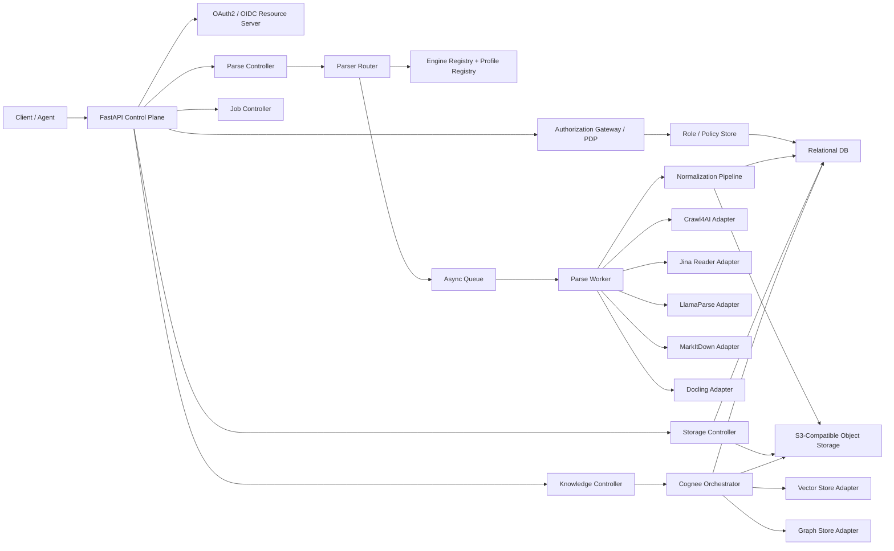

# Cortex Technical Design

## 0.1 2026-04-19 Crawl4AI 容器运行时修正

本节优先级高于前文较早版本中“本地 Compose 暂时跳过 Crawl4AI 浏览器准备”的说明。

### 目标

让 `crawl4ai` 在仓内交付的 API / Parse Worker 容器里真正可运行，而不是只在本地 Docker 联调时绕过浏览器启动。

### 最终容器策略

1. `cortex-api` 与 `cortex-parse-worker` 统一改为基于 Playwright 官方 Python 镜像构建：
   `mcr.microsoft.com/playwright/python:v1.58.0-noble`
2. 构建阶段不再执行 `playwright install --with-deps`；该基础镜像已经自带 Playwright 浏览器二进制与 Linux 系统依赖。
3. 运行阶段继续保留 `prepare_crawl4ai_runtime.py` 的预检链路，因此容器启动时仍会真实验证浏览器是否可用。
4. Crawl4AI 运行时解析新增显式容器覆盖变量：
   - `CORTEX_PLAYWRIGHT_BROWSERS_PATH`
   - `CORTEX_CRAWL4AI_BASE_DIRECTORY`
5. Compose 默认设置 `CORTEX_PLAYWRIGHT_BROWSERS_PATH=/ms-playwright`，覆盖 `configs/cortex.runtime.*.yaml` 中面向宿主机的浏览器目录。
6. `cortex-api` 与 `cortex-parse-worker` 默认启用 `init: true` 和 `shm_size: 1gb`，降低 Chromium 在 Docker 中的僵尸进程与共享内存问题。

### 这样设计的原因

- 既保持 API 与 runtime config 的厂商中立，又采用了 Playwright 官方文档推荐的容器化浏览器交付路径。
- 去掉了此前 `docker compose up -Build` 依赖在线 Debian 镜像源健康度的脆弱点。
- 保留了 Crawl4AI 的 fail-fast 运行时校验，而不是通过静默禁用浏览器能力来换取“看起来能启动”。

## 0. 2026-04-17 Docker Compose 更新

为避免“本地联调用 Compose 很顺手，但生产部署被顺手带偏”这种常见问题，当前技术方案正式将 Compose 拆分为两层：

### 0.1 `compose.local.yaml`

用途：开发机、本地联调、集成测试、冒烟验证。

原则：
- 一条命令同时启动依赖与 Cortex 核心服务。
- 直接对齐仓库中的 `.env` 和 `configs/cortex.runtime.local.yaml`。
- Cortex 容器内部统一改用服务名寻址，而不是继续使用宿主机 `127.0.0.1`。
- 保留本地可观测性链路，方便直接联调 OTel / Jaeger / Prometheus / Grafana。

当前本地栈包含：
- `postgres`
- `minio`
- `redis`
- `otel-collector`
- `jaeger-all-in-one`
- `prometheus`
- `grafana`
- `cortex-migrate`
- `cortex-api`
- `cortex-parse-worker`
- `cortex-knowledge-worker`

补充约定：
- 本地 compose 默认不在镜像构建阶段预装 Crawl4AI 的 Playwright 浏览器与系统依赖。
- 本地 compose 也默认跳过 API / Parse Worker 启动时的 Crawl4AI 浏览器预探针。
- 目的不是关闭 `crawl4ai` 能力本身，而是避免开发机在调试通用 API 时被浏览器依赖下载或 Debian mirror 抖动阻塞。
- 生产镜像与专用浏览器型解析环境仍应保留 fail-fast 的浏览器预装路径。

推荐入口：

```powershell
powershell -ExecutionPolicy Bypass -File scripts\dev\stack.ps1 up -Build
```

等价原生命令：

```powershell
docker compose -p cortex-local -f compose.local.yaml up -d --build
```

### 0.2 `compose.prod.yaml`

用途：预发、自托管生产、云上容器运行时。

原则：
- 只编排 Cortex 核心容器，不内置本地开发依赖。
- 默认假定 PostgreSQL、S3、Redis、OTel Collector、身份提供方由外部基础设施提供。
- API、Parse Worker、Knowledge Worker 可独立部署和扩缩容。

当前生产编排包含：
- `cortex-migrate`
- `cortex-api`
- `cortex-parse-worker`
- `cortex-knowledge-worker`

推荐入口：

```bash
docker compose --env-file .env.prod -f compose.prod.yaml up -d
```

如需先做迁移：

```bash
docker compose --env-file .env.prod -f compose.prod.yaml --profile migrate up cortex-migrate
docker compose --env-file .env.prod -f compose.prod.yaml up -d
```

### 0.3 为什么必须拆分 local / prod

原因有三类：

1. 本地方便的 MinIO / Postgres / Grafana 并不等于生产的最佳拓扑。
2. 本地调试用的弱默认值、开放端口、弱鉴权配置不应直接进入生产。
3. API、Parse Worker、Knowledge Worker 在生产中的容量模型不同，需要独立伸缩。

因此本设计的正式结论是：
- `compose.local.yaml` 负责“本地全栈可运行”
- `compose.prod.yaml` 负责“核心服务可部署”
- 更底层的云资源与托管中间件由 IaC、平台配置或独立运维编排接管

### 0.4 与镜像构建的关系

Compose 分层依赖于当前已经完成的多目标镜像策略：
- `api`
- `parse-worker`
- `parse-worker-docling`
- `knowledge-worker`
- `evaluation-worker`
- `evaluation-worker-runtime`
- `synthesis-worker`
- `synthesis-worker-runtime`

其中 `knowledge-worker` 现在显式依赖 `cortex-knowledge[runtime]`，避免出现镜像能构建、容器能启动，但运行时缺少 Cognee 主依赖的隐性错误。

`parse-worker-docling` 是面向 Docling / OCR / 高保真文档转换的重型可选镜像。默认 `api` 与 `parse-worker` 不再安装 `docling`、`torch`、`opencv-python` 和完整 `markitdown[all]` 依赖，避免所有在线服务都承担 10GB 级镜像体积和大 wheel 下载失败风险。需要 Docling 能力时，通过 Compose profile 或生产编排单独启用该 worker，并按作业路由/队列策略独立扩缩容。

`evaluation-worker` 与 `synthesis-worker` 默认同样走轻量镜像，只安装 Cortex 自身编排、队列、DB、Storage 与 HTTP service adapter 所需依赖。DeepEval、SDV 及其可能拉入的模型/数据科学依赖只进入 `evaluation-worker-runtime`、`synthesis-worker-runtime` 这两个显式重型 target。这样默认 `docker compose up --build` 不会因为本地 SDK 类评测/合成引擎拉取大 wheel 而把 API 和核心 worker 镜像放大。

基础镜像按运行角色拆分：

- 浏览器型运行单元（`api`、`parse-worker`、`parse-worker-docling`）默认基于 `mcr.microsoft.com/playwright/python:v1.58.0-noble`，避免构建阶段现场安装 Chromium 与 Linux 依赖。
- 非浏览器型运行单元（`knowledge-worker`、`evaluation-worker`、`synthesis-worker` 及其 runtime 变体）默认基于 `ghcr.io/astral-sh/uv:python3.12-bookworm-slim`，避免本地一键构建被 Docker Hub `python:*` 拉取波动阻断。
- `uv` 不再通过 `pip install` 安装，而是从 `ghcr.io/astral-sh/uv:0.7.22` 复制 `/uv` 与 `/uvx`，减少 PyPI 网络故障点。
- 本地 Compose 暴露 `CORTEX_PYTHON_BASE_IMAGE`、`CORTEX_UV_IMAGE`、`CORTEX_PLAYWRIGHT_PYTHON_BASE_IMAGE` 覆盖点，方便企业内网镜像仓库、镜像加速器或离线制品库接管。

## 1. 文档目标

本文档给出 Cortex 的完整技术设计，覆盖：

1. `Parse API`：面向 URL、对象存储文件和外部 URI 的统一解析能力。
2. `Storage API`：面向 S3 兼容对象存储的上传、下载与元数据治理。
3. `Cognee API`：面向知识数据集的 Add / Cognify / Memify / Search 工作流。

本版设计重点解决三个核心问题：

- Parse 不再绑定单一解析器，而是升级为**可扩展、可插拔、多引擎路由机制**。
- 所有元数据与控制面设计坚持**Vendor-Neutrality**，避免绑定单一云厂商或数据库能力。
- API、Worker、对象存储、知识引擎之间通过**统一资源模型**与**异步作业模型**耦合，而不是点对点硬编码。

## 2. 设计原则

### 2.1 厂商中立

- 对象存储只依赖标准 S3 协议。
- 关系型元数据只依赖可迁移 SQL 子集。
- 向量库与图数据库通过适配器层解耦。
- 解析器能力通过插件契约接入，不把某家供应商的字段直接暴露成平台主模型。

### 2.2 Parse 引擎可插拔

Parse 的主接口只关心：

- 输入来源
- 解析意图
- 标准化输出
- 元数据契约
- 作业治理

具体由哪个引擎执行、如何回退、引擎特定参数怎么映射，全部交给 Parser Router、Engine Adapter 和 Profile Registry。

### 2.3 AI 原生

- 主输出是 LLM-ready Markdown。
- 支持标准化元数据、chunking、可追溯 provenance。
- 为 Cognee、RAG、GraphRAG、Agent Search 预留稳定对象模型。

### 2.4 高可用与可维护

- 长任务统一走 Job 模型。
- 大文件不经 API 中转。
- 失败保留诊断与中间产物，方便补偿与重试。
- 通过配置模板和策略模式减少硬编码分支。

### 2.5 最小权限与策略分层

- 认证与授权分离：身份真实性由 OAuth 2.0 / OIDC 体系负责，权限判定由 Cortex 授权层负责。
- 功能权限与数据权限分离：接口可调用性通过 scope / permission 控制，具体资源可见性通过 RBAC + ABAC 混合策略控制。
- 默认拒绝：跨租户访问、未声明 scope、未命中资源策略的请求一律拒绝。
- 审计优先：每次授权决策都可关联到 actor、tenant、resource、policy、trace_id。

## 3. 总体架构



## 4. 技术栈

### 4.1 平台基础

- API 框架：`FastAPI`
- 依赖管理：`uv`
- ORM / SQL：`SQLAlchemy` + Alembic 风格迁移
- 异步作业：`Arq` 或兼容队列 Worker
- 对象存储：`boto3` / S3 兼容客户端

### 4.2 Parse 引擎层

- `crawl4ai`：交互式网页抓取、认证态、反机器人、截图/PDF/SSL 采集
- `Jina Reader`：远程 URL 到 LLM-friendly 文本 / Markdown / JSON 抽取
- `LlamaParse`：高保真文档解析、广泛文件格式支持、页级结构结果
- `MarkItDown`：本地轻量文件转 Markdown
- `Docling`：本地高质量文档理解与结构化导出

### 4.3 知识处理层

- `cognee`
- 外挂向量库适配器
- 外挂图库适配器

### 4.4 基于 `uv` 的 Workspace 模型

编码阶段建议把 Cortex 组织为一个 `uv workspace` 单仓工程，而不是单一巨型包。原因是：

- API、Parse Worker、Knowledge Worker 的运行时边界天然不同。
- Parse 引擎依赖差异很大，需要按部署角色裁剪安装集。
- `uv` workspace 允许多个成员共享一个 `uv.lock`，同时保持每个成员独立 `pyproject.toml`。
- 后续即使替换某个子模块的构建后端，也不会影响整个仓库的依赖解算与运行方式。

根工作区建议只承担三件事：

1. 统一 Python 版本与依赖锁定。
2. 统一 lint / test / type-check / docs 工具链。
3. 聚合 workspace member，不承载业务运行时代码。

推荐的根级 `pyproject.toml` 模型如下：

```toml
[project]
name = "cortex-workspace"
version = "0.1.0"
requires-python = ">=3.12,<3.14"
dependencies = []

[dependency-groups]
dev = [
  "pytest>=8.3,<9",
  "pytest-asyncio>=0.25,<0.26",
  "httpx>=0.28,<0.29",
  "respx>=0.22,<0.23",
]
lint = [
  "ruff>=0.11,<0.12",
]
types = [
  "pyright>=1.1.390",
]
docs = [
  "mkdocs-material>=9.6,<10",
]

[tool.uv]
package = false

[tool.uv.workspace]
members = [
  "apps/api",
  "workers/parse-worker",
  "workers/knowledge-worker",
  "packages/common",
  "packages/contracts",
  "packages/domain",
  "packages/db",
  "packages/auth",
  "packages/storage",
  "packages/parse",
  "packages/knowledge",
  "packages/observability",
]
```

这个模型的关键点：

- 根项目不打包，只做 workspace 与工具链聚合。
- 每个 workspace member 独立声明自己的运行依赖。
- 整个仓库共享一个 `uv.lock`，保证 API、Worker、测试环境解算一致。
- 纯 Python 成员默认使用 `uv_build`；若未来某个成员需要原生扩展，再单独切换该成员的 build backend。

### 4.5 推荐目录结构

```text
cortex/
  pyproject.toml
  uv.lock
  .python-version
  README.md
  otel-collector.yaml
  specs/
    cortex-api.yaml
    cortex-dfd.md
    cortex-init.sql
    cortex-prd.md
    cortex-schema.md
    cortex-tech.md
    cortex-tasks.md
  apps/
    api/
      pyproject.toml
      src/cortex_api/
        main.py
        lifespan.py
        dependencies/
        middleware/
        routers/
        services/
  workers/
    parse-worker/
      pyproject.toml
      src/cortex_worker_parse/
        main.py
        bootstrap.py
        handlers/
    knowledge-worker/
      pyproject.toml
      src/cortex_worker_knowledge/
        main.py
        bootstrap.py
        handlers/
  packages/
    common/
      pyproject.toml
      src/cortex_common/
    contracts/
      pyproject.toml
      src/cortex_contracts/
    domain/
      pyproject.toml
      src/cortex_domain/
    db/
      pyproject.toml
      alembic.ini
      migrations/
      src/cortex_db/
    auth/
      pyproject.toml
      src/cortex_auth/
    storage/
      pyproject.toml
      src/cortex_storage/
    parse/
      pyproject.toml
      src/cortex_parse/
        adapters/
        normalization/
        profiles/
    knowledge/
      pyproject.toml
      src/cortex_knowledge/
    observability/
      pyproject.toml
      src/cortex_observability/
  tests/
    contract/
    integration/
    e2e/
  scripts/
    dev/
    ci/
```

约束如下：

- 一律使用 `src/` 布局，避免本地路径污染导入结果。
- `apps/` 与 `workers/` 只放进程入口、依赖装配与路由，不直接承载核心领域逻辑。
- `packages/` 承载可复用模块，是长期演进的主战场。
- `tests/contract`、`tests/integration`、`tests/e2e` 放在根目录，方便跨成员联调。

### 4.6 包职责与依赖方向

| 成员 | import root | 核心职责 | 允许直接依赖 |
| --- | --- | --- | --- |
| `packages/common` | `cortex_common` | settings、ID、时钟、异常、JSON/URI 工具、幂等与通用 helper | 无 |
| `packages/contracts` | `cortex_contracts` | 与 OpenAPI 对齐的 Pydantic DTO、枚举、ProblemDetails、事件载荷 | `cortex_common` |
| `packages/domain` | `cortex_domain` | 领域实体、值对象、服务协议、状态机、业务规则 | `cortex_common` |
| `packages/db` | `cortex_db` | SQLAlchemy metadata、session、repository、迁移、持久化模型 | `cortex_common`, `cortex_domain` |
| `packages/auth` | `cortex_auth` | token 校验、caller context、scope 判定、RBAC/ABAC、授权审计 | `cortex_common`, `cortex_contracts`, `cortex_db` |
| `packages/storage` | `cortex_storage` | S3 客户端抽象、upload/download、checksum、multipart、object metadata 服务 | `cortex_common`, `cortex_contracts`, `cortex_db` |
| `packages/parse` | `cortex_parse` | router、engine registry、profile loader、adapter、normalizer、artifact persistence | `cortex_common`, `cortex_contracts`, `cortex_domain`, `cortex_db`, `cortex_storage`, `cortex_observability` |
| `packages/knowledge` | `cortex_knowledge` | dataset service、Cognee orchestration、search service、graph/vector adapter | `cortex_common`, `cortex_contracts`, `cortex_domain`, `cortex_db`, `cortex_storage`, `cortex_observability` |
| `packages/observability` | `cortex_observability` | OTel bootstrap、metric helper、logger correlation、trace propagation | `cortex_common` |
| `apps/api` | `cortex_api` | FastAPI app、routers、dependency injection、middleware、lifespan | 上述所有业务包 |
| `workers/parse-worker` | `cortex_worker_parse` | Parse job 消费、Worker bootstrap、错误恢复、重试语义 | `cortex_parse`, `cortex_storage`, `cortex_db`, `cortex_observability`, `cortex_common` |
| `workers/knowledge-worker` | `cortex_worker_knowledge` | Add/Cognify/Memify/Search 后台任务执行 | `cortex_knowledge`, `cortex_db`, `cortex_storage`, `cortex_observability`, `cortex_common` |

必须遵守的依赖规则：

- `domain` 不依赖 `FastAPI`、`SQLAlchemy`、`boto3`、`cognee` 等外部框架。
- `contracts` 不依赖 ORM 模型，只表达接口契约。
- `apps/api` 和 `workers/*` 不直接拼接 SQL，也不直接操作底层引擎 SDK，必须通过 package service / repository / adapter 调用。
- 引擎特定实现只能存在于 `cortex_parse.adapters.*`，不能渗透到 API 层。

### 4.7 Parse 引擎代码模型

`packages/parse` 内部建议再做一层清晰分层：

```text
src/cortex_parse/
  models/
  router/
  registry/
  profiles/
  adapters/
    crawl4ai.py
    jina_reader.py
    llamaparse.py
    markitdown.py
    docling.py
  normalization/
    markdown.py
    metadata.py
    provenance.py
  services/
  persistence/
```

其中：

- `models/`：`ParseRequest`、`ParsedDocument`、`EngineAttempt`、`ParseDiagnostics`
- `router/`：引擎选择、fallback、质量阈值判定
- `registry/`：引擎注册与能力标签
- `profiles/`：YAML / DB profile 装载与校验
- `adapters/`：每个解析引擎的协议实现
- `normalization/`：Markdown、元数据、分类标签、时间字段标准化
- `persistence/`：document、artifact、attempt 的持久化

引擎依赖不建议全部写死在 API 包中，推荐由 `cortex_parse` 通过 extras 控制：

- `parse[crawl4ai]`
- `parse[llamaparse]`
- `parse[markitdown]`
- `parse[markitdown-all]`
- `parse[docling]`
- `parse[document-engines]`
- `parse[default-engines]`
- `parse[all-engines]`

`jina_reader` 仅依赖 `httpx` 与运行时 API Key，不需要额外 wheel 组。

这样 Parse Worker 可按部署角色裁剪安装集：

- 默认 API / Parse Worker 安装 `default-engines`：`crawl4ai`、`llama_parse`、`markitdown` 基础包。
- 仅高保真文档节点安装 `document-engines`：`docling` 与完整 `markitdown[all]`。
- 需要所有能力的混合节点安装 `all-engines`，但不建议作为默认 API 镜像基线。
- Docling 节点建议独立镜像、独立 worker、独立扩缩容，避免 `docling -> torch`、`rapidocr -> opencv-python` 等重型链路影响默认在线服务构建和发布。

### 4.8 配置与环境模型

配置分三层，不把策略硬编码在 Python 里：

1. **Root Tooling Config**
   - 根级 `pyproject.toml`
   - `uv.lock`
   - lint / test / type-check 配置
2. **Runtime Settings**
   - `cortex_common.settings`
   - 使用 `pydantic-settings` 从环境变量、secret file、默认值加载
   - 只承载应用基础设施参数和统一运行时配置文件路径，如 `CORTEX_RUNTIME_CONFIG_PATH`
3. **Business Policy Config**
   - `configs/cortex.runtime.yaml`
   - `packages/parse/profiles/*.yaml`
   - `packages/auth/policies/*.yaml` 或 DB policy

建议的 settings 切分：

- `AppSettings`
- `DatabaseSettings`
- `S3Settings`
- `QueueSettings`
- `AuthSettings`
- `RuntimeConfigSettings`
- `ParseSettings`
- `CogneeSettings`
- `TelemetrySettings`

其中与鉴权直接相关、且必须留在环境侧而不是 runtime YAML 中的配置包括：

- `CORTEX_AUTH_MODE`
- `CORTEX_AUTH_JWT_SHARED_SECRET`
- `CORTEX_AUTH_INTROSPECTION_URL`
- `CORTEX_AUTH_INTROSPECTION_CLIENT_ID`
- `CORTEX_AUTH_INTROSPECTION_CLIENT_SECRET`

#### 4.8.1 统一运行时配置文件

真正部署时，Cortex 不再把 Crawl4AI、Jina Reader、LlamaParse、MarkItDown、Docling、Cognee 的配置散落在各个 adapter 或 `.env` 中，而是统一收敛到仓库内的：

- `configs/cortex.runtime.yaml`
- `configs/cortex.runtime.local.yaml`
- `configs/cortex.runtime.staging.yaml`
- `configs/cortex.runtime.prod.yaml`

其中 `parse.engines.crawl4ai.base_directory_ref` 用于集中管理 Crawl4AI 的运行期工作目录。它覆盖 provider 默认的用户 Home 目录，把缓存、日志、内部 SQLite、下载文件和浏览器状态统一收敛到仓库内或挂载卷中的可写路径，避免不同主机、容器或服务账号下出现权限漂移。

它是**受版本控制的运行时契约**，用于描述：

- Parse 默认 profile
- 各解析引擎的启停状态
- 各引擎的 provider-specific 默认参数
- 统一的 secret reference
- Cognee 的 LLM / embedding / vector DB / graph DB / migration DB 配置

LLM / Embedding 相关能力统一采用“模型供应商槽位 + runtime 引用”的 OpenAI-compatible provider contract：

- `.env` / secret manager 只声明供应商槽位，例如 `OPENAI_BASE_URL`、`OPENAI_API_KEY`、`OPENAI_MODEL_ID`、`OPENAI_EMBEDDING_MODEL_ID`，以及 `OPENROUTER_*`、`OLLAMA_*`、`GEMINI_*`、`QWEN_*`、`LOCAL_LLM_*` 等同构变量。
- runtime YAML 决定不同 API 类型引用哪个槽位，例如 Knowledge 引用 `OPENROUTER_*`，Evaluation DeepEval 可引用 `KIMI_*`，Synthesis DeepEval Synthesizer 可引用 `QWEN_*`，也可以通过 `configs/cortex.runtime.ollama.yaml` 把 Knowledge、Evaluation 和 Synthesis 统一切到本地 `OLLAMA_*`。
- `llm_provider`、`embedding_provider`、BAML LLM 等 Cognee SDK 适配字段不是用户必须维护的配置项；Cortex 会在 Cognee adapter 中按 OpenAI-compatible 默认值补齐，并从 `llm_model_ref`、`llm_endpoint_ref`、`llm_api_key_ref` 自动派生 BAML LLM 字段。`openrouter` 与 `ollama` 作为 Cortex provider alias 会在调用 Cognee SDK 前映射为 OpenAI-compatible provider。
- DeepEval 与 DeepEval Synthesizer 通过 runtime schema 中的 `model_ref`、`api_url_ref`、`api_key_ref` 读取当前引擎引用的 provider 槽位，并在运行前同步设置 `OPENAI_API_URL`、`OPENAI_BASE_URL`、`OPENAI_API_BASE`、`LITELLM_API_BASE`，兼容 OpenAI SDK、LiteLLM 与 DeepEval 的常见读取方式。
- EvalScope 不引入模型供应商 API Key 字段；它要么调用外部 EvalScope HTTP service，要么在 runtime worker 内以 Python SDK self-hosted service 模式运行，外部服务鉴权通过 `evaluation.engines.evalscope.headers` 表达。

Ollama 接入约定：

- 使用 Ollama 的 OpenAI-compatible `/v1` 协议，宿主机直接访问可写 `http://localhost:11434/v1`，Docker Compose 内推荐写 `http://host.docker.internal:11434/v1`。
- `OLLAMA_API_KEY=ollama` 是 OpenAI SDK / TensorZero 等兼容客户端要求的非空占位值；Ollama 本地服务默认会忽略这个值。
- `OLLAMA_MODEL_ID` 与 `OLLAMA_EMBEDDING_MODEL_ID` 必须先在宿主机 `ollama pull`。默认示例使用 `llama3.1:8b` 和 `nomic-embed-text`，embedding 维度按 `768` 配置；如果改用其他 embedding 模型，需要同步更新 `OLLAMA_EMBEDDING_DIMENSIONS`。
- Parse 域不默认消费 LLM provider slot；Crawl4AI、Jina Reader、LlamaParse、MarkItDown、Docling 仍通过 `parse.engines.*` 独立配置。Evaluation / Synthesis 的 DeepEval 引擎、Knowledge 的 Cognee 通过 runtime refs 引用 `OLLAMA_*`。

推荐约定：

- `.env` 只放 secret、endpoint、模型 ID、embedding 维度、或 `CORTEX_RUNTIME_CONFIG_PATH` 这类 coarse override
- 对象存储在容器/服务网格内部地址与外部调用方可达地址不一致时，必须拆分
  `CORTEX_S3_ENDPOINT`（控制面直连地址）与 `CORTEX_S3_PUBLIC_ENDPOINT`（预签名 URL 对外地址）
- `configs/cortex.runtime.yaml` 放 provider 行为与运行时模板
- `configs/cortex.runtime.<env>.yaml` 放可直接切换的环境化运行时配置
- `packages/parse/profiles/*.yaml` 放 route / fallback / normalization 策略
- request 级 `engine_options` 只做最后一跳覆盖，不承担长期运维配置
- 浏览器型 provider 的工作目录、代理引用、storage state 等运行时基础设施项也应留在 runtime config，而不是散落到临时请求里

Docling / RapidOCR 运行日志治理：

- `Loading weights`、`RapidOCR File exists and is valid` 等日志是模型加载和 OCR 引擎初始化信息，不应按错误处理。
- 默认容器启动脚本不再通过外层 shell 无限重启 `cortex-parse-worker`，而是让 Python worker 在进程内长驻轮询，避免每一轮 idle polling 都重建 Docling / RapidOCR runtime。
- `DoclingParseEngine` 会按 converter options 复用 `DocumentConverter` 实例，降低同一 worker 连续处理文档时的模型重复加载成本。
- 作业级失败统一通过 `cortex parse worker run: failed ...`、jobs 表状态和 job events 暴露，启动健康信息只在 bootstrap 阶段打印一次。

统一运行时配置支持以下 reference scheme：

- `env:VAR_NAME`：从环境变量取值
- `file:./relative/path.txt`：读取文件内容
- `path:./relative/path`：解析为绝对路径字符串
- `literal:value`：显式内联字面值

这样可以做到：

- API Key、proxy、storage state 不直接写进代码
- 配置文件可审计、可 review、可灰度
- 不同 deployment ring / tenant / environment 可以复用同一份结构化模板

#### 4.8.2 配置优先级

统一后的建议优先级为：

```text
Built-in Adapter Defaults
  < configs/cortex.runtime.yaml
  < parse profile engine_overrides
  < request.parser.engine_options
```

其中：

- 基础设施级 env 变量仍高于代码默认值，但不再承担主要的 provider 行为编排。
- `configs/cortex.runtime.yaml` 是 parse / knowledge provider 的主配置面。
- profile 负责“策略”，runtime config 负责“运行时默认值”，request override 负责“临时特例”。

建议的配置优先级：

```text
Environment Variables
  > Secret Files / Mounted Secrets
  > Runtime YAML / DB Policy
  > Code Defaults
```

其中：

- 凭据推荐通过 `env:` / `file:` reference 注入，不进入 Git。
- Parse profile 和权限策略优先以 YAML 启动，再逐步迁移为 DB 可运营配置。
- `otel-collector.yaml` 保持仓库内可见，用作默认开发和部署基线。
- `configs/cortex.runtime.yaml` 保持仓库内可见，作为 provider runtime baseline；真正敏感信息只通过 reference 解析。

### 4.9 数据访问与迁移模型

数据库访问建议统一由 `cortex_db` 承担，避免 API、Worker 和业务包各自维护连接方式。

推荐做法：

- 使用 `SQLAlchemy 2.x` async engine + async session。
- 所有 repository 接口在 `domain` 或 `db` 中声明，应用层只依赖接口。
- 迁移目录统一放在 `packages/db/migrations/versions/`。
- `cortex-init.sql` 作为初始 schema 基线来源，随后转入迁移脚本维护。
- SQLite 与 PostgreSQL 共用同一套 ORM model，但避免使用厂商私有字段类型与 SQL 方言特性。

建议的持久化分工：

- `objects` / `object_versions` -> `cortex_storage`
- `documents` / `document_artifacts` / `parse_run_attempts` -> `cortex_parse`
- `datasets` / `knowledge_runs` / `search_*` -> `cortex_knowledge`
- `permissions` / `roles` / `authorization_*` -> `cortex_auth`

### 4.10 入口进程与命令模型

每个运行成员都应通过自己的 `project.scripts` 暴露稳定入口，避免手写脆弱命令。

推荐脚本名：

- `cortex-api`
- `cortex-parse-worker`
- `cortex-knowledge-worker`
- `cortex-db-migrate`

推荐开发命令：

```bash
uv sync
uv run --package cortex-api cortex-api
uv run --package cortex-worker-parse cortex-parse-worker
uv run --package cortex-worker-knowledge cortex-knowledge-worker
uv run --package cortex-db cortex-db-migrate upgrade head
uv run --group lint ruff check .
uv run --group types pyright
uv run --group dev --group test pytest
```

开发流程应固定为：

1. 更新 `specs/cortex-tasks.md`
2. `uv sync`
3. 编码
4. 运行 lint / types / tests
5. 更新任务状态与文档

### 4.11 测试与质量门禁模型

测试建议分四层：

1. **Unit Tests**
   - 每个 package 内部逻辑、normalizer、policy evaluator、repository mapper
2. **Contract Tests**
   - 校验 `cortex_contracts` 与 `cortex-api.yaml` 的字段一致性
3. **Integration Tests**
   - FastAPI + DB + S3 mock / localstack / MinIO + queue + worker
4. **E2E Tests**
   - 从 upload / parse / add / search 走一条完整主链路

质量门禁建议最少包括：

- `ruff check`
- `pyright`
- `pytest`
- OpenAPI schema 校验
- 关键配置文件校验：`otel-collector.yaml`、parse profile YAML、policy YAML

### 4.12 为什么采用这套代码模型

这套代码模型服务于 Cortex 的几个核心目标：

- **可扩展**：新增引擎、新增 Worker、新增适配器不需要重写 API 主体。
- **可部署**：不同节点可按角色裁剪依赖，不必把所有引擎都打进一个镜像。
- **可维护**：接口契约、领域逻辑、基础设施实现分层清晰。
- **可迁移**：DB、S3、PDP、解析引擎、向量库都通过适配层进入。
- **适合 `uv`**：shared lockfile + workspace member + 依赖分组，正好匹配多包单仓工程。

## 5. Parse 平台化设计

### 5.1 从单一解析器到多引擎平台

旧设计默认 Parse 等于 Crawl4AI。新设计改为：

```text
Parse API
  -> Parser Router
      -> Strategy Selection
      -> Engine Adapter
      -> Fallback Policy
      -> Normalization Pipeline
      -> Standardized ParsedDocument
```

也就是说：

- 上层 API 面向统一协议。
- 下层解析通过引擎策略切换。
- 同一请求可以按 profile 自动选择最合适引擎。
- 如果首选引擎失败，可按策略回退到下一个引擎。

### 5.2 核心组件

#### A. Parser Router

Parser Router 负责：

- 根据输入类型和 profile 选择引擎
- 装配引擎特定参数
- 执行 fallback 链路
- 汇总多引擎诊断
- 把原始输出送入标准化流水线

#### B. Engine Registry

Engine Registry 记录：

- 引擎标识
- 引擎版本
- 支持的输入类型
- 支持的格式
- 能力标签
- 部署模式
- 默认优先级

典型能力标签：

- `interactive_web`
- `auth_session`
- `anti_bot`
- `ocr`
- `pdf_layout`
- `html_to_markdown`
- `file_to_markdown`
- `structured_json`
- `page_metadata`
- `screenshot_capture`

#### C. Profile Registry

Profile Registry 记录“配置模板”，把策略和参数从代码中抽离出来。

典型 profile：

- `web_fast`
- `web_authenticated`
- `web_antibot`
- `doc_high_fidelity`
- `doc_local_lightweight`
- `doc_local_structured`
- `auto_default`

每个 profile 定义：

- 允许的输入类型
- 首选引擎
- 允许 fallback 的引擎列表
- 标准化策略
- 元数据抽取策略
- chunking 默认策略
- artifact 持久化策略

#### D. Engine Adapter

每个解析器都实现同一个抽象契约：

```python
class ParseEngine(Protocol):
    engine_key: str

    async def can_handle(self, request: ParseRequest) -> CapabilityDecision: ...
    async def parse(self, request: ParseRequest) -> EngineParseResult: ...
    def normalize_error(self, exc: Exception) -> EngineError: ...
```

统一输出 `EngineParseResult`：

- `raw_markdown`
- `raw_text`
- `raw_metadata`
- `artifacts`
- `page_items`
- `diagnostics`

#### E. Normalization Pipeline

不同引擎的输出不一致，所以 Parse 平台必须在引擎之后做一层标准化。

标准化任务包括：

- Markdown 清洗
- 标题归一
- canonical URL 归一
- 语言与 MIME 归一
- 分类标签归一
- 时间字段标准化
- 审计与 provenance 结构化
- 可选 chunking

### 5.3 引擎适用性矩阵

| 引擎 | 最佳场景 | 优势 | 局限 |
| --- | --- | --- | --- |
| Crawl4AI | 动态网页、认证页面、反机器人站点 | 浏览器级渲染、session、proxy、screenshot/PDF、SSL、stealth/undetected | 成本高于纯文本提取 |
| Jina Reader | 快速网页提取、轻量 URL 解析 | 直接把 URL 转为 LLM-friendly 内容；ReaderLM v2 同时支持 HTML-to-Markdown 与 HTML-to-JSON | 对复杂交互站点控制有限 |
| LlamaParse | 高保真文档云解析 | 文件格式支持广、页级结构丰富、适合复杂 PDF/Office | 云依赖更强 |
| MarkItDown | 本地轻量文件转 Markdown | 简洁、易部署、成本低、适合作为通用文件 fallback | 深度版面理解有限 |
| Docling | 本地高质量文档理解 | Markdown/HTML/DocTags/JSON 导出、PDF/OCR/结构理解更强 | 相对更重，运行成本更高 |

### 5.4 官方能力边界对设计的影响

#### Crawl4AI

根据官方高级功能文档，Crawl4AI 明确支持代理、PDF 与截图抓取、SSL 证书提取、自定义 Header、storage state、robots.txt 检查，以及 stealth / undetected browser 等反机器人能力。因此在 Cortex 中，它应被定位为：

- `web_interactive_primary`
- `auth_session_primary`
- `anti_bot_primary`

而不是通用文件解析器。

在工程实现上，还需要把“可写工作目录”和“Playwright 子进程 / 命名管道可用性”视为部署前置条件。前者由 `parse.engines.crawl4ai.base_directory_ref` 统一收敛，后者则必须在目标宿主环境中完成能力验证；这属于运行时承载条件，不应再由 API 调用方手工理解或拼装。

#### Jina Reader

Jina Reader 官方页面说明 ReaderLM v2 专门针对 HTML-to-Markdown 和 HTML-to-JSON 转换，目标是把 URL 直接转换为适合 LLM 的干净内容。因此在 Cortex 中，Jina Reader 应定位为：

- `web_fast_remote`
- `html_fast_extract`
- `metadata_light_extract`

适合作为快速网页提取引擎，或 Crawl4AI 的低成本替代路径。

#### LlamaParse

LlamaParse 官方 Parsing API 文档显示其支持大量文件扩展名，并在模型中暴露 Markdown 表达、bbox、页级元素等结构。这意味着它适合：

- `document_high_fidelity_primary`
- `page_layout_rich_primary`
- `cloud_document_parser`

在当前 Cortex 实现中，`llama_parse` adapter 明确按 **Llama Cloud / Parsing API** 路线接入，并通过统一运行时配置中的 `parse.engines.llama_parse` 管理 `api_key_ref` 与默认参数；如果未来需要本地开源解析链路，应新增独立 adapter key，而不是把 cloud 与 local 行为混在一个 `llama_parse` 配置段里。

#### MarkItDown

MarkItDown 官方仓库定位就是“将多种文件转换为 Markdown”，并支持插件扩展。因此在 Cortex 中它应作为：

- `document_lightweight_local`
- `fallback_file_to_markdown`
- `airgapped_light_parser`

#### Docling

Docling 官方 README 明确列出多种导出格式，包括 Markdown、HTML、DocTags 和 JSON，也强调 PDF、扫描件和结构化理解能力。因此它适合作为：

- `document_structured_local_primary`
- `ocr_document_primary`
- `rich_layout_local_primary`

### 5.5 路由策略

#### 策略零：极简公共 API + 内部编译器

对外 REST 不再把 `parser.profile_ref`、`fallback_policy`、`crawl.content_selector`、
`engine_options` 等低层细节暴露给普通调用方，而是收敛为：

- `sources`
- `engine_id`
- `scene`（可选）

同步接口默认只需要前两个字段；异步作业额外补充：

- `priority`
- `webhook`

因此：

- **两参数是否足够**：对同步 Parse 的主路径，`sources + engine_id` 足够覆盖大多数调用；其中 `sources` 可同时承载单条或批量来源。
- **为什么仍保留第 3 个参数 `scene`**：同一个引擎通常同时存在“快速”“高保真”“深度抓取”“认证态”等不同最优配置。没有 `scene`，系统只能猜测，难以同时兼顾性能与结果质量。
- **为什么不把更多高级参数继续公开**：这些参数会迅速把 API 重新推回“适配器透传接口”，破坏稳定性、可维护性与可迁移性。

内部通过 `Parse Request Compiler / Planner` 完成：

`Public Parse Request -> Source Resolver -> Scene Preset Resolver -> Internal ParseSyncRequest`

这样保留了 Cortex 当前多引擎、profile、worker、fallback、持久化与审计主链路，同时把用户心智降到最小。

#### 策略一：显式选引擎

客户端直接指定：

- `preferred_engine = crawl4ai`
- `preferred_engine = jina_reader`
- `preferred_engine = llmparse`
- `preferred_engine = markitdown`
- `preferred_engine = docling`

适合控制要求强的场景。

#### 策略二：Profile 驱动

客户端指定 profile：

- `profile_ref = web_fast`
- `profile_ref = web_authenticated`
- `profile_ref = doc_high_fidelity`

Router 依据 profile 自动选引擎。

#### 策略三：能力驱动自动路由

客户端不给出固定引擎，只给出意图与输入：

- URL + `need_interactive_render=true` -> Crawl4AI
- URL + `latency_priority=high` -> Jina Reader
- object/pdf + `layout_fidelity=high` -> LlamaParse 或 Docling
- object/docx + `local_only=true` -> MarkItDown 或 Docling

#### 策略四：Fallback

例子：

1. `crawl4ai`
2. `jina_reader`
3. `markitdown` 或失败终止

或者：

1. `docling`
2. `llamaparse`
3. `markitdown`

fallback 触发条件：

- engine execution failure
- quality threshold not met
- metadata completeness below target
- timeout

### 5.6 统一标准化输出

所有引擎最终都要收敛到统一 `ParsedDocument`：

```json
{
  "document_id": "doc_...",
  "source_type": "url",
  "source_url": "https://example.com",
  "source_format": "text/html",
  "title": "Example",
  "markdown": "# Example",
  "normalized_metadata": {
    "title": "Example",
    "language": "en",
    "author": null,
    "publish_date": null,
    "category_tags": ["docs"],
    "summary": null
  },
  "parser": {
    "engine_key": "crawl4ai",
    "profile_ref": "web_authenticated",
    "fallback_used": false
  },
  "audit": {
    "created_at": "2026-04-12T00:00:00Z"
  }
}
```

### 5.7 标准元数据模型

引擎输出至少映射到以下标准字段：

- `title`
- `source_url`
- `canonical_url`
- `source_format`
- `detected_mime_type`
- `language`
- `author`
- `publish_date`
- `description`
- `summary`
- `keywords`
- `category_tags`
- `labels`
- `content_hash_sha256`
- `parser.engine_key`
- `parser.profile_ref`
- `provenance`
- `audit`

引擎特定字段保留在：

- `raw_metadata`
- `engine_payload_summary`
- `diagnostics`

这样既统一接口，又不丢失引擎特性。

## 6. Parse API 设计

### 6.1 公共输入模型

对外 Parse API 采用“少参数、强约束、自动编译”的设计。

#### 同步 Parse

顶层字段不超过 3 个：

1. `sources`
2. `engine_id`
3. `scene`（可选）

#### 异步 Parse Job

顶层字段不超过 5 个：

1. `sources`
2. `engine_id`
3. `scene`（可选）
4. `priority`（可选）
5. `webhook`（可选）

#### `sources` 统一模型

`sources` 是一个字符串数组，不要求调用方理解内部 parser 模型，也不再要求显式传 `mime_type`、`kind`、`filename`：

- `https://...` / `http://...`：公共网页 URL
- `s3://bucket/key`、`file://...`：外部文件 URI
- `cortex://objects/{object_id}`：引用已上传对象

调用方只需要提交来源定位符。系统会自动完成：

- 来源类型识别（URL / URI / object）
- 文件名推断
- 扩展名推断
- MIME 侦测或推断
- 对象来源的受控下载 URL 解析

#### `engine_id`

`engine_id` 是公开 API 的主选择器，典型值：

- `crawl4ai`
- `jina_reader`
- `llama_parse`
- `markitdown`
- `docling`
- `auto`

`auto` 允许平台基于来源类型、文件扩展名、推断 MIME、场景意图和可用引擎目录自动选择默认引擎，但不要求普通调用方理解 profile 细节。

#### `scene`

`scene` 是**可选**的高层意图，不是 provider-specific 参数透传。典型值：

- `balanced`
- `deep_web`
- `authenticated_web`
- `fast_extract`
- `document_fidelity`
- `document_ai`
- `lightweight`

它的作用是让 Cortex 在相同 `engine_id` 下切换不同 profile / preset，而不是让用户填写几十个细粒度抓取参数。

### 6.1A 内部编译模型

公共请求不会直接进入 `ParseService`，而是先进入 `Parse Request Compiler`：

1. 逐条解析 `sources`
2. 自动推断 `source_kind`
3. 自动推断文件名、扩展名与 MIME；如来源是 `cortex://objects/{object_id}`，则解析为受控可访问 URI / URL
4. 若 `engine_id=auto`，根据 `scene + source_kind + extension + inferred_mime + activated_engines` 选择最佳首选引擎与 fallback 链
5. 若 `engine_id` 为显式值，则校验其是否已激活并解析到该引擎默认 scene 或指定 scene
6. 根据最终的 `engine_id + scene` 选择内部 `profile_ref`
7. 装配该 profile 对应的：
   - `parser.allowed_engines`
   - `parser.engine_options`
   - `crawl`
   - `normalization`
   - `output`
   - `persistence`
   - `timeout_seconds`
8. 为每个来源生成一份内部 `ParseSyncRequest` / `ParseJobRequest`

当前自动路由策略遵循以下原则：

- 普通网页 URL 优先 `crawl4ai`，回退 `jina_reader`
- 快速网页抽取场景优先 `jina_reader`
- PDF / 高保真文档优先 `llama_parse`，回退 `docling`
- 本地轻量文档优先 `markitdown`，回退 `docling`
- 显式 `scene=document_ai` 时优先 `docling`
- 当某类内置引擎未激活时，自动路由器会在当前激活引擎目录内选择最接近的可用路径，而不是返回空选择

这使得：

- API 保持简洁
- 引擎能力仍然可插拔
- profile 与 preset 仍然是运营面的主控制点
- 后续新增解析引擎时无需重新设计公开 API

### 6.2 输出模型

Parse 输出包括：

- `ParsedDocument`
- `ParseArtifacts`
- `ParseDiagnostics`
- `EngineAttempt[]`

### 6.3 管理接口

为了让多引擎真正可运营，建议新增：

- `GET /v1/parse/engines`
- `GET /v1/parse/profiles`

这样客户端可以查看：

- 当前注册的解析器
- 能力标签
- 支持输入类型
- 推荐 scene
- 默认 scene
- 默认 profile
- scene 到 profile 的解析规则（面向运维与调试）

## 7. Storage 设计

Storage API 延续当前设计，但要与 Parse 平台更紧密联动。

### 7.1 关键原则

- 原始文件先入对象存储。
- Parse 对文件输入主要消费 `object_id`。
- Markdown、HTML、截图、PDF、网络日志等产物也统一入对象存储。
- bucket 与 object key 路由保持服务端拥有。客户端只提供文件身份与业务元数据，不直接决定 bucket、prefix、multipart 分片策略。
- 本地、容器、反向代理等场景下，对象存储需要区分两个地址：
  - `CORTEX_S3_ENDPOINT`：API / Worker 用于 `head_object`、`create_bucket`、`complete_multipart_upload` 的控制面直连地址
  - `CORTEX_S3_PUBLIC_ENDPOINT`：写入预签名 URL 给浏览器、Swagger、curl、Postman 的外部可达地址
- `tenant_demo/obj_xxx/README.md` 这类值是 object key 前缀，不是 bucket；真实 bucket 仍然是 `cortex-local` 这类单独字段。
- `completeUploadSession` 必须保留，因为文件数据面是客户端直传对象存储，Cortex 仍需在完成阶段确认对象已可见、回填 provider 元数据、并提交最终 object/version 记录。

### 7.1.1 小文件便捷上传

为降低 Swagger UI、本地联调、演示和小文件测试的使用门槛，Storage API 新增：

```http
POST /v1/storage/files
Content-Type: multipart/form-data
```

该接口的边界如下：

- 仅用于小文件和人工测试场景，默认大小上限由 `CORTEX_STORAGE_DIRECT_UPLOAD_MAX_BYTES` 控制，默认 50MiB。
- 用户只上传 `file`，可选提供 `metadata_json`、`access_policy_json`、`tags`、`checksum_sha256`。
- `filename`、`content_type`、`size_bytes` 由上传文件和实际字节流动态获得，不要求调用方手填。
- API 进程会短暂承担文件数据面代理职责，因此该接口不作为大文件、高吞吐、批量导入或断点续传的推荐路径。
- 成功后直接返回 `StorageObject`，内部仍然写入同一套 `objects` 与 `object_versions`，不会引入新表或第二套元数据模型。
- 生产主路径仍然是 `POST /v1/storage/uploads` -> `PUT presigned_url` -> `POST /v1/storage/uploads/{uploadId}/complete`。

### 7.2 统一对象类型

对象存储中的核心对象可分为：

- 原始对象 `source`
- 归一结果 `normalized`
- 解析产物 `artifact`
- 会话状态 `session_state`

## 8. Cognee 设计

### 8.1 Add

Add 支持以下输入：

- `document_id`
- `object_id`
- 原始文本
- 外部 URI

Parse 产出的 `document_id` 是 Cognee 最稳定的输入之一。

### 8.2 Cognify

在 Cognify 阶段，Cortex 可以使用 Parse 的标准 chunk 作为优先输入，降低下游重复切分成本。

### 8.3 Memify

Memify 继续运行在已建好的图谱上，不依赖具体解析器实现。

### 8.4 Search

Search 返回的 provenance 应能够回溯到：

- `dataset_id`
- `document_id`
- `chunk_id`
- 原始 `source_url` 或 `object_id`
- `parser.engine_key`

## 9. 关系型元数据模型

在标准 SQL 元数据层，建议新增以下实体：

- `parser_engines`
- `parser_profiles`
- `parse_run_attempts`

作用分别是：

- 记录解析器注册信息
- 记录配置模板
- 记录一次 ParseRun 中每一次引擎尝试

这样可以支持：

- 运营侧启停某个引擎
- 灰度新解析器
- 回溯某次任务的 fallback 过程

## 10. 配置模板设计

Parse 的配置建议拆成两层：

1. **Public Scene Preset**
   - 公开给 API 调用方的是 `engine_id + scene`
   - 它定义“高层场景意图”，例如 `crawl4ai + deep_web`

2. **Internal Profile**
   - 公开场景最终解析为内部 `profile_ref`
   - profile 继续承载 fallback、normalization、engine overrides 等底层控制

换句话说，`scene` 是外部契约，`profile` 是内部编排与运维契约。

Profile 仍采用“平台通用参数 + 引擎覆盖参数”的双层结构：

```yaml
profile_ref: web_authenticated
selection:
  preferred_engine: crawl4ai
  allowed_engines: [crawl4ai, jina_reader]
  fallback_mode: ordered
normalization:
  schema_version: cortex.parse.v1
  infer_language: true
  include_page_metadata: true
engine_overrides:
  crawl4ai:
    enable_stealth: true
    use_persistent_context: true
    capture_screenshot: true
  jina_reader:
    mode: markdown
```

## 11. Worker 执行模型

### 11.1 同步模式

适用于：

- 轻量 URL 提取
- 小文件快速转 Markdown
- 用户交互式预览

优先考虑：

- `sources + engine_id` 两参数主路径
- Jina Reader 快速提取 preset
- MarkItDown 轻量文档 preset
- Crawl4AI `balanced` preset

### 11.2 异步模式

适用于：

- 认证态网页
- 大文件或复杂 PDF
- 批量导入
- Cognify / Memify

优先考虑：

- Crawl4AI `deep_web` / `authenticated_web` 强配置 preset
- LlamaParse
- Docling

## 12. 错误处理与可观测性

### 12.1 错误归一

不同引擎抛出的错误需要收敛到统一分类：

- `unsupported_source`
- `unsupported_format`
- `authentication_required`
- `anti_bot_blocked`
- `timeout`
- `engine_unavailable`
- `normalization_failed`

### 12.2 OpenTelemetry 对齐原则

- 所有 HTTP API、异步 Worker、队列消费者、数据库访问与对象存储调用都必须接受并透传 W3C Trace Context：`traceparent`、`tracestate`，并支持 `baggage` 作为跨服务实验与发布标签承载。
- Trace、Metric、Log 三类信号统一使用 OpenTelemetry SDK 采集，并优先通过 OTLP 导出到 OpenTelemetry Collector。
- 通用协议与基础设施维度优先采用 OpenTelemetry 语义约定；Cortex 领域指标与属性使用稳定前缀 `cortex.*`，避免供应商私有命名渗透到契约层。
- 所有错误响应、作业状态、任务事件、Parse 诊断与 Search 返回都应携带可关联的 `trace_id`、`span_id` 或 `request_id`，便于从 API 返回直接跳转到链路追踪与日志检索。

### 12.3 遥测拓扑

建议采用以下默认拓扑：

1. `FastAPI`、`Parse Worker`、`Knowledge Worker` 内置 OpenTelemetry instrumentation。
2. 应用实例通过 OTLP/gRPC 或 OTLP/HTTP 将 trace、metric、log 导出到 `OpenTelemetry Collector`。
3. `OpenTelemetry Collector` 负责批处理、脱敏、尾采样、属性补全与多后端分发。
4. Trace 导出到 `Jaeger`；Metric 可通过两种厂商中立方式接入 `Prometheus`：
   - Collector 暴露 Prometheus scrape endpoint；
   - Prometheus 开启 OTLP receiver，直接接收 OTel metric。
5. `Grafana` 原生连接 Jaeger 与 Prometheus，用于统一 Dashboard、Exemplar 跳转、告警和发布观测。

这条链路的关键点是：应用侧只理解 OpenTelemetry 和 OTLP，不与具体监控厂商 SDK 直接耦合。

### 12.4 Span 设计

链路追踪至少覆盖以下 span：

- `http.server`：所有入站 API 请求。
- `parse.router.select`：解析路由与 profile / engine 选择。
- `parse.engine.execute`：单个解析引擎一次执行尝试。
- `parse.normalize.markdown`：Markdown 规范化与元数据归一。
- `storage.upload.initialize`、`storage.upload.complete`、`storage.download.sign_url`
- `knowledge.add`、`knowledge.cognify`、`knowledge.memify`、`knowledge.search`
- `queue.publish`、`queue.consume`
- `db.sql.query`
- `object_storage.put`、`object_storage.get`

建议补充的关键 span attributes：

- 资源与调用侧：`service.name`、`service.version`、`service.instance.id`、`deployment.environment.name`
- HTTP 维度：method、route、status code、user agent、tenant_id
- Parse 维度：`cortex.parse.profile`、`cortex.parse.engine`、`cortex.parse.source_kind`、`cortex.parse.fallback_used`
- Storage 维度：`cortex.storage.bucket`、`cortex.storage.object_id`
- Knowledge 维度：`cortex.knowledge.operation`、`cortex.dataset.id`

### 12.5 指标设计

指标分为基础平台指标与领域指标两层：

- 基础平台指标：
  - HTTP 请求量、错误率、延迟分位
  - 队列深度、任务排队时延、Worker 并发
  - SQL / S3 / 外部引擎依赖时延与错误率
- Parse 领域指标：
  - `cortex.parse.requests`
  - `cortex.parse.duration`
  - `cortex.parse.success_ratio`
  - `cortex.parse.fallback.count`
  - `cortex.parse.metadata.completeness`
  - `cortex.parse.engine.attempts`
- Storage 领域指标：
  - `cortex.storage.upload.bytes`
  - `cortex.storage.download.bytes`
  - `cortex.storage.multipart.parts`
  - `cortex.storage.integrity_failures`
- Cognee / Search 领域指标：
  - `cortex.knowledge.run.duration`
  - `cortex.knowledge.run.failures`
  - `cortex.search.request.duration`
  - `cortex.search.hit.count`
  - `cortex.search.answer.empty_ratio`

其中 HTTP、数据库、消息队列等基础指标优先对齐 OpenTelemetry 标准语义；`cortex.*` 用于表达领域补充维度。

### 12.6 日志、异常与告警

- 所有结构化日志统一输出 JSON，并写入 `trace_id`、`span_id`、`request_id`、`tenant_id`、`job_id`、`deployment ring`、`experiment variant`。
- 对捕获到的异常必须在当前 span 上记录 exception event，并设置错误状态。
- 对超时、fallback、反爬拦截、对象存储一致性失败等关键事件，除日志外还应写入任务事件流与指标计数器。
- 告警规则建议围绕错误率、P95/P99 延迟、队列堆积、引擎级 Parse 成功率、搜索空回答率与对象写入失败率建立。

### 12.7 A/B 测试与发布治理

为支持 A/B 测试、蓝绿部署、金丝雀部署，统一约定以下遥测标签：

- 标准资源属性：`service.name`、`service.version`、`deployment.environment.name`
- Cortex 自定义属性：
  - `cortex.deployment.ring`：`blue`、`green`、`canary`、`stable`
  - `cortex.release.channel`：`baseline`、`experiment`、`rollback`
  - `cortex.experiment.id`
  - `cortex.experiment.variant`
  - `cortex.feature_flags`

这些属性既可作为 span / metric labels，也可通过 `baggage` 在 API Gateway、Worker、Webhook 回调和下游适配器之间传递。这样 Grafana 能按发布环、实验桶、租户、解析引擎进行横向对比，Jaeger 也能按同一组维度过滤链路。

### 12.8 采样与成本控制

- 默认采用 `ParentBased + TraceIdRatio` 头采样，保证同一请求在整条链路上的采样一致性。
- 在 Collector 侧增加尾采样策略，优先保留错误请求、慢请求、fallback 请求、搜索空命中请求与金丝雀流量。
- 对高频日志与高基数标签做白名单控制，避免租户 ID、URL、对象 key 等维度无限膨胀。

### 12.9 SLO 与诊断沉淀

建议至少建立以下 SLO：

- Parse Sync 成功率与 P95 时延
- Search 成功率与 P95 时延
- Upload 初始化接口 P95
- 异步任务排队时延
- 关键依赖可用率

每次 ParseRun / KnowledgeRun / SearchRequest 至少保留：

- 请求快照
- 选中的 profile
- 引擎尝试序列
- 时延
- 错误
- 产物引用
- `trace_id` / `span_id`
- deployment 与 experiment 上下文

## 13. 安全与合规

### 13.1 认证标准

Cortex 的认证层保持厂商中立，但应遵循行业通用标准：

- 外部身份与令牌签发采用 `OAuth 2.0` / `OpenID Connect`
- 优先接受符合 JWT Access Token Profile 的自包含 access token
- 对 opaque token 保留 introspection 兼容路径
- 所有 token 都必须校验 `iss`、`aud`、`exp`、`nbf`、`iat`、`jti`

推荐令牌声明：

- `sub`：调用主体
- `client_id`
- `tenant_id`
- `scope`
- `roles`
- `entitlements`
- `azp` / `act`（如存在代理调用或委托调用）

当前实现的模式边界应明确写死，而不是模糊处理：

| 模式 | Token 来源 | Cortex 侧校验方式 | 当前实现所需密钥 / 凭据 | 备注 |
| --- | --- | --- | --- | --- |
| `dev` | 手工构造 `dev:` token | 解码 Cortex 自定义 `dev:` payload | 无 | 仅适合本地 / 测试，不应视为正式 IdP |
| `jwt` | 外部系统签发 | 共享密钥 JWT 校验 | `CORTEX_AUTH_JWT_SHARED_SECRET` | 当前实现使用 HMAC shared secret，而非 JWKS |
| `introspection` | 外部授权服务器签发 opaque token | 调用 introspection endpoint | `CORTEX_AUTH_INTROSPECTION_URL`、`...CLIENT_ID`、`...CLIENT_SECRET` | Cortex 不负责生成这类 token |
| `hybrid` | JWT 与 opaque token 混用 | 先 JWT、后 introspection | `CORTEX_AUTH_JWT_SHARED_SECRET` + introspection client credentials | 两类 token 都应来自外部授权体系 |

因此，Cortex 的定位仍然是 **OAuth 2.0 / OIDC 资源服务器优先**：

- 如果接入企业统一身份平台，token 的签发应完全交给外部 IdP。
- 如果处于本地、自托管、CI 或无外部 IdP 的早期阶段，可直接手工构造 `dev:` token，或由外围脚本 / CI 安全地注入 JWT。
- `introspection` 模式不提供本地签发，因为那会把 Cortex 推向“自己实现一套 opaque token authorization server”的范畴，不符合当前范围控制。

?????????? Swagger ?????Cortex ??? `CORTEX_ENV=local` ? `CORTEX_AUTH_MODE=dev` ????? `POST /v1/dev/auth/token`????????? `dev:` token??? Swagger?curl ??????????????????????????????? Cortex ??????????????? IdP ???????????????

### 13.2 功能权限模型

功能权限用于控制“能否调用某类 API”，以 OAuth scope 和平台 permission catalog 为主：

- `health:read`
- `jobs:read`
- `jobs:cancel`
- `parse:read`
- `parse:write`
- `storage:read`
- `storage:write`
- `storage:download`
- `knowledge:read`
- `knowledge:write`
- `observability:read`
- `admin:read`
- `admin:write`

探针端点的权限边界：

- `/v1/health/live` 面向 Docker / Kubernetes liveness probe，必须允许无鉴权访问，避免容器健康检查因缺少 Bearer token 被误判为失败。
- `/v1/health/ready` 会触达依赖状态，仍按受保护 API 处理，需要 `health:read`。

Knowledge / Cognee 模型槽位边界：

- 本地 `configs/cortex.runtime.local.yaml` 默认将 Cognee LLM 与 embedding 绑定到 `OPENROUTER_*`，避免 Add / Cognify 阶段继续消耗 OpenAI 默认额度；OpenRouter base URL 默认为 `https://openrouter.ai/api/v1`，embedding 可使用 OpenRouter 支持的 embedding model，例如 `openai/text-embedding-3-small`。
- Cortex 在构建 Cognee runtime 时会把已解析的 LLM endpoint/key 同步到 `OPENAI_BASE_URL`、`OPENAI_API_URL`、`OPENAI_API_BASE`、`OPENAI_API_KEY`、`LITELLM_API_BASE`、`LITELLM_API_KEY`，兼容 Cognee / LiteLLM 读取 OpenAI-compatible 环境变量的路径。
- 如果所选 provider 槽位缺少 model 或 API key，Cortex 会直接抛出配置错误，不再允许 Cognee 静默回落到容器中的 OpenAI 默认环境变量。

最佳实践是让 access token 只携带粗粒度功能权限，不把大规模资源白名单直接塞进 token。

### 13.3 数据权限模型

数据权限用于控制“能否访问某个租户、某个对象、某份文档、某个数据集、某个作业结果”，采用 RBAC + ABAC 组合：

1. **Tenant Boundary**
   - 默认只能访问自身 `tenant_id` 下的资源。
2. **Role Binding**
   - actor 可在租户级或资源级绑定角色。
3. **Resource Policy**
   - 资源携带 `access_level` 与 `access_policy_json`。
4. **Attribute Conditions**
   - 可按 owner、classification、tag、dataset membership、purpose-of-use、environment、release ring 等条件判定。

推荐的 `access_level`：

- `tenant_private`
- `tenant_shared`
- `restricted`
- `confidential`

### 13.4 内置角色建议

建议至少提供以下内置角色：

- `tenant_admin`
- `parse_operator`
- `storage_writer`
- `storage_reader`
- `storage_downloader`
- `knowledge_editor`
- `knowledge_reader`
- `auditor`
- `observability_viewer`
- `service_ingestor`
- `service_searcher`

这些角色只是一组 permission 的聚合，不直接替代资源级数据授权。

### 13.5 授权决策流程

每次请求按如下顺序求值：

1. 认证 token 与 audience
2. 检查接口所需 scope / permission
3. 解析 actor、tenant、roles、entitlements
4. 加载目标资源上下文
5. 计算 role binding 与 resource policy
6. 以 deny-overrides 规则产出最终 allow / deny
7. 将结果写入审计与 trace

其中：

- 功能权限失败返回 `403`，原因标记为 `insufficient_scope`
- 数据权限失败返回 `403`，原因标记为 `resource_access_denied`
- token 缺失、失效或 audience 不匹配返回 `401`

### 13.6 搜索、下载与作业的特殊约束

- `Search` 必须在检索前过滤无权访问的数据集，在命中汇总前再次过滤 document / chunk / graph hit，避免旁路泄露。
- `Download URL` 必须在生成预签名 URL 之前完成授权，签发后的 URL TTL 应短于普通对象读取会话。
- `Job` 查询与取消必须校验调用者对目标 job 及其底层资源都具备权限，不能因为知道 `job_id` 就跨资源读取执行细节。

### 13.7 策略引擎适配层

为保持 Vendor-Neutrality，授权判定不绑定某个特定 PDP 实现。Cortex 只定义统一的 Policy Evaluation Contract，底层可接入：

- 内建 SQL 规则求值器
- `OPA` 适配器
- `Cedar` 适配器
- 其它兼容 PDP

无论底层如何实现，平台对外暴露的 permission key、role key、decision reason code 都保持稳定。

### 13.8 审计与合规

- 每次授权决策记录 `decision_id`、actor、tenant、permission、resource、effect、reason_code、trace_id。
- 凭据、代理账号、第三方 parser token 只保存引用，不落明文。
- 对于 Jina Reader、LlamaParse 这类远程引擎，应支持按租户配置出站白名单与数据主权策略。
- 对于 `local_only=true` 的场景，Router 只允许选择 MarkItDown、Docling、Crawl4AI 本地部署模式。
- `baggage`、日志和审计事件中不得出现 bearer token、cookie、预签名 URL 全量查询串或文档正文片段。

## 14. 部署建议

### 14.1 控制面

- `FastAPI`
- `uvicorn` / `gunicorn`
- `SQLAlchemy`

### 14.2 Worker 面

- Parse Worker 与 Knowledge Worker 分池部署
- 浏览器型引擎与文档型引擎分池部署
- 有状态会话目录单独挂载

### 14.3 解析引擎部署分层

- 本地引擎：`crawl4ai`, `markitdown`, `docling`
- 远程引擎：`jina_reader`, `llamaparse`

通过统一 Adapter 契约接入，既能混合部署，也能逐步替换。

### 14.4 可观测性部署面

- API 与 Worker 统一注入 OpenTelemetry SDK，中间件负责 HTTP、SQL、队列与对象存储调用自动埋点。
- `OpenTelemetry Collector` 建议独立部署并水平扩展，承担批处理、限流、尾采样、属性清洗与多后端导出。
- `Jaeger` 作为 trace 查询面，`Prometheus` 作为 metric 存储与规则引擎，`Grafana` 负责统一可视化与发布观测。
- 蓝绿 / 金丝雀环境共享同一套 Dashboard 模板，但通过 `deployment.environment.name` 与 `cortex.deployment.ring` 分组展示。

## 15. 结论

Cortex 的关键升级不是“又支持了几个 parser”，而是把 Parse 抽象成一个真正的平台能力：

- 上层 API 不依赖某个解析器的私有语义。
- 下层引擎可以自由替换、组合和回退。
- 输出永远收敛到统一 Markdown + 标准元数据模型。

这使 Cortex 既能承接复杂动态网页，也能承接高保真文档解析，并为后续 Cognee、RAG 和 Agent 工作流提供稳定底座。
## 16. Crawl4AI 浏览器运行时自动化

### 16.1 设计目标

`crawl4ai` 与 `jina_reader` / `markitdown` / `docling` 的最大差异，不在 API 合约，而在宿主机能力：

1. 需要 Playwright 浏览器二进制
2. 需要浏览器对应的系统依赖
3. 需要宿主机允许 Node / Playwright 子进程与命名管道

因此 Cortex 不再把浏览器准备视为“人工前置步骤”，而是纳入正式运行时自动化。

### 16.2 统一运行时字段

`parse.engines.crawl4ai` 已扩展如下统一字段：

- `base_directory_ref`
- `playwright_browsers_path_ref`
- `playwright_browser`
- `playwright_validate_on_startup`

设计意图：

- `base_directory_ref`：把 Crawl4AI 的缓存、日志、内部数据库与下载工件固定到 repo-local 或挂载卷，避免落到用户 Home 导致权限漂移
- `playwright_browsers_path_ref`：固定 Playwright 浏览器安装目录，避免浏览器散落在全局用户目录
- `playwright_browser`：允许在 `chromium` / 后续浏览器种类之间切换
- `playwright_validate_on_startup`：控制 API / Worker 启动时是否做浏览器预检

### 16.3 运行时准备链路

当前正式链路如下：

1. `prepare_crawl4ai_playwright_runtime()`
   - 解析 runtime overlay
   - 创建 base directory 与 browsers path
   - 注入 `CRAWL4_AI_BASE_DIRECTORY` / `CRAWL4AI_BASE_DIRECTORY` / `PLAYWRIGHT_BROWSERS_PATH`
2. `probe_playwright_browser()`
   - 通过独立子进程执行 Playwright 探针
   - 验证目标浏览器能否真实启动
   - 避免把 Playwright 内部 future / event-loop 噪音污染主进程日志
3. `install_playwright_browser()`
   - 通过 `python -m playwright install <browser>` 安装浏览器
   - 捕获 stdout / stderr 并纳入错误分类

API 与 Parse Worker 在启动时默认执行预检；真正的懒安装行为只留给显式脚本，而不内嵌进 HTTP 请求路径。

### 16.4 结构化失败分类

为避免运维时只看到一段第三方堆栈，Cortex 将常见浏览器准备失败收敛为稳定错误码：

- `browser_binary_missing`
- `host_process_policy_blocked`
- `host_browser_dependencies_missing`
- `browser_download_tls_failed`
- `playwright_runtime_preflight_failed`

这些分类由 `classify_crawl4ai_playwright_failure()` 统一产出，供：

- `scripts/runtime/prepare_crawl4ai_runtime.py`
- API / Worker 启动前准备脚本
- CI/CD 构建阶段日志

共同复用。

### 16.5 启动脚本分层

仓库中的启动脚本分成两层：

#### 开发态

- `scripts/dev/run-api.ps1`
- `scripts/dev/run-api.sh`
- `scripts/dev/run-parse-worker.ps1`
- `scripts/dev/run-parse-worker.sh`
- `scripts/dev/prepare-crawl4ai.ps1`
- `scripts/dev/prepare-crawl4ai.sh`

用途是：

- 固定 repo-local `.uv-python` 与 `.venv`
- 避免激活中的 `.venv` 被 `uv sync` 锁死
- 本地开发时允许自动修复环境

#### 生产态 / 容器态

- `scripts/runtime/start-api.sh`
- `scripts/runtime/start-parse-worker.sh`
- `scripts/runtime/start-knowledge-worker.sh`

用途是：

- 启动前执行 Crawl4AI 预检
- Worker 采用“单次轮询 + 外层守护循环”
- 非零退出直接冒泡给 supervisor / container runtime，而不是静默吞错

### 16.6 容器化策略

仓库新增正式 `Dockerfile`，目标是把浏览器安装前移到镜像构建阶段：

1. build 阶段完成 `uv sync`
2. 使用 `configs/cortex.runtime.prod.yaml`
3. 执行 `prepare_crawl4ai_runtime.py --install-if-missing --with-deps --no-probe`
4. 运行阶段只保留预检，不再现场下载浏览器

这意味着生产环境可以把最常见的两类问题拆开治理：

- 浏览器缺失：在镜像构建阶段失败
- 宿主机策略拦截子进程：在部署探针阶段失败

而不会等到业务请求打到 `/v1/parse` 才暴露。

### 16.7 发布建议

推荐约定：

1. CI/CD 构建镜像时预装 Playwright 浏览器与 Linux 依赖
2. API 与 Parse Worker 使用统一 runtime overlay
3. 运行时关闭自动安装，只保留探针
4. 若目标宿主机存在 `spawn EPERM` / `WinError 5` 这类策略拦截，优先把 `crawl4ai` 固定放到 Linux 容器中运行
5. 若无法满足浏览器宿主机能力，则暂时禁用 `crawl4ai`，把 URL 解析路由到 `jina_reader` / `llama_parse`

这样能把浏览器型解析引擎的失败从“线上请求时故障”前移成“构建或部署阶段故障”。

## 17. Evaluation 平台化设计

### 17.1 目标

Evaluation 域不是单个引擎的薄封装，而是 Cortex 内部的统一评测平面。API 面向业务暴露稳定的评测类型、输入源、目标与指标键；引擎差异由 Router、Adapter、Profile 与 Result Normalizer 吞掉。

### 17.2 核心组件

1. Eval Engine Registry
   - 注册可用引擎，如 deepeval、evalscope、未来的 
agas、内部 benchmark runner。
   - 暴露引擎能力、默认 profile、健康状态、可执行模式（sync / async）与 metric 前缀。
2. Eval Metric Catalog
   - 用 Cortex 标准 metric_key 统一描述业务侧指标，例如 
ag.faithfulness、perf.ttft、dialog.coherence。
   - 保存到引擎原生 metric 的映射，例如 FaithfulnessMetric、EvalScope stress/perf 指标、未来自定义指标实现。
3. Eval Router
   - 根据 eval_type、目标类型、样本规模、profile、引擎可用性与策略权重选择最佳引擎。
   - 典型默认路由：perf -> evalscope，
ag/agentic/multi_turn/custom -> deepeval，当指定 engine_id 时按显式优先。
4. Eval Runner
   - 负责编译请求、准备输入、调用引擎、聚合分片结果、生成统一报告。
5. Eval Report Builder
   - 将原生结果转为统一 EvalRunResult、ScoreCard、artifact 引用和失败样本摘要。

### 17.3 统一请求模型

Evaluation API 业务面坚持“稳定核心字段 + 可扩展附加配置”的模式：

- 核心字段：
ame、eval_type、engine_id、input、	arget、metrics
- 扩展字段：profile_key、engine_options、output、webhook
- 原则：
  - 业务方先选评测类型和指标，不需要先理解底层引擎参数。
  - 通用设置优先进入一层稳定字段；只有引擎专属能力才下沉到 engine_options。
  - 当 engine_id=auto 时，由 Router 自动选择最优可用引擎。

### 17.4 统一结果模型

所有评测引擎都必须输出统一结构：

- summary: 总体是否通过、综合分、按命名空间聚合的分数
- metrics[]: 单指标结果、阈值、样本规模、底层原生 metric 键
- samples: 总样本数、通过/失败/跳过统计
- rtifacts[]: 详细报告、失败样本、原始日志、截图或 HTML 等对象引用
- 	elemetry: 	race_id、span_id、
equest_id

### 17.5 执行模型

- Sync：只适用于小样本校验、profile 调参、接口冒烟。
- Async：默认推荐模式。API 写入 Job 后立即返回 job_id，Worker 负责运行、重试、心跳与结果落盘。
- 并行：同一次运行中的多个 metric 可以并行执行；大样本集可按分片并发后再做 summary reduce。
- Artifact：报告正文、失败样本、原始 benchmark 输出统一落到 Storage，对应对象 ID 回写到 eval_runs。

### 17.6 OTel 与实验支持

- 每个评测作业创建根 span，例如 cortex.eval.run。
- 引擎调用、目标 API 调用、分片聚合、artifact 写入都记录子 span。
- 支持将 deployment.environment.name、service.version、cortex.experiment.id、cortex.experiment.variant 打入 trace / metric labels，便于 A/B、蓝绿、金丝雀分析。

### 17.7 凭证与运行时依赖边界

- `evalscope` 在 Cortex 中支持两种模式：
  - `mode: external_http`: 调用已经部署好的 EvalScope HTTP service，Cortex 只需要 `base_url`、`timeout_seconds` 和可选 `headers`。
  - `mode: self_hosted_sdk`: 由 Cortex runtime worker 安装 `evalscope[service]`，并通过 `evalscope.service.run_service(host, port, debug)` 启动本地 EvalScope Flask service，再调用 `/api/v1/eval` 与 `/api/v1/perf`。
- EvalScope 不存在必须配置的 `EVALSCOPE_API_KEY`；如果外部 EvalScope Service 被 API Gateway、Ingress 或 sidecar 保护，应在 `evaluation.engines.evalscope.headers` 中通过 `env:` 引用注入服务访问 header，例如 `Authorization: env:EVALSCOPE_SERVICE_AUTH_HEADER`。
- 本地 self-hosted 默认端口为 `19000`，避免与 MinIO S3 API 的宿主机 `9000` 端口冲突；容器内由 evaluation runtime worker 私有启动，无需暴露给宿主机。
- `deepeval` 不再配置独立 vendor API Key。模型供应商统一使用 OpenAI-compatible provider 槽位，由 runtime YAML 的 `model_ref`、`api_url_ref`、`api_key_ref` 显式引用，例如 `env:GEMINI_MODEL_ID`、`env:GEMINI_BASE_URL`、`env:GEMINI_API_KEY`。
- 默认 `evaluation-worker` 不安装 `deepeval` 或 `evalscope[service]`，只保留 Cortex 编排和 EvalScope external HTTP 调用能力。需要本地 DeepEval 或 EvalScope self-hosted SDK 时使用 `evaluation-worker-runtime` 镜像或安装 `cortex-worker-evaluation[runtime]`。

## 18. Synthesis 平台化设计

### 18.1 目标

Synthesis 域负责生成可复用、可审计、可落盘的数据资产。结构化合成优先对接 SDV；非结构化合成优先对接 DeepEval Synthesizer；但 API 层保持统一的数据模型与运行方式。

### 18.2 核心组件

1. Synthesis Engine Registry
   - 管理 sdv、deepeval_synth 与未来内部引擎。
2. Synthesis Router
   - 根据 synthesis_type、输入源、样本规模、输出格式和 profile 选择引擎。
   - 典型默认路由：
     - structured_single_table / structured_relational -> sdv
     - 
ag_goldens / qa_pairs / conversation_goldens / gent_trajectories -> deepeval_synth
3. Schema Translator
   - 将 Cortex 侧 source / mapping / profile 转译为 SDV metadata、DeepEval synthesizer config 或未来引擎配置。
4. Quality Gate Evaluator
   - 对输出数据集做统计质量、隐私检查、业务规则检查，并统一写回结果。

### 18.3 统一请求模型

Synthesis API 业务面字段保持稳定：

- 核心字段：
ame、synthesis_type、engine_id、source
- 扩展字段：profile_key、config、output、webhook
- 原则：
  - 来源统一用 source 描述，不要求调用方理解 SDV metadata 和 DeepEval seed dataset 的内部结构。
  - 产物统一落到 Dataset / Storage，不由调用方直接处理引擎原始文件结构。

### 18.4 统一结果模型

统一输出包含：

- summary: 请求样本数、实际输出样本数、质量分、隐私分、说明
- quality_gates[]: 每个质量门禁的阈值与结果
- outputs[]: 结果对象、报告对象、日志对象引用
- output_dataset_id: 当产物被持久化为 Dataset 时返回
- 	elemetry: 	race_id、span_id、
equest_id

### 18.5 执行与回环

- 结构化合成结果可以直接进入 Storage / Dataset，被后续 Add、Cognify 或下游训练流程复用。
- 非结构化合成结果可以直接成为 Evaluation 的输入数据集，实现“先合成、再评测、再修复”的闭环。
- 对失败或质量不达标的任务保留 artifact 和原因，便于人工复盘和再次执行。

### 18.6 凭证与运行时依赖边界

- `sdv` 是本地 SDK 型引擎，不需要 Cortex runtime API Key；数据源权限由 Cortex Storage / Dataset / DB 权限模型控制。
- DeepEval Synthesizer 与 Evaluation 的 DeepEval 策略一致：不配置独立 vendor API Key，而是引用 runtime YAML 选定的模型供应商槽位，例如 `env:QWEN_MODEL_ID`、`env:QWEN_BASE_URL`、`env:QWEN_API_KEY`。
- 默认 `synthesis-worker` 不安装 `sdv` 或 `deepeval`，避免把数据科学和 LLM 评测依赖拖进所有镜像。需要本地合成 SDK 时使用 `synthesis-worker-runtime` 镜像或安装 `cortex-worker-synthesis[runtime]`。

## 19. 代码模型与 uv 包布局

### 19.1 推荐包结构

- packages/evaluation
  - 领域模型、Router、Registry、Result Normalizer、Service
- packages/evaluation-engines
  - DeepEval / EvalScope / future adapters
- packages/synthesis
  - 领域模型、Router、Translator、Quality Gate、Service
- packages/synthesis-engines
  - SDV / DeepEval Synthesizer / future adapters
- workers/worker-eval
  - 长耗时评测执行器
- workers/worker-synthesis
  - 长耗时合成执行器

### 19.2 uv 依赖策略

- cortex-evaluation[deepeval]
- cortex-synthesis[sdv]
- cortex-synthesis[deepeval]

默认安装只带基础 contract / service / router。EvalScope external HTTP mode 不需要安装 `evalscope` Python 包；EvalScope self-hosted SDK、DeepEval 与 SDV 这类重型第三方引擎通过 extra 或独立 runtime worker 镜像启用，避免 API 主镜像和默认 worker 无限膨胀。

### 19.3 Pydantic 代码模型示意

`python
from __future__ import annotations

from abc import ABC, abstractmethod
from enum import StrEnum
from typing import Any

from pydantic import BaseModel, Field


class EvalType(StrEnum):
    PERF = "perf"
    RAG = "rag"
    AGENTIC = "agentic"
    MULTI_TURN = "multi_turn"
    CUSTOM = "custom"


class SynthesisType(StrEnum):
    STRUCTURED_SINGLE_TABLE = "structured_single_table"
    STRUCTURED_RELATIONAL = "structured_relational"
    RAG_GOLDENS = "rag_goldens"
    QA_PAIRS = "qa_pairs"
    CONVERSATION_GOLDENS = "conversation_goldens"
    AGENT_TRAJECTORIES = "agent_trajectories"
    CUSTOM = "custom"


class MetricConfig(BaseModel):
    metric_key: str
    threshold: float | None = None
    params: dict[str, Any] = Field(default_factory=dict)


class EvalJobRequest(BaseModel):
    name: str | None = None
    eval_type: EvalType
    engine_id: str = "auto"
    profile_key: str | None = None
    input: dict[str, Any]
    target: dict[str, Any] | None = None
    metrics: list[MetricConfig] = Field(default_factory=list)
    engine_options: dict[str, Any] = Field(default_factory=dict)
    output: dict[str, Any] = Field(default_factory=dict)


class EvalRunReport(BaseModel):
    eval_run_id: str
    engine_id: str
    eval_type: EvalType
    summary: dict[str, Any]
    metrics: list[dict[str, Any]]
    artifacts: list[dict[str, Any]] = Field(default_factory=list)
    trace_id: str | None = None


class SynthesisJobRequest(BaseModel):
    name: str | None = None
    synthesis_type: SynthesisType
    engine_id: str = "auto"
    profile_key: str | None = None
    source: dict[str, Any]
    config: dict[str, Any] = Field(default_factory=dict)
    output: dict[str, Any] = Field(default_factory=dict)


class SynthesisRunReport(BaseModel):
    synthesis_run_id: str
    engine_id: str
    synthesis_type: SynthesisType
    summary: dict[str, Any]
    outputs: list[dict[str, Any]] = Field(default_factory=list)
    trace_id: str | None = None


class BaseEvalEngine(ABC):
    engine_id: str

    @abstractmethod
    async def run(self, request: EvalJobRequest) -> EvalRunReport:
        raise NotImplementedError


class BaseSynthesisEngine(ABC):
    engine_id: str

    @abstractmethod
    async def run(self, request: SynthesisJobRequest) -> SynthesisRunReport:
        raise NotImplementedError
`

## 20. 开发建议顺序

1. 先补充 contract、SQL、OpenAPI 与任务清单，冻结领域语义。
2. 再实现 Registry / Router / DTO / Service，保持 API 与 Worker 共享同一套领域模型。
3. 先接入最有代表性的引擎组合：DeepEval + EvalScope + SDV + DeepEval Synthesizer。
4. 最后补齐异步 Worker、artifact 落盘、质量门禁、E2E 验证与 README 操作文档。

## 21. Evaluation / Synthesis Worker Hydration And Artifact Runtime

### 21.1 输入水合边界

Evaluation 与 Synthesis 的 API 允许调用方引用 `dataset_id`、`object_id` 或 `object_ids`。这些引用不会在 API 入口层被提前展开，原因是：

- API 请求必须保持轻量，避免同步读取大对象或大数据集。
- Worker 才拥有长任务预算、重试、心跳、错误记录和可观测上下文。
- 引擎适配器只消费规范化后的 inline cases / records / documents，不直接依赖 Cortex 数据库或对象存储。

当前实现约定：

- Evaluation Worker 会把 dataset item metadata 或 JSON / JSONL / CSV object 转换为 `EvalTestCase[]`。
- `field_mapping` 优先级最高；未配置时使用稳定兜底字段名，如 `question`、`answer`、`expected`、`contexts`。
- Synthesis Worker 会把 dataset item metadata 转成 `inline_records`，把 document item / text object 转成 `documents`。
- Storage object 内容通过 `StorageService.read_object_bytes` 读取，底层仍是 S3-compatible facade，保持厂商中立。

### 21.2 Artifact 持久化策略

异步 Evaluation / Synthesis 作业完成后，Worker 必须生成一个规范产物：

- Evaluation: `evaluation_report`，JSON 格式，写入 Storage，并将 object_id 回写到 `eval_runs.report_object_id`。
- Synthesis: `synthesis_output`，JSON 格式，写入 Storage，并将 object_id 回写到 `synthesis_runs.output_object_id`。

关系型数据库只保存摘要、指标、质量门禁和对象引用，不保存大体积报告正文。这样可以避免 SQL 表膨胀，也方便后续把 S3-compatible 存储无缝迁移到 MinIO、AWS S3、Ceph RGW、OSS 或其他兼容实现。

### 21.3 Observability

Evaluation 与 Synthesis 运行路径增加以下 OTel 语义：

- `cortex.eval.run` span: `cortex.eval.type`、`cortex.eval.engine_id`、`cortex.eval.profile_key`、`cortex.eval.input_type`、`cortex.eval.metric_count`、`cortex.eval.status`。
- `cortex.synthesis.run` span: `cortex.synthesis.type`、`cortex.synthesis.engine_id`、`cortex.synthesis.profile_key`、`cortex.synthesis.source_type`、`cortex.synthesis.output_format`、`cortex.synthesis.status`。
- Prometheus-ready counters / histograms:
  - `cortex.eval.runs`
  - `cortex.eval.run.duration`
  - `cortex.synthesis.runs`
  - `cortex.synthesis.run.duration`

这些 labels 可以直接用于 Grafana 按评测类型、合成类型、引擎、状态切片；失败 span 会记录 exception，便于从 API 返回的 trace_id 追到 Jaeger。

## 22. Runtime API Docs And OpenAPI 3.1

Cortex 的运行时 OpenAPI contract 固定为 OpenAPI `3.1.0`，用于表达 JSON Schema 2020-12、nullable/union schema、复杂 examples 与后续 AI 原生扩展字段。内置 `/docs` 不能依赖 FastAPI 默认 CDN 页面，也不能使用不支持 OpenAPI 3.1 的旧版 Swagger UI。

当前实现采用以下策略：

- `FastAPI(docs_url=None, openapi_url="/openapi.json", openapi_version="3.1.0")` 禁用默认 CDN-backed docs，并显式锁定运行时 OpenAPI 版本。
- `cortex_api.docs.register_docs_routes` 注册 Cortex 自有 `/docs` 与 `/docs/oauth2-redirect`。
- Swagger UI `5.32.4` 静态资源 vendored 在 `apps/api/src/cortex_api/static/swagger-ui`，由 `/_docs/swagger-ui/5.32.4/*` 提供。
- `/docs` 返回 `Cache-Control: no-store`，并使用版本化静态资源路径，避免浏览器继续命中旧的 Swagger UI 4.x bundle。
- `swagger-ui-bundle.js`、`swagger-ui.css`、favicon 与 license/notice 一起随 API 包进入镜像，容器运行时不访问外部 CDN。
- Contract smoke test 同时验证 `/openapi.json.openAPI == 3.1.0`、`/docs` 引用本地资源，以及本地 bundle 含有 `SwaggerUIBundle`。

运维排查顺序：

1. 访问 `http://127.0.0.1:8080/openapi.json`，确认 `openapi` 为 `3.1.0`。
2. 访问 `http://127.0.0.1:8080/_docs/swagger-ui/5.32.4/swagger-ui-bundle.js`，确认返回 200。
3. 若浏览器仍报 OpenAPI version invalid，强制刷新或清理缓存，并重新构建 API 镜像。

本地重型构建模式由 `scripts/dev/stack.ps1 -Heavy` 看护，会启用 `docling`、`eval-runtime`、`synthesis-runtime` 三个 Compose profile，用于构建 Docling Parse Worker、DeepEval Evaluation Worker、SDV / DeepEval Synthesis Worker 等重依赖镜像：

`powershell -ExecutionPolicy Bypass -File scripts\dev\stack.ps1 build -Heavy`

## 23. Engine Availability Semantics

Cortex 将 engine 状态拆成两层：

- Runtime enabled: 由 `cortex.runtime.*.yaml` 控制，表示该 engine 被纳入控制面 catalog 和异步作业路由。
- Local executable: 当前进程是否安装了该 engine 的 SDK / 浏览器 / 模型运行依赖，表示 `/sync` 是否能在 API 进程内直接执行。

因此本地/生产的轻量 API 镜像可以展示并接受重型 engine 的异步作业，但不需要把 Docling、DeepEval、SDV、Torch 等重依赖装进 API 镜像：

- Parse `docling`: runtime enabled 时 catalog 显示 `active`，异步 `/v1/parse/jobs` 可路由到 `cortex-parse-worker-docling`；若直接调用 API `/v1/parse/sync` 且 API 进程未安装 Docling，会返回明确的 in-process runtime missing 错误。
- Evaluation `deepeval`: runtime enabled 但 API 进程未安装 SDK 时，engine status 为 `degraded`；`/v1/eval/jobs` 可路由到 `cortex-evaluation-worker-runtime`，`/v1/eval/sync` 需要 API 自身安装 `cortex-evaluation[runtime]`。
- Synthesis `sdv` / `deepeval`: runtime enabled 但 API 进程未安装 SDK 时，engine status 为 `degraded`；`/v1/synthesis/jobs` 可路由到 `cortex-synthesis-worker-runtime`，`/v1/synthesis/sync` 需要 API 自身安装 `cortex-synthesis[runtime]`。

`degraded` 在这里不是故障态，而是控制面/执行面拆分后的健康降级信号：可排队、可调度，但不可在当前 API 进程同步执行。
## 2026-04-26 Runtime Routing 补充：Parse Worker Engine Affinity

Swagger 实测暴露出一个重要边界：API 进程可以把 `docling` 显示为可路由的 active engine，但默认轻量 `cortex-parse-worker` 不能安装 `docling -> torch -> opencv-python` 这条重依赖链。如果所有 parse worker 都无差别领取 `parse` 队列中的作业，显式 `engine_id=docling` 的任务会被轻量 worker 抢到，随后在执行阶段报 `Docling is enabled ... but is not installed in this process`。

修正后的执行模型：

- `ParseRequestCompiler` 负责把用户极简请求 `sources + engine_id + scene` 编译为内部 `ParseJobRequest`。
- 当 `engine_id != auto` 时，`allowed_engines=[engine_id]`，`fallback_policy.enabled=false`，批量 sources 中每个 job 都固定到同一个显式引擎。
- 当 `engine_id=auto` 时，才按 scene、source kind、文件扩展名和当前激活 engine 生成 ordered fallback 列表。
- `ParseJobControlService` 在 job 的 `deployment_context.parse_worker` 中记录 `preferred_engine_key` 与 `engine_keys`。
- `cortex-parse-worker` 启动时读取 `CORTEX_PARSE_WORKER_ENGINE_KEYS`，只领取与自身能力集合相交的 queued job。
- 本地默认轻量 worker 声明 `crawl4ai,jina_reader,llama_parse,markitdown`；`cortex-parse-worker-docling` 声明 `docling`。

本地 MinIO / S3 Cortex Storage 对象支持三种用户可读 locator：

- `cortex://objects/{object_id}`
- `{object_id}`
- `s3://{bucket}/{tenant_id}/{object_id}/{filename}` 或原始 `{bucket}/{tenant_id}/{object_id}/{filename}`

编译器只把包含 `obj_...` 段的 S3/bucket key 解析为 Cortex managed object。随后 API 层通过 StorageService 按数据权限校验、签发短期 download URL，并把文件名与 MIME 交给路由策略。

部署含义：

- API catalog 的 active/degraded 表示“控制面可见与可路由”，不等同于 API 进程一定能同步执行重 SDK。
- 需要 Docling 的生产环境必须部署独立 `parse-worker-docling` 或等价 worker pool，并配置 engine affinity。
- 同一队列可以容纳不同 engine job，但 worker 领取必须按能力过滤，避免轻量 worker 消耗重型任务的重试预算。
