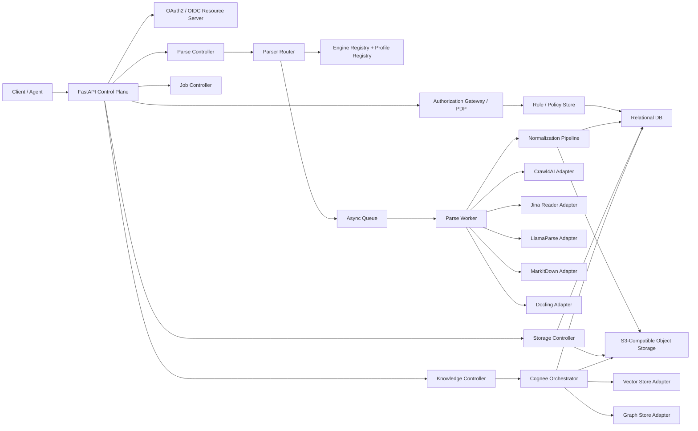

# Cortex Technical Design

## 1. 文档目标

本文档给出 Cortex 的完整技术设计，覆盖：

1. `Parse API`：面向 URL、对象存储文件和外部 URI 的统一解析能力。
2. `Storage API`：面向 S3 兼容对象存储的上传、下载与元数据治理。
3. `Cognee API`：面向知识数据集的 Add / Cognify / Memify / Search 工作流。

本版设计重点解决三个核心问题：

- Parse 不再绑定单一解析器，而是升级为**可扩展、可插拔、多引擎路由机制**。
- 所有元数据与控制面设计坚持**Vendor-Neutrality**，避免绑定单一云厂商或数据库能力。
- API、Worker、对象存储、知识引擎之间通过**统一资源模型**与**异步作业模型**耦合，而不是点对点硬编码。

## 2. 设计原则

### 2.1 厂商中立

- 对象存储只依赖标准 S3 协议。
- 关系型元数据只依赖可迁移 SQL 子集。
- 向量库与图数据库通过适配器层解耦。
- 解析器能力通过插件契约接入，不把某家供应商的字段直接暴露成平台主模型。

### 2.2 Parse 引擎可插拔

Parse 的主接口只关心：

- 输入来源
- 解析意图
- 标准化输出
- 元数据契约
- 作业治理

具体由哪个引擎执行、如何回退、引擎特定参数怎么映射，全部交给 Parser Router、Engine Adapter 和 Profile Registry。

### 2.3 AI 原生

- 主输出是 LLM-ready Markdown。
- 支持标准化元数据、chunking、可追溯 provenance。
- 为 Cognee、RAG、GraphRAG、Agent Search 预留稳定对象模型。

### 2.4 高可用与可维护

- 长任务统一走 Job 模型。
- 大文件不经 API 中转。
- 失败保留诊断与中间产物，方便补偿与重试。
- 通过配置模板和策略模式减少硬编码分支。

### 2.5 最小权限与策略分层

- 认证与授权分离：身份真实性由 OAuth 2.0 / OIDC 体系负责，权限判定由 Cortex 授权层负责。
- 功能权限与数据权限分离：接口可调用性通过 scope / permission 控制，具体资源可见性通过 RBAC + ABAC 混合策略控制。
- 默认拒绝：跨租户访问、未声明 scope、未命中资源策略的请求一律拒绝。
- 审计优先：每次授权决策都可关联到 actor、tenant、resource、policy、trace_id。

## 3. 总体架构



## 4. 技术栈

### 4.1 平台基础

- API 框架：`FastAPI`
- 依赖管理：`uv`
- ORM / SQL：`SQLAlchemy` + Alembic 风格迁移
- 异步作业：`Arq` 或兼容队列 Worker
- 对象存储：`boto3` / S3 兼容客户端

### 4.2 Parse 引擎层

- `crawl4ai`：交互式网页抓取、认证态、反机器人、截图/PDF/SSL 采集
- `Jina Reader`：远程 URL 到 LLM-friendly 文本 / Markdown / JSON 抽取
- `LlamaParse`：高保真文档解析、广泛文件格式支持、页级结构结果
- `MarkItDown`：本地轻量文件转 Markdown
- `Docling`：本地高质量文档理解与结构化导出

### 4.3 知识处理层

- `cognee`
- 外挂向量库适配器
- 外挂图库适配器

### 4.4 基于 `uv` 的 Workspace 模型

编码阶段建议把 Cortex 组织为一个 `uv workspace` 单仓工程，而不是单一巨型包。原因是：

- API、Parse Worker、Knowledge Worker 的运行时边界天然不同。
- Parse 引擎依赖差异很大，需要按部署角色裁剪安装集。
- `uv` workspace 允许多个成员共享一个 `uv.lock`，同时保持每个成员独立 `pyproject.toml`。
- 后续即使替换某个子模块的构建后端，也不会影响整个仓库的依赖解算与运行方式。

根工作区建议只承担三件事：

1. 统一 Python 版本与依赖锁定。
2. 统一 lint / test / type-check / docs 工具链。
3. 聚合 workspace member，不承载业务运行时代码。

推荐的根级 `pyproject.toml` 模型如下：

```toml
[project]
name = "cortex-workspace"
version = "0.1.0"
requires-python = ">=3.12,<3.14"
dependencies = []

[dependency-groups]
dev = [
  "pytest>=8.3,<9",
  "pytest-asyncio>=0.25,<0.26",
  "httpx>=0.28,<0.29",
  "respx>=0.22,<0.23",
]
lint = [
  "ruff>=0.11,<0.12",
]
types = [
  "pyright>=1.1.390",
]
docs = [
  "mkdocs-material>=9.6,<10",
]

[tool.uv]
package = false

[tool.uv.workspace]
members = [
  "apps/api",
  "workers/parse-worker",
  "workers/knowledge-worker",
  "packages/common",
  "packages/contracts",
  "packages/domain",
  "packages/db",
  "packages/auth",
  "packages/storage",
  "packages/parse",
  "packages/knowledge",
  "packages/observability",
]
```

这个模型的关键点：

- 根项目不打包，只做 workspace 与工具链聚合。
- 每个 workspace member 独立声明自己的运行依赖。
- 整个仓库共享一个 `uv.lock`，保证 API、Worker、测试环境解算一致。
- 纯 Python 成员默认使用 `uv_build`；若未来某个成员需要原生扩展，再单独切换该成员的 build backend。

### 4.5 推荐目录结构

```text
cortex/
  pyproject.toml
  uv.lock
  .python-version
  README.md
  otel-collector.yaml
  specs/
    cortex-api.yaml
    cortex-dfd.md
    cortex-init.sql
    cortex-prd.md
    cortex-schema.md
    cortex-tech.md
    cortex-tasks.md
  apps/
    api/
      pyproject.toml
      src/cortex_api/
        main.py
        lifespan.py
        dependencies/
        middleware/
        routers/
        services/
  workers/
    parse-worker/
      pyproject.toml
      src/cortex_worker_parse/
        main.py
        bootstrap.py
        handlers/
    knowledge-worker/
      pyproject.toml
      src/cortex_worker_knowledge/
        main.py
        bootstrap.py
        handlers/
  packages/
    common/
      pyproject.toml
      src/cortex_common/
    contracts/
      pyproject.toml
      src/cortex_contracts/
    domain/
      pyproject.toml
      src/cortex_domain/
    db/
      pyproject.toml
      alembic.ini
      migrations/
      src/cortex_db/
    auth/
      pyproject.toml
      src/cortex_auth/
    storage/
      pyproject.toml
      src/cortex_storage/
    parse/
      pyproject.toml
      src/cortex_parse/
        adapters/
        normalization/
        profiles/
    knowledge/
      pyproject.toml
      src/cortex_knowledge/
    observability/
      pyproject.toml
      src/cortex_observability/
  tests/
    contract/
    integration/
    e2e/
  scripts/
    dev/
    ci/
```

约束如下：

- 一律使用 `src/` 布局，避免本地路径污染导入结果。
- `apps/` 与 `workers/` 只放进程入口、依赖装配与路由，不直接承载核心领域逻辑。
- `packages/` 承载可复用模块，是长期演进的主战场。
- `tests/contract`、`tests/integration`、`tests/e2e` 放在根目录，方便跨成员联调。

### 4.6 包职责与依赖方向

| 成员 | import root | 核心职责 | 允许直接依赖 |
| --- | --- | --- | --- |
| `packages/common` | `cortex_common` | settings、ID、时钟、异常、JSON/URI 工具、幂等与通用 helper | 无 |
| `packages/contracts` | `cortex_contracts` | 与 OpenAPI 对齐的 Pydantic DTO、枚举、ProblemDetails、事件载荷 | `cortex_common` |
| `packages/domain` | `cortex_domain` | 领域实体、值对象、服务协议、状态机、业务规则 | `cortex_common` |
| `packages/db` | `cortex_db` | SQLAlchemy metadata、session、repository、迁移、持久化模型 | `cortex_common`, `cortex_domain` |
| `packages/auth` | `cortex_auth` | token 校验、caller context、scope 判定、RBAC/ABAC、授权审计 | `cortex_common`, `cortex_contracts`, `cortex_db` |
| `packages/storage` | `cortex_storage` | S3 客户端抽象、upload/download、checksum、multipart、object metadata 服务 | `cortex_common`, `cortex_contracts`, `cortex_db` |
| `packages/parse` | `cortex_parse` | router、engine registry、profile loader、adapter、normalizer、artifact persistence | `cortex_common`, `cortex_contracts`, `cortex_domain`, `cortex_db`, `cortex_storage`, `cortex_observability` |
| `packages/knowledge` | `cortex_knowledge` | dataset service、Cognee orchestration、search service、graph/vector adapter | `cortex_common`, `cortex_contracts`, `cortex_domain`, `cortex_db`, `cortex_storage`, `cortex_observability` |
| `packages/observability` | `cortex_observability` | OTel bootstrap、metric helper、logger correlation、trace propagation | `cortex_common` |
| `apps/api` | `cortex_api` | FastAPI app、routers、dependency injection、middleware、lifespan | 上述所有业务包 |
| `workers/parse-worker` | `cortex_worker_parse` | Parse job 消费、Worker bootstrap、错误恢复、重试语义 | `cortex_parse`, `cortex_storage`, `cortex_db`, `cortex_observability`, `cortex_common` |
| `workers/knowledge-worker` | `cortex_worker_knowledge` | Add/Cognify/Memify/Search 后台任务执行 | `cortex_knowledge`, `cortex_db`, `cortex_storage`, `cortex_observability`, `cortex_common` |

必须遵守的依赖规则：

- `domain` 不依赖 `FastAPI`、`SQLAlchemy`、`boto3`、`cognee` 等外部框架。
- `contracts` 不依赖 ORM 模型，只表达接口契约。
- `apps/api` 和 `workers/*` 不直接拼接 SQL，也不直接操作底层引擎 SDK，必须通过 package service / repository / adapter 调用。
- 引擎特定实现只能存在于 `cortex_parse.adapters.*`，不能渗透到 API 层。

### 4.7 Parse 引擎代码模型

`packages/parse` 内部建议再做一层清晰分层：

```text
src/cortex_parse/
  models/
  router/
  registry/
  profiles/
  adapters/
    crawl4ai.py
    jina_reader.py
    llamaparse.py
    markitdown.py
    docling.py
  normalization/
    markdown.py
    metadata.py
    provenance.py
  services/
  persistence/
```

其中：

- `models/`：`ParseRequest`、`ParsedDocument`、`EngineAttempt`、`ParseDiagnostics`
- `router/`：引擎选择、fallback、质量阈值判定
- `registry/`：引擎注册与能力标签
- `profiles/`：YAML / DB profile 装载与校验
- `adapters/`：每个解析引擎的协议实现
- `normalization/`：Markdown、元数据、分类标签、时间字段标准化
- `persistence/`：document、artifact、attempt 的持久化

引擎依赖不建议全部写死在 API 包中，推荐由 `cortex_parse` 通过 extras 控制：

- `parse[crawl4ai]`
- `parse[jina]`
- `parse[llamaparse]`
- `parse[markitdown]`
- `parse[docling]`

这样 Parse Worker 可按部署角色裁剪安装集：

- 仅网页抓取节点安装 `crawl4ai`
- 仅本地文档节点安装 `markitdown` / `docling`
- 混合节点再叠加云端引擎适配器

### 4.8 配置与环境模型

配置分三层，不把策略硬编码在 Python 里：

1. **Root Tooling Config**
   - 根级 `pyproject.toml`
   - `uv.lock`
   - lint / test / type-check 配置
2. **Runtime Settings**
   - `cortex_common.settings`
   - 使用 `pydantic-settings` 从环境变量、secret file、默认值加载
   - 只承载应用基础设施参数和统一运行时配置文件路径，如 `CORTEX_RUNTIME_CONFIG_PATH`
3. **Business Policy Config**
   - `configs/cortex.runtime.yaml`
   - `packages/parse/profiles/*.yaml`
   - `packages/auth/policies/*.yaml` 或 DB policy

建议的 settings 切分：

- `AppSettings`
- `DatabaseSettings`
- `S3Settings`
- `QueueSettings`
- `AuthSettings`
- `RuntimeConfigSettings`
- `ParseSettings`
- `CogneeSettings`
- `TelemetrySettings`

其中与鉴权直接相关、且必须留在环境侧而不是 runtime YAML 中的配置包括：

- `CORTEX_AUTH_MODE`
- `CORTEX_AUTH_JWT_SHARED_SECRET`
- `CORTEX_AUTH_INTROSPECTION_URL`
- `CORTEX_AUTH_INTROSPECTION_CLIENT_ID`
- `CORTEX_AUTH_INTROSPECTION_CLIENT_SECRET`
- `CORTEX_AUTH_TOKEN_ISSUER_ENABLED`
- `CORTEX_AUTH_TOKEN_ISSUER_BOOTSTRAP_SECRET`
- `CORTEX_AUTH_TOKEN_DEFAULT_TTL_SECONDS`
- `CORTEX_AUTH_TOKEN_MAX_TTL_SECONDS`

#### 4.8.1 统一运行时配置文件

真正部署时，Cortex 不再把 Crawl4AI、Jina Reader、LlamaParse、MarkItDown、Docling、Cognee 的配置散落在各个 adapter 或 `.env` 中，而是统一收敛到仓库内的：

- `configs/cortex.runtime.yaml`
- `configs/cortex.runtime.local.yaml`
- `configs/cortex.runtime.staging.yaml`
- `configs/cortex.runtime.prod.yaml`

其中 `parse.engines.crawl4ai.base_directory_ref` 用于集中管理 Crawl4AI 的运行期工作目录。它覆盖 provider 默认的用户 Home 目录，把缓存、日志、内部 SQLite、下载文件和浏览器状态统一收敛到仓库内或挂载卷中的可写路径，避免不同主机、容器或服务账号下出现权限漂移。

它是**受版本控制的运行时契约**，用于描述：

- Parse 默认 profile
- 各解析引擎的启停状态
- 各引擎的 provider-specific 默认参数
- 统一的 secret reference
- Cognee 的 LLM / embedding / vector DB / graph DB / migration DB 配置

推荐约定：

- `.env` 只放 secret、endpoint、或 `CORTEX_RUNTIME_CONFIG_PATH` 这类 coarse override
- `configs/cortex.runtime.yaml` 放 provider 行为与运行时模板
- `configs/cortex.runtime.<env>.yaml` 放可直接切换的环境化运行时配置
- `packages/parse/profiles/*.yaml` 放 route / fallback / normalization 策略
- request 级 `engine_options` 只做最后一跳覆盖，不承担长期运维配置
- 浏览器型 provider 的工作目录、代理引用、storage state 等运行时基础设施项也应留在 runtime config，而不是散落到临时请求里

统一运行时配置支持以下 reference scheme：

- `env:VAR_NAME`：从环境变量取值
- `file:./relative/path.txt`：读取文件内容
- `path:./relative/path`：解析为绝对路径字符串
- `literal:value`：显式内联字面值

这样可以做到：

- API Key、proxy、storage state 不直接写进代码
- 配置文件可审计、可 review、可灰度
- 不同 deployment ring / tenant / environment 可以复用同一份结构化模板

#### 4.8.2 配置优先级

统一后的建议优先级为：

```text
Built-in Adapter Defaults
  < configs/cortex.runtime.yaml
  < parse profile engine_overrides
  < request.parser.engine_options
```

其中：

- 基础设施级 env 变量仍高于代码默认值，但不再承担主要的 provider 行为编排。
- `configs/cortex.runtime.yaml` 是 parse / knowledge provider 的主配置面。
- profile 负责“策略”，runtime config 负责“运行时默认值”，request override 负责“临时特例”。

建议的配置优先级：

```text
Environment Variables
  > Secret Files / Mounted Secrets
  > Runtime YAML / DB Policy
  > Code Defaults
```

其中：

- 凭据推荐通过 `env:` / `file:` reference 注入，不进入 Git。
- Parse profile 和权限策略优先以 YAML 启动，再逐步迁移为 DB 可运营配置。
- `otel-collector.yaml` 保持仓库内可见，用作默认开发和部署基线。
- `configs/cortex.runtime.yaml` 保持仓库内可见，作为 provider runtime baseline；真正敏感信息只通过 reference 解析。

### 4.9 数据访问与迁移模型

数据库访问建议统一由 `cortex_db` 承担，避免 API、Worker 和业务包各自维护连接方式。

推荐做法：

- 使用 `SQLAlchemy 2.x` async engine + async session。
- 所有 repository 接口在 `domain` 或 `db` 中声明，应用层只依赖接口。
- 迁移目录统一放在 `packages/db/migrations/versions/`。
- `cortex-init.sql` 作为初始 schema 基线来源，随后转入迁移脚本维护。
- SQLite 与 PostgreSQL 共用同一套 ORM model，但避免使用厂商私有字段类型与 SQL 方言特性。

建议的持久化分工：

- `objects` / `object_versions` -> `cortex_storage`
- `documents` / `document_artifacts` / `parse_run_attempts` -> `cortex_parse`
- `datasets` / `knowledge_runs` / `search_*` -> `cortex_knowledge`
- `permissions` / `roles` / `authorization_*` -> `cortex_auth`

### 4.10 入口进程与命令模型

每个运行成员都应通过自己的 `project.scripts` 暴露稳定入口，避免手写脆弱命令。

推荐脚本名：

- `cortex-api`
- `cortex-parse-worker`
- `cortex-knowledge-worker`
- `cortex-db-migrate`

推荐开发命令：

```bash
uv sync
uv run --package cortex-api cortex-api
uv run --package cortex-worker-parse cortex-parse-worker
uv run --package cortex-worker-knowledge cortex-knowledge-worker
uv run --package cortex-db cortex-db-migrate upgrade head
uv run --group lint ruff check .
uv run --group types pyright
uv run --group dev --group test pytest
```

开发流程应固定为：

1. 更新 `specs/cortex-tasks.md`
2. `uv sync`
3. 编码
4. 运行 lint / types / tests
5. 更新任务状态与文档

### 4.11 测试与质量门禁模型

测试建议分四层：

1. **Unit Tests**
   - 每个 package 内部逻辑、normalizer、policy evaluator、repository mapper
2. **Contract Tests**
   - 校验 `cortex_contracts` 与 `cortex-api.yaml` 的字段一致性
3. **Integration Tests**
   - FastAPI + DB + S3 mock / localstack / MinIO + queue + worker
4. **E2E Tests**
   - 从 upload / parse / add / search 走一条完整主链路

质量门禁建议最少包括：

- `ruff check`
- `pyright`
- `pytest`
- OpenAPI schema 校验
- 关键配置文件校验：`otel-collector.yaml`、parse profile YAML、policy YAML

### 4.12 为什么采用这套代码模型

这套代码模型服务于 Cortex 的几个核心目标：

- **可扩展**：新增引擎、新增 Worker、新增适配器不需要重写 API 主体。
- **可部署**：不同节点可按角色裁剪依赖，不必把所有引擎都打进一个镜像。
- **可维护**：接口契约、领域逻辑、基础设施实现分层清晰。
- **可迁移**：DB、S3、PDP、解析引擎、向量库都通过适配层进入。
- **适合 `uv`**：shared lockfile + workspace member + 依赖分组，正好匹配多包单仓工程。

## 5. Parse 平台化设计

### 5.1 从单一解析器到多引擎平台

旧设计默认 Parse 等于 Crawl4AI。新设计改为：

```text
Parse API
  -> Parser Router
      -> Strategy Selection
      -> Engine Adapter
      -> Fallback Policy
      -> Normalization Pipeline
      -> Standardized ParsedDocument
```

也就是说：

- 上层 API 面向统一协议。
- 下层解析通过引擎策略切换。
- 同一请求可以按 profile 自动选择最合适引擎。
- 如果首选引擎失败，可按策略回退到下一个引擎。

### 5.2 核心组件

#### A. Parser Router

Parser Router 负责：

- 根据输入类型和 profile 选择引擎
- 装配引擎特定参数
- 执行 fallback 链路
- 汇总多引擎诊断
- 把原始输出送入标准化流水线

#### B. Engine Registry

Engine Registry 记录：

- 引擎标识
- 引擎版本
- 支持的输入类型
- 支持的格式
- 能力标签
- 部署模式
- 默认优先级

典型能力标签：

- `interactive_web`
- `auth_session`
- `anti_bot`
- `ocr`
- `pdf_layout`
- `html_to_markdown`
- `file_to_markdown`
- `structured_json`
- `page_metadata`
- `screenshot_capture`

#### C. Profile Registry

Profile Registry 记录“配置模板”，把策略和参数从代码中抽离出来。

典型 profile：

- `web_fast`
- `web_authenticated`
- `web_antibot`
- `doc_high_fidelity`
- `doc_local_lightweight`
- `doc_local_structured`
- `auto_default`

每个 profile 定义：

- 允许的输入类型
- 首选引擎
- 允许 fallback 的引擎列表
- 标准化策略
- 元数据抽取策略
- chunking 默认策略
- artifact 持久化策略

#### D. Engine Adapter

每个解析器都实现同一个抽象契约：

```python
class ParseEngine(Protocol):
    engine_key: str

    async def can_handle(self, request: ParseRequest) -> CapabilityDecision: ...
    async def parse(self, request: ParseRequest) -> EngineParseResult: ...
    def normalize_error(self, exc: Exception) -> EngineError: ...
```

统一输出 `EngineParseResult`：

- `raw_markdown`
- `raw_text`
- `raw_metadata`
- `artifacts`
- `page_items`
- `diagnostics`

#### E. Normalization Pipeline

不同引擎的输出不一致，所以 Parse 平台必须在引擎之后做一层标准化。

标准化任务包括：

- Markdown 清洗
- 标题归一
- canonical URL 归一
- 语言与 MIME 归一
- 分类标签归一
- 时间字段标准化
- 审计与 provenance 结构化
- 可选 chunking

### 5.3 引擎适用性矩阵

| 引擎 | 最佳场景 | 优势 | 局限 |
| --- | --- | --- | --- |
| Crawl4AI | 动态网页、认证页面、反机器人站点 | 浏览器级渲染、session、proxy、screenshot/PDF、SSL、stealth/undetected | 成本高于纯文本提取 |
| Jina Reader | 快速网页提取、轻量 URL 解析 | 直接把 URL 转为 LLM-friendly 内容；ReaderLM v2 同时支持 HTML-to-Markdown 与 HTML-to-JSON | 对复杂交互站点控制有限 |
| LlamaParse | 高保真文档云解析 | 文件格式支持广、页级结构丰富、适合复杂 PDF/Office | 云依赖更强 |
| MarkItDown | 本地轻量文件转 Markdown | 简洁、易部署、成本低、适合作为通用文件 fallback | 深度版面理解有限 |
| Docling | 本地高质量文档理解 | Markdown/HTML/DocTags/JSON 导出、PDF/OCR/结构理解更强 | 相对更重，运行成本更高 |

### 5.4 官方能力边界对设计的影响

#### Crawl4AI

根据官方高级功能文档，Crawl4AI 明确支持代理、PDF 与截图抓取、SSL 证书提取、自定义 Header、storage state、robots.txt 检查，以及 stealth / undetected browser 等反机器人能力。因此在 Cortex 中，它应被定位为：

- `web_interactive_primary`
- `auth_session_primary`
- `anti_bot_primary`

而不是通用文件解析器。

在工程实现上，还需要把“可写工作目录”和“Playwright 子进程 / 命名管道可用性”视为部署前置条件。前者由 `parse.engines.crawl4ai.base_directory_ref` 统一收敛，后者则必须在目标宿主环境中完成能力验证；这属于运行时承载条件，不应再由 API 调用方手工理解或拼装。

#### Jina Reader

Jina Reader 官方页面说明 ReaderLM v2 专门针对 HTML-to-Markdown 和 HTML-to-JSON 转换，目标是把 URL 直接转换为适合 LLM 的干净内容。因此在 Cortex 中，Jina Reader 应定位为：

- `web_fast_remote`
- `html_fast_extract`
- `metadata_light_extract`

适合作为快速网页提取引擎，或 Crawl4AI 的低成本替代路径。

#### LlamaParse

LlamaParse 官方 Parsing API 文档显示其支持大量文件扩展名，并在模型中暴露 Markdown 表达、bbox、页级元素等结构。这意味着它适合：

- `document_high_fidelity_primary`
- `page_layout_rich_primary`
- `cloud_document_parser`

在当前 Cortex 实现中，`llama_parse` adapter 明确按 **Llama Cloud / Parsing API** 路线接入，并通过统一运行时配置中的 `parse.engines.llama_parse` 管理 `api_key_ref` 与默认参数；如果未来需要本地开源解析链路，应新增独立 adapter key，而不是把 cloud 与 local 行为混在一个 `llama_parse` 配置段里。

#### MarkItDown

MarkItDown 官方仓库定位就是“将多种文件转换为 Markdown”，并支持插件扩展。因此在 Cortex 中它应作为：

- `document_lightweight_local`
- `fallback_file_to_markdown`
- `airgapped_light_parser`

#### Docling

Docling 官方 README 明确列出多种导出格式，包括 Markdown、HTML、DocTags 和 JSON，也强调 PDF、扫描件和结构化理解能力。因此它适合作为：

- `document_structured_local_primary`
- `ocr_document_primary`
- `rich_layout_local_primary`

### 5.5 路由策略

#### 策略零：极简公共 API + 内部编译器

对外 REST 不再把 `parser.profile_ref`、`fallback_policy`、`crawl.content_selector`、
`engine_options` 等低层细节暴露给普通调用方，而是收敛为：

- `sources`
- `engine_id`
- `scene`（可选）

同步接口默认只需要前两个字段；异步作业额外补充：

- `priority`
- `webhook`

因此：

- **两参数是否足够**：对同步 Parse 的主路径，`sources + engine_id` 足够覆盖大多数调用；其中 `sources` 可同时承载单条或批量来源。
- **为什么仍保留第 3 个参数 `scene`**：同一个引擎通常同时存在“快速”“高保真”“深度抓取”“认证态”等不同最优配置。没有 `scene`，系统只能猜测，难以同时兼顾性能与结果质量。
- **为什么不把更多高级参数继续公开**：这些参数会迅速把 API 重新推回“适配器透传接口”，破坏稳定性、可维护性与可迁移性。

内部通过 `Parse Request Compiler / Planner` 完成：

`Public Parse Request -> Source Resolver -> Scene Preset Resolver -> Internal ParseSyncRequest`

这样保留了 Cortex 当前多引擎、profile、worker、fallback、持久化与审计主链路，同时把用户心智降到最小。

#### 策略一：显式选引擎

客户端直接指定：

- `preferred_engine = crawl4ai`
- `preferred_engine = jina_reader`
- `preferred_engine = llmparse`
- `preferred_engine = markitdown`
- `preferred_engine = docling`

适合控制要求强的场景。

#### 策略二：Profile 驱动

客户端指定 profile：

- `profile_ref = web_fast`
- `profile_ref = web_authenticated`
- `profile_ref = doc_high_fidelity`

Router 依据 profile 自动选引擎。

#### 策略三：能力驱动自动路由

客户端不给出固定引擎，只给出意图与输入：

- URL + `need_interactive_render=true` -> Crawl4AI
- URL + `latency_priority=high` -> Jina Reader
- object/pdf + `layout_fidelity=high` -> LlamaParse 或 Docling
- object/docx + `local_only=true` -> MarkItDown 或 Docling

#### 策略四：Fallback

例子：

1. `crawl4ai`
2. `jina_reader`
3. `markitdown` 或失败终止

或者：

1. `docling`
2. `llamaparse`
3. `markitdown`

fallback 触发条件：

- engine execution failure
- quality threshold not met
- metadata completeness below target
- timeout

### 5.6 统一标准化输出

所有引擎最终都要收敛到统一 `ParsedDocument`：

```json
{
  "document_id": "doc_...",
  "source_type": "url",
  "source_url": "https://example.com",
  "source_format": "text/html",
  "title": "Example",
  "markdown": "# Example",
  "normalized_metadata": {
    "title": "Example",
    "language": "en",
    "author": null,
    "publish_date": null,
    "category_tags": ["docs"],
    "summary": null
  },
  "parser": {
    "engine_key": "crawl4ai",
    "profile_ref": "web_authenticated",
    "fallback_used": false
  },
  "audit": {
    "created_at": "2026-04-12T00:00:00Z"
  }
}
```

### 5.7 标准元数据模型

引擎输出至少映射到以下标准字段：

- `title`
- `source_url`
- `canonical_url`
- `source_format`
- `detected_mime_type`
- `language`
- `author`
- `publish_date`
- `description`
- `summary`
- `keywords`
- `category_tags`
- `labels`
- `content_hash_sha256`
- `parser.engine_key`
- `parser.profile_ref`
- `provenance`
- `audit`

引擎特定字段保留在：

- `raw_metadata`
- `engine_payload_summary`
- `diagnostics`

这样既统一接口，又不丢失引擎特性。

## 6. Parse API 设计

### 6.1 公共输入模型

对外 Parse API 采用“少参数、强约束、自动编译”的设计。

#### 同步 Parse

顶层字段不超过 3 个：

1. `sources`
2. `engine_id`
3. `scene`（可选）

#### 异步 Parse Job

顶层字段不超过 5 个：

1. `sources`
2. `engine_id`
3. `scene`（可选）
4. `priority`（可选）
5. `webhook`（可选）

#### `sources` 统一模型

`sources` 是一个字符串数组，不要求调用方理解内部 parser 模型，也不再要求显式传 `mime_type`、`kind`、`filename`：

- `https://...` / `http://...`：公共网页 URL
- `s3://bucket/key`、`file://...`：外部文件 URI
- `cortex://objects/{object_id}`：引用已上传对象

调用方只需要提交来源定位符。系统会自动完成：

- 来源类型识别（URL / URI / object）
- 文件名推断
- 扩展名推断
- MIME 侦测或推断
- 对象来源的受控下载 URL 解析

#### `engine_id`

`engine_id` 是公开 API 的主选择器，典型值：

- `crawl4ai`
- `jina_reader`
- `llama_parse`
- `markitdown`
- `docling`
- `auto`

`auto` 允许平台基于来源类型、文件扩展名、推断 MIME、场景意图和可用引擎目录自动选择默认引擎，但不要求普通调用方理解 profile 细节。

#### `scene`

`scene` 是**可选**的高层意图，不是 provider-specific 参数透传。典型值：

- `balanced`
- `deep_web`
- `authenticated_web`
- `fast_extract`
- `document_fidelity`
- `document_ai`
- `lightweight`

它的作用是让 Cortex 在相同 `engine_id` 下切换不同 profile / preset，而不是让用户填写几十个细粒度抓取参数。

### 6.1A 内部编译模型

公共请求不会直接进入 `ParseService`，而是先进入 `Parse Request Compiler`：

1. 逐条解析 `sources`
2. 自动推断 `source_kind`
3. 自动推断文件名、扩展名与 MIME；如来源是 `cortex://objects/{object_id}`，则解析为受控可访问 URI / URL
4. 若 `engine_id=auto`，根据 `scene + source_kind + extension + inferred_mime + activated_engines` 选择最佳首选引擎与 fallback 链
5. 若 `engine_id` 为显式值，则校验其是否已激活并解析到该引擎默认 scene 或指定 scene
6. 根据最终的 `engine_id + scene` 选择内部 `profile_ref`
7. 装配该 profile 对应的：
   - `parser.allowed_engines`
   - `parser.engine_options`
   - `crawl`
   - `normalization`
   - `output`
   - `persistence`
   - `timeout_seconds`
8. 为每个来源生成一份内部 `ParseSyncRequest` / `ParseJobRequest`

当前自动路由策略遵循以下原则：

- 普通网页 URL 优先 `crawl4ai`，回退 `jina_reader`
- 快速网页抽取场景优先 `jina_reader`
- PDF / 高保真文档优先 `llama_parse`，回退 `docling`
- 本地轻量文档优先 `markitdown`，回退 `docling`
- 显式 `scene=document_ai` 时优先 `docling`
- 当某类内置引擎未激活时，自动路由器会在当前激活引擎目录内选择最接近的可用路径，而不是返回空选择

这使得：

- API 保持简洁
- 引擎能力仍然可插拔
- profile 与 preset 仍然是运营面的主控制点
- 后续新增解析引擎时无需重新设计公开 API

### 6.2 输出模型

Parse 输出包括：

- `ParsedDocument`
- `ParseArtifacts`
- `ParseDiagnostics`
- `EngineAttempt[]`

### 6.3 管理接口

为了让多引擎真正可运营，建议新增：

- `GET /v1/parse/engines`
- `GET /v1/parse/profiles`

这样客户端可以查看：

- 当前注册的解析器
- 能力标签
- 支持输入类型
- 推荐 scene
- 默认 scene
- 默认 profile
- scene 到 profile 的解析规则（面向运维与调试）

## 7. Storage 设计

Storage API 延续当前设计，但要与 Parse 平台更紧密联动。

### 7.1 关键原则

- 原始文件先入对象存储。
- Parse 对文件输入主要消费 `object_id`。
- Markdown、HTML、截图、PDF、网络日志等产物也统一入对象存储。

### 7.2 统一对象类型

对象存储中的核心对象可分为：

- 原始对象 `source`
- 归一结果 `normalized`
- 解析产物 `artifact`
- 会话状态 `session_state`

## 8. Cognee 设计

### 8.1 Add

Add 支持以下输入：

- `document_id`
- `object_id`
- 原始文本
- 外部 URI

Parse 产出的 `document_id` 是 Cognee 最稳定的输入之一。

### 8.2 Cognify

在 Cognify 阶段，Cortex 可以使用 Parse 的标准 chunk 作为优先输入，降低下游重复切分成本。

### 8.3 Memify

Memify 继续运行在已建好的图谱上，不依赖具体解析器实现。

### 8.4 Search

Search 返回的 provenance 应能够回溯到：

- `dataset_id`
- `document_id`
- `chunk_id`
- 原始 `source_url` 或 `object_id`
- `parser.engine_key`

## 9. 关系型元数据模型

在标准 SQL 元数据层，建议新增以下实体：

- `parser_engines`
- `parser_profiles`
- `parse_run_attempts`

作用分别是：

- 记录解析器注册信息
- 记录配置模板
- 记录一次 ParseRun 中每一次引擎尝试

这样可以支持：

- 运营侧启停某个引擎
- 灰度新解析器
- 回溯某次任务的 fallback 过程

## 10. 配置模板设计

Parse 的配置建议拆成两层：

1. **Public Scene Preset**
   - 公开给 API 调用方的是 `engine_id + scene`
   - 它定义“高层场景意图”，例如 `crawl4ai + deep_web`

2. **Internal Profile**
   - 公开场景最终解析为内部 `profile_ref`
   - profile 继续承载 fallback、normalization、engine overrides 等底层控制

换句话说，`scene` 是外部契约，`profile` 是内部编排与运维契约。

Profile 仍采用“平台通用参数 + 引擎覆盖参数”的双层结构：

```yaml
profile_ref: web_authenticated
selection:
  preferred_engine: crawl4ai
  allowed_engines: [crawl4ai, jina_reader]
  fallback_mode: ordered
normalization:
  schema_version: cortex.parse.v1
  infer_language: true
  include_page_metadata: true
engine_overrides:
  crawl4ai:
    enable_stealth: true
    use_persistent_context: true
    capture_screenshot: true
  jina_reader:
    mode: markdown
```

## 11. Worker 执行模型

### 11.1 同步模式

适用于：

- 轻量 URL 提取
- 小文件快速转 Markdown
- 用户交互式预览

优先考虑：

- `sources + engine_id` 两参数主路径
- Jina Reader 快速提取 preset
- MarkItDown 轻量文档 preset
- Crawl4AI `balanced` preset

### 11.2 异步模式

适用于：

- 认证态网页
- 大文件或复杂 PDF
- 批量导入
- Cognify / Memify

优先考虑：

- Crawl4AI `deep_web` / `authenticated_web` 强配置 preset
- LlamaParse
- Docling

## 12. 错误处理与可观测性

### 12.1 错误归一

不同引擎抛出的错误需要收敛到统一分类：

- `unsupported_source`
- `unsupported_format`
- `authentication_required`
- `anti_bot_blocked`
- `timeout`
- `engine_unavailable`
- `normalization_failed`

### 12.2 OpenTelemetry 对齐原则

- 所有 HTTP API、异步 Worker、队列消费者、数据库访问与对象存储调用都必须接受并透传 W3C Trace Context：`traceparent`、`tracestate`，并支持 `baggage` 作为跨服务实验与发布标签承载。
- Trace、Metric、Log 三类信号统一使用 OpenTelemetry SDK 采集，并优先通过 OTLP 导出到 OpenTelemetry Collector。
- 通用协议与基础设施维度优先采用 OpenTelemetry 语义约定；Cortex 领域指标与属性使用稳定前缀 `cortex.*`，避免供应商私有命名渗透到契约层。
- 所有错误响应、作业状态、任务事件、Parse 诊断与 Search 返回都应携带可关联的 `trace_id`、`span_id` 或 `request_id`，便于从 API 返回直接跳转到链路追踪与日志检索。

### 12.3 遥测拓扑

建议采用以下默认拓扑：

1. `FastAPI`、`Parse Worker`、`Knowledge Worker` 内置 OpenTelemetry instrumentation。
2. 应用实例通过 OTLP/gRPC 或 OTLP/HTTP 将 trace、metric、log 导出到 `OpenTelemetry Collector`。
3. `OpenTelemetry Collector` 负责批处理、脱敏、尾采样、属性补全与多后端分发。
4. Trace 导出到 `Jaeger`；Metric 可通过两种厂商中立方式接入 `Prometheus`：
   - Collector 暴露 Prometheus scrape endpoint；
   - Prometheus 开启 OTLP receiver，直接接收 OTel metric。
5. `Grafana` 原生连接 Jaeger 与 Prometheus，用于统一 Dashboard、Exemplar 跳转、告警和发布观测。

这条链路的关键点是：应用侧只理解 OpenTelemetry 和 OTLP，不与具体监控厂商 SDK 直接耦合。

### 12.4 Span 设计

链路追踪至少覆盖以下 span：

- `http.server`：所有入站 API 请求。
- `parse.router.select`：解析路由与 profile / engine 选择。
- `parse.engine.execute`：单个解析引擎一次执行尝试。
- `parse.normalize.markdown`：Markdown 规范化与元数据归一。
- `storage.upload.initialize`、`storage.upload.complete`、`storage.download.sign_url`
- `knowledge.add`、`knowledge.cognify`、`knowledge.memify`、`knowledge.search`
- `queue.publish`、`queue.consume`
- `db.sql.query`
- `object_storage.put`、`object_storage.get`

建议补充的关键 span attributes：

- 资源与调用侧：`service.name`、`service.version`、`service.instance.id`、`deployment.environment.name`
- HTTP 维度：method、route、status code、user agent、tenant_id
- Parse 维度：`cortex.parse.profile`、`cortex.parse.engine`、`cortex.parse.source_kind`、`cortex.parse.fallback_used`
- Storage 维度：`cortex.storage.bucket`、`cortex.storage.object_id`
- Knowledge 维度：`cortex.knowledge.operation`、`cortex.dataset.id`

### 12.5 指标设计

指标分为基础平台指标与领域指标两层：

- 基础平台指标：
  - HTTP 请求量、错误率、延迟分位
  - 队列深度、任务排队时延、Worker 并发
  - SQL / S3 / 外部引擎依赖时延与错误率
- Parse 领域指标：
  - `cortex.parse.requests`
  - `cortex.parse.duration`
  - `cortex.parse.success_ratio`
  - `cortex.parse.fallback.count`
  - `cortex.parse.metadata.completeness`
  - `cortex.parse.engine.attempts`
- Storage 领域指标：
  - `cortex.storage.upload.bytes`
  - `cortex.storage.download.bytes`
  - `cortex.storage.multipart.parts`
  - `cortex.storage.integrity_failures`
- Cognee / Search 领域指标：
  - `cortex.knowledge.run.duration`
  - `cortex.knowledge.run.failures`
  - `cortex.search.request.duration`
  - `cortex.search.hit.count`
  - `cortex.search.answer.empty_ratio`

其中 HTTP、数据库、消息队列等基础指标优先对齐 OpenTelemetry 标准语义；`cortex.*` 用于表达领域补充维度。

### 12.6 日志、异常与告警

- 所有结构化日志统一输出 JSON，并写入 `trace_id`、`span_id`、`request_id`、`tenant_id`、`job_id`、`deployment ring`、`experiment variant`。
- 对捕获到的异常必须在当前 span 上记录 exception event，并设置错误状态。
- 对超时、fallback、反爬拦截、对象存储一致性失败等关键事件，除日志外还应写入任务事件流与指标计数器。
- 告警规则建议围绕错误率、P95/P99 延迟、队列堆积、引擎级 Parse 成功率、搜索空回答率与对象写入失败率建立。

### 12.7 A/B 测试与发布治理

为支持 A/B 测试、蓝绿部署、金丝雀部署，统一约定以下遥测标签：

- 标准资源属性：`service.name`、`service.version`、`deployment.environment.name`
- Cortex 自定义属性：
  - `cortex.deployment.ring`：`blue`、`green`、`canary`、`stable`
  - `cortex.release.channel`：`baseline`、`experiment`、`rollback`
  - `cortex.experiment.id`
  - `cortex.experiment.variant`
  - `cortex.feature_flags`

这些属性既可作为 span / metric labels，也可通过 `baggage` 在 API Gateway、Worker、Webhook 回调和下游适配器之间传递。这样 Grafana 能按发布环、实验桶、租户、解析引擎进行横向对比，Jaeger 也能按同一组维度过滤链路。

### 12.8 采样与成本控制

- 默认采用 `ParentBased + TraceIdRatio` 头采样，保证同一请求在整条链路上的采样一致性。
- 在 Collector 侧增加尾采样策略，优先保留错误请求、慢请求、fallback 请求、搜索空命中请求与金丝雀流量。
- 对高频日志与高基数标签做白名单控制，避免租户 ID、URL、对象 key 等维度无限膨胀。

### 12.9 SLO 与诊断沉淀

建议至少建立以下 SLO：

- Parse Sync 成功率与 P95 时延
- Search 成功率与 P95 时延
- Upload 初始化接口 P95
- 异步任务排队时延
- 关键依赖可用率

每次 ParseRun / KnowledgeRun / SearchRequest 至少保留：

- 请求快照
- 选中的 profile
- 引擎尝试序列
- 时延
- 错误
- 产物引用
- `trace_id` / `span_id`
- deployment 与 experiment 上下文

## 13. 安全与合规

### 13.1 认证标准

Cortex 的认证层保持厂商中立，但应遵循行业通用标准：

- 外部身份与令牌签发采用 `OAuth 2.0` / `OpenID Connect`
- 优先接受符合 JWT Access Token Profile 的自包含 access token
- 对 opaque token 保留 introspection 兼容路径
- 所有 token 都必须校验 `iss`、`aud`、`exp`、`nbf`、`iat`、`jti`

推荐令牌声明：

- `sub`：调用主体
- `client_id`
- `tenant_id`
- `scope`
- `roles`
- `entitlements`
- `azp` / `act`（如存在代理调用或委托调用）

当前实现的模式边界应明确写死，而不是模糊处理：

| 模式 | Token 来源 | Cortex 侧校验方式 | 当前实现所需密钥 / 凭据 | 备注 |
| --- | --- | --- | --- | --- |
| `dev` | 手工构造 `dev:` token，或调用 `/v1/auth/token` | 解码 Cortex 自定义 `dev:` payload | 可选 `CORTEX_AUTH_TOKEN_ISSUER_BOOTSTRAP_SECRET` | 仅适合本地 / 测试，不应视为正式 IdP |
| `jwt` | 外部系统签发，或调用 `/v1/auth/token` | 共享密钥 JWT 校验 | `CORTEX_AUTH_JWT_SHARED_SECRET` | 当前实现使用 HMAC shared secret，而非 JWKS |
| `introspection` | 外部授权服务器签发 opaque token | 调用 introspection endpoint | `CORTEX_AUTH_INTROSPECTION_URL`、`...CLIENT_ID`、`...CLIENT_SECRET` | Cortex 不负责生成这类 token |
| `hybrid` | JWT 与 opaque token 混用 | 先 JWT、后 introspection | `CORTEX_AUTH_JWT_SHARED_SECRET` + introspection client credentials | 内建 issuer 只负责 JWT 分支 |

因此，Cortex 的定位仍然是 **OAuth 2.0 / OIDC 资源服务器优先**：

- 如果接入企业统一身份平台，token 的签发应完全交给外部 IdP。
- 如果处于本地、自托管、CI、运维 bootstrap 或无外部 IdP 的初期阶段，可以启用 Cortex 的内建 token issuer。
- 内建 token issuer 必须显式启用，并受 `X-Cortex-Issuer-Secret` / `CORTEX_AUTH_TOKEN_ISSUER_BOOTSTRAP_SECRET` 保护。
- `introspection` 模式不提供本地签发，因为那会把 Cortex 推向“自己实现一套 opaque token authorization server”的范畴，不符合当前范围控制。

### 13.2 功能权限模型

功能权限用于控制“能否调用某类 API”，以 OAuth scope 和平台 permission catalog 为主：

- `health:read`
- `jobs:read`
- `jobs:cancel`
- `parse:read`
- `parse:write`
- `storage:read`
- `storage:write`
- `storage:download`
- `knowledge:read`
- `knowledge:write`
- `observability:read`
- `admin:read`
- `admin:write`

最佳实践是让 access token 只携带粗粒度功能权限，不把大规模资源白名单直接塞进 token。

### 13.3 数据权限模型

数据权限用于控制“能否访问某个租户、某个对象、某份文档、某个数据集、某个作业结果”，采用 RBAC + ABAC 组合：

1. **Tenant Boundary**
   - 默认只能访问自身 `tenant_id` 下的资源。
2. **Role Binding**
   - actor 可在租户级或资源级绑定角色。
3. **Resource Policy**
   - 资源携带 `access_level` 与 `access_policy_json`。
4. **Attribute Conditions**
   - 可按 owner、classification、tag、dataset membership、purpose-of-use、environment、release ring 等条件判定。

推荐的 `access_level`：

- `tenant_private`
- `tenant_shared`
- `restricted`
- `confidential`

### 13.4 内置角色建议

建议至少提供以下内置角色：

- `tenant_admin`
- `parse_operator`
- `storage_writer`
- `storage_reader`
- `storage_downloader`
- `knowledge_editor`
- `knowledge_reader`
- `auditor`
- `observability_viewer`
- `service_ingestor`
- `service_searcher`

这些角色只是一组 permission 的聚合，不直接替代资源级数据授权。

### 13.5 授权决策流程

每次请求按如下顺序求值：

1. 认证 token 与 audience
2. 检查接口所需 scope / permission
3. 解析 actor、tenant、roles、entitlements
4. 加载目标资源上下文
5. 计算 role binding 与 resource policy
6. 以 deny-overrides 规则产出最终 allow / deny
7. 将结果写入审计与 trace

其中：

- 功能权限失败返回 `403`，原因标记为 `insufficient_scope`
- 数据权限失败返回 `403`，原因标记为 `resource_access_denied`
- token 缺失、失效或 audience 不匹配返回 `401`

### 13.6 搜索、下载与作业的特殊约束

- `Search` 必须在检索前过滤无权访问的数据集，在命中汇总前再次过滤 document / chunk / graph hit，避免旁路泄露。
- `Download URL` 必须在生成预签名 URL 之前完成授权，签发后的 URL TTL 应短于普通对象读取会话。
- `Job` 查询与取消必须校验调用者对目标 job 及其底层资源都具备权限，不能因为知道 `job_id` 就跨资源读取执行细节。

### 13.7 策略引擎适配层

为保持 Vendor-Neutrality，授权判定不绑定某个特定 PDP 实现。Cortex 只定义统一的 Policy Evaluation Contract，底层可接入：

- 内建 SQL 规则求值器
- `OPA` 适配器
- `Cedar` 适配器
- 其它兼容 PDP

无论底层如何实现，平台对外暴露的 permission key、role key、decision reason code 都保持稳定。

### 13.8 审计与合规

- 每次授权决策记录 `decision_id`、actor、tenant、permission、resource、effect、reason_code、trace_id。
- 凭据、代理账号、第三方 parser token 只保存引用，不落明文。
- 对于 Jina Reader、LlamaParse 这类远程引擎，应支持按租户配置出站白名单与数据主权策略。
- 对于 `local_only=true` 的场景，Router 只允许选择 MarkItDown、Docling、Crawl4AI 本地部署模式。
- `baggage`、日志和审计事件中不得出现 bearer token、cookie、预签名 URL 全量查询串或文档正文片段。

## 14. 部署建议

### 14.1 控制面

- `FastAPI`
- `uvicorn` / `gunicorn`
- `SQLAlchemy`

### 14.2 Worker 面

- Parse Worker 与 Knowledge Worker 分池部署
- 浏览器型引擎与文档型引擎分池部署
- 有状态会话目录单独挂载

### 14.3 解析引擎部署分层

- 本地引擎：`crawl4ai`, `markitdown`, `docling`
- 远程引擎：`jina_reader`, `llamaparse`

通过统一 Adapter 契约接入，既能混合部署，也能逐步替换。

### 14.4 可观测性部署面

- API 与 Worker 统一注入 OpenTelemetry SDK，中间件负责 HTTP、SQL、队列与对象存储调用自动埋点。
- `OpenTelemetry Collector` 建议独立部署并水平扩展，承担批处理、限流、尾采样、属性清洗与多后端导出。
- `Jaeger` 作为 trace 查询面，`Prometheus` 作为 metric 存储与规则引擎，`Grafana` 负责统一可视化与发布观测。
- 蓝绿 / 金丝雀环境共享同一套 Dashboard 模板，但通过 `deployment.environment.name` 与 `cortex.deployment.ring` 分组展示。

## 15. 结论

Cortex 的关键升级不是“又支持了几个 parser”，而是把 Parse 抽象成一个真正的平台能力：

- 上层 API 不依赖某个解析器的私有语义。
- 下层引擎可以自由替换、组合和回退。
- 输出永远收敛到统一 Markdown + 标准元数据模型。

这使 Cortex 既能承接复杂动态网页，也能承接高保真文档解析，并为后续 Cognee、RAG 和 Agent 工作流提供稳定底座。
