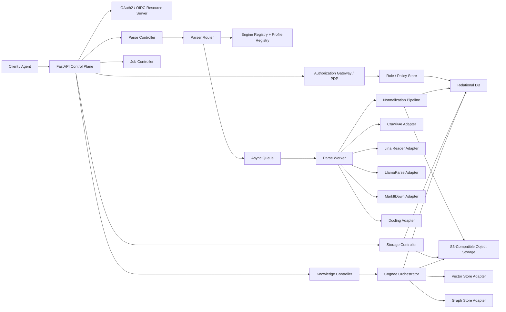

# Cortex Technical Design

## 1. 文档目标

本文档给出 Cortex 的完整技术设计，覆盖：

1. `Parse API`：面向 URL、对象存储文件和外部 URI 的统一解析能力。
2. `Storage API`：面向 S3 兼容对象存储的上传、下载与元数据治理。
3. `Cognee API`：面向知识数据集的 Add / Cognify / Memify / Search 工作流。

本版设计重点解决三个核心问题：

- Parse 不再绑定单一解析器，而是升级为**可扩展、可插拔、多引擎路由机制**。
- 所有元数据与控制面设计坚持**Vendor-Neutrality**，避免绑定单一云厂商或数据库能力。
- API、Worker、对象存储、知识引擎之间通过**统一资源模型**与**异步作业模型**耦合，而不是点对点硬编码。

## 2. 设计原则

### 2.1 厂商中立

- 对象存储只依赖标准 S3 协议。
- 关系型元数据只依赖可迁移 SQL 子集。
- 向量库与图数据库通过适配器层解耦。
- 解析器能力通过插件契约接入，不把某家供应商的字段直接暴露成平台主模型。

### 2.2 Parse 引擎可插拔

Parse 的主接口只关心：

- 输入来源
- 解析意图
- 标准化输出
- 元数据契约
- 作业治理

具体由哪个引擎执行、如何回退、引擎特定参数怎么映射，全部交给 Parser Router、Engine Adapter 和 Profile Registry。

### 2.3 AI 原生

- 主输出是 LLM-ready Markdown。
- 支持标准化元数据、chunking、可追溯 provenance。
- 为 Cognee、RAG、GraphRAG、Agent Search 预留稳定对象模型。

### 2.4 高可用与可维护

- 长任务统一走 Job 模型。
- 大文件不经 API 中转。
- 失败保留诊断与中间产物，方便补偿与重试。
- 通过配置模板和策略模式减少硬编码分支。

### 2.5 最小权限与策略分层

- 认证与授权分离：身份真实性由 OAuth 2.0 / OIDC 体系负责，权限判定由 Cortex 授权层负责。
- 功能权限与数据权限分离：接口可调用性通过 scope / permission 控制，具体资源可见性通过 RBAC + ABAC 混合策略控制。
- 默认拒绝：跨租户访问、未声明 scope、未命中资源策略的请求一律拒绝。
- 审计优先：每次授权决策都可关联到 actor、tenant、resource、policy、trace_id。

## 3. 总体架构



## 4. 技术栈

### 4.1 平台基础

- API 框架：`FastAPI`
- 依赖管理：`uv`
- ORM / SQL：`SQLAlchemy` + Alembic 风格迁移
- 异步作业：`Arq` 或兼容队列 Worker
- 对象存储：`boto3` / S3 兼容客户端

### 4.2 Parse 引擎层

- `crawl4ai`：交互式网页抓取、认证态、反机器人、截图/PDF/SSL 采集
- `Jina Reader`：远程 URL 到 LLM-friendly 文本 / Markdown / JSON 抽取
- `LlamaParse`：高保真文档解析、广泛文件格式支持、页级结构结果
- `MarkItDown`：本地轻量文件转 Markdown
- `Docling`：本地高质量文档理解与结构化导出

### 4.3 知识处理层

- `cognee`
- 外挂向量库适配器
- 外挂图库适配器

## 5. Parse 平台化设计

### 5.1 从单一解析器到多引擎平台

旧设计默认 Parse 等于 Crawl4AI。新设计改为：

```text
Parse API
  -> Parser Router
      -> Strategy Selection
      -> Engine Adapter
      -> Fallback Policy
      -> Normalization Pipeline
      -> Standardized ParsedDocument
```

也就是说：

- 上层 API 面向统一协议。
- 下层解析通过引擎策略切换。
- 同一请求可以按 profile 自动选择最合适引擎。
- 如果首选引擎失败，可按策略回退到下一个引擎。

### 5.2 核心组件

#### A. Parser Router

Parser Router 负责：

- 根据输入类型和 profile 选择引擎
- 装配引擎特定参数
- 执行 fallback 链路
- 汇总多引擎诊断
- 把原始输出送入标准化流水线

#### B. Engine Registry

Engine Registry 记录：

- 引擎标识
- 引擎版本
- 支持的输入类型
- 支持的格式
- 能力标签
- 部署模式
- 默认优先级

典型能力标签：

- `interactive_web`
- `auth_session`
- `anti_bot`
- `ocr`
- `pdf_layout`
- `html_to_markdown`
- `file_to_markdown`
- `structured_json`
- `page_metadata`
- `screenshot_capture`

#### C. Profile Registry

Profile Registry 记录“配置模板”，把策略和参数从代码中抽离出来。

典型 profile：

- `web_fast`
- `web_authenticated`
- `web_antibot`
- `doc_high_fidelity`
- `doc_local_lightweight`
- `doc_local_structured`
- `auto_default`

每个 profile 定义：

- 允许的输入类型
- 首选引擎
- 允许 fallback 的引擎列表
- 标准化策略
- 元数据抽取策略
- chunking 默认策略
- artifact 持久化策略

#### D. Engine Adapter

每个解析器都实现同一个抽象契约：

```python
class ParseEngine(Protocol):
    engine_key: str

    async def can_handle(self, request: ParseRequest) -> CapabilityDecision: ...
    async def parse(self, request: ParseRequest) -> EngineParseResult: ...
    def normalize_error(self, exc: Exception) -> EngineError: ...
```

统一输出 `EngineParseResult`：

- `raw_markdown`
- `raw_text`
- `raw_metadata`
- `artifacts`
- `page_items`
- `diagnostics`

#### E. Normalization Pipeline

不同引擎的输出不一致，所以 Parse 平台必须在引擎之后做一层标准化。

标准化任务包括：

- Markdown 清洗
- 标题归一
- canonical URL 归一
- 语言与 MIME 归一
- 分类标签归一
- 时间字段标准化
- 审计与 provenance 结构化
- 可选 chunking

### 5.3 引擎适用性矩阵

| 引擎 | 最佳场景 | 优势 | 局限 |
| --- | --- | --- | --- |
| Crawl4AI | 动态网页、认证页面、反机器人站点 | 浏览器级渲染、session、proxy、screenshot/PDF、SSL、stealth/undetected | 成本高于纯文本提取 |
| Jina Reader | 快速网页提取、轻量 URL 解析 | 直接把 URL 转为 LLM-friendly 内容；ReaderLM v2 同时支持 HTML-to-Markdown 与 HTML-to-JSON | 对复杂交互站点控制有限 |
| LlamaParse | 高保真文档云解析 | 文件格式支持广、页级结构丰富、适合复杂 PDF/Office | 云依赖更强 |
| MarkItDown | 本地轻量文件转 Markdown | 简洁、易部署、成本低、适合作为通用文件 fallback | 深度版面理解有限 |
| Docling | 本地高质量文档理解 | Markdown/HTML/DocTags/JSON 导出、PDF/OCR/结构理解更强 | 相对更重，运行成本更高 |

### 5.4 官方能力边界对设计的影响

#### Crawl4AI

根据官方高级功能文档，Crawl4AI 明确支持代理、PDF 与截图抓取、SSL 证书提取、自定义 Header、storage state、robots.txt 检查，以及 stealth / undetected browser 等反机器人能力。因此在 Cortex 中，它应被定位为：

- `web_interactive_primary`
- `auth_session_primary`
- `anti_bot_primary`

而不是通用文件解析器。

#### Jina Reader

Jina Reader 官方页面说明 ReaderLM v2 专门针对 HTML-to-Markdown 和 HTML-to-JSON 转换，目标是把 URL 直接转换为适合 LLM 的干净内容。因此在 Cortex 中，Jina Reader 应定位为：

- `web_fast_remote`
- `html_fast_extract`
- `metadata_light_extract`

适合作为快速网页提取引擎，或 Crawl4AI 的低成本替代路径。

#### LlamaParse

LlamaParse 官方 Parsing API 文档显示其支持大量文件扩展名，并在模型中暴露 Markdown 表达、bbox、页级元素等结构。这意味着它适合：

- `document_high_fidelity_primary`
- `page_layout_rich_primary`
- `cloud_document_parser`

#### MarkItDown

MarkItDown 官方仓库定位就是“将多种文件转换为 Markdown”，并支持插件扩展。因此在 Cortex 中它应作为：

- `document_lightweight_local`
- `fallback_file_to_markdown`
- `airgapped_light_parser`

#### Docling

Docling 官方 README 明确列出多种导出格式，包括 Markdown、HTML、DocTags 和 JSON，也强调 PDF、扫描件和结构化理解能力。因此它适合作为：

- `document_structured_local_primary`
- `ocr_document_primary`
- `rich_layout_local_primary`

### 5.5 路由策略

#### 策略一：显式选引擎

客户端直接指定：

- `preferred_engine = crawl4ai`
- `preferred_engine = jina_reader`
- `preferred_engine = llmparse`
- `preferred_engine = markitdown`
- `preferred_engine = docling`

适合控制要求强的场景。

#### 策略二：Profile 驱动

客户端指定 profile：

- `profile_ref = web_fast`
- `profile_ref = web_authenticated`
- `profile_ref = doc_high_fidelity`

Router 依据 profile 自动选引擎。

#### 策略三：能力驱动自动路由

客户端不给出固定引擎，只给出意图与输入：

- URL + `need_interactive_render=true` -> Crawl4AI
- URL + `latency_priority=high` -> Jina Reader
- object/pdf + `layout_fidelity=high` -> LlamaParse 或 Docling
- object/docx + `local_only=true` -> MarkItDown 或 Docling

#### 策略四：Fallback

例子：

1. `crawl4ai`
2. `jina_reader`
3. `markitdown` 或失败终止

或者：

1. `docling`
2. `llamaparse`
3. `markitdown`

fallback 触发条件：

- engine execution failure
- quality threshold not met
- metadata completeness below target
- timeout

### 5.6 统一标准化输出

所有引擎最终都要收敛到统一 `ParsedDocument`：

```json
{
  "document_id": "doc_...",
  "source_type": "url",
  "source_url": "https://example.com",
  "source_format": "text/html",
  "title": "Example",
  "markdown": "# Example",
  "normalized_metadata": {
    "title": "Example",
    "language": "en",
    "author": null,
    "publish_date": null,
    "category_tags": ["docs"],
    "summary": null
  },
  "parser": {
    "engine_key": "crawl4ai",
    "profile_ref": "web_authenticated",
    "fallback_used": false
  },
  "audit": {
    "created_at": "2026-04-12T00:00:00Z"
  }
}
```

### 5.7 标准元数据模型

引擎输出至少映射到以下标准字段：

- `title`
- `source_url`
- `canonical_url`
- `source_format`
- `detected_mime_type`
- `language`
- `author`
- `publish_date`
- `description`
- `summary`
- `keywords`
- `category_tags`
- `labels`
- `content_hash_sha256`
- `parser.engine_key`
- `parser.profile_ref`
- `provenance`
- `audit`

引擎特定字段保留在：

- `raw_metadata`
- `engine_payload_summary`
- `diagnostics`

这样既统一接口，又不丢失引擎特性。

## 6. Parse API 设计

### 6.1 输入模型

Parse 输入需要支持：

- `url`
- `object_id`
- `uri`

配套字段包括：

- `parser.profile_ref`
- `parser.preferred_engine_key`
- `parser.allowed_engines`
- `parser.engine_options`
- `parser.fallback_policy`
- `normalization`
- `crawl`
- `output`
- `persistence`

### 6.2 输出模型

Parse 输出包括：

- `ParsedDocument`
- `ParseArtifacts`
- `ParseDiagnostics`
- `EngineAttempt[]`

### 6.3 管理接口

为了让多引擎真正可运营，建议新增：

- `GET /v1/parse/engines`
- `GET /v1/parse/profiles`

这样客户端可以查看：

- 当前注册的解析器
- 能力标签
- 支持输入类型
- 推荐 profile

## 7. Storage 设计

Storage API 延续当前设计，但要与 Parse 平台更紧密联动。

### 7.1 关键原则

- 原始文件先入对象存储。
- Parse 对文件输入主要消费 `object_id`。
- Markdown、HTML、截图、PDF、网络日志等产物也统一入对象存储。

### 7.2 统一对象类型

对象存储中的核心对象可分为：

- 原始对象 `source`
- 归一结果 `normalized`
- 解析产物 `artifact`
- 会话状态 `session_state`

## 8. Cognee 设计

### 8.1 Add

Add 支持以下输入：

- `document_id`
- `object_id`
- 原始文本
- 外部 URI

Parse 产出的 `document_id` 是 Cognee 最稳定的输入之一。

### 8.2 Cognify

在 Cognify 阶段，Cortex 可以使用 Parse 的标准 chunk 作为优先输入，降低下游重复切分成本。

### 8.3 Memify

Memify 继续运行在已建好的图谱上，不依赖具体解析器实现。

### 8.4 Search

Search 返回的 provenance 应能够回溯到：

- `dataset_id`
- `document_id`
- `chunk_id`
- 原始 `source_url` 或 `object_id`
- `parser.engine_key`

## 9. 关系型元数据模型

在标准 SQL 元数据层，建议新增以下实体：

- `parser_engines`
- `parser_profiles`
- `parse_run_attempts`

作用分别是：

- 记录解析器注册信息
- 记录配置模板
- 记录一次 ParseRun 中每一次引擎尝试

这样可以支持：

- 运营侧启停某个引擎
- 灰度新解析器
- 回溯某次任务的 fallback 过程

## 10. 配置模板设计

Profile 应采用“平台通用参数 + 引擎覆盖参数”的双层结构：

```yaml
profile_ref: web_authenticated
selection:
  preferred_engine: crawl4ai
  allowed_engines: [crawl4ai, jina_reader]
  fallback_mode: ordered
normalization:
  schema_version: cortex.parse.v1
  infer_language: true
  include_page_metadata: true
engine_overrides:
  crawl4ai:
    enable_stealth: true
    use_persistent_context: true
    capture_screenshot: true
  jina_reader:
    mode: markdown
```

## 11. Worker 执行模型

### 11.1 同步模式

适用于：

- 轻量 URL 提取
- 小文件快速转 Markdown
- 用户交互式预览

优先考虑：

- Jina Reader
- MarkItDown
- 简化模式 Crawl4AI

### 11.2 异步模式

适用于：

- 认证态网页
- 大文件或复杂 PDF
- 批量导入
- Cognify / Memify

优先考虑：

- Crawl4AI 全功能模式
- LlamaParse
- Docling

## 12. 错误处理与可观测性

### 12.1 错误归一

不同引擎抛出的错误需要收敛到统一分类：

- `unsupported_source`
- `unsupported_format`
- `authentication_required`
- `anti_bot_blocked`
- `timeout`
- `engine_unavailable`
- `normalization_failed`

### 12.2 OpenTelemetry 对齐原则

- 所有 HTTP API、异步 Worker、队列消费者、数据库访问与对象存储调用都必须接受并透传 W3C Trace Context：`traceparent`、`tracestate`，并支持 `baggage` 作为跨服务实验与发布标签承载。
- Trace、Metric、Log 三类信号统一使用 OpenTelemetry SDK 采集，并优先通过 OTLP 导出到 OpenTelemetry Collector。
- 通用协议与基础设施维度优先采用 OpenTelemetry 语义约定；Cortex 领域指标与属性使用稳定前缀 `cortex.*`，避免供应商私有命名渗透到契约层。
- 所有错误响应、作业状态、任务事件、Parse 诊断与 Search 返回都应携带可关联的 `trace_id`、`span_id` 或 `request_id`，便于从 API 返回直接跳转到链路追踪与日志检索。

### 12.3 遥测拓扑

建议采用以下默认拓扑：

1. `FastAPI`、`Parse Worker`、`Knowledge Worker` 内置 OpenTelemetry instrumentation。
2. 应用实例通过 OTLP/gRPC 或 OTLP/HTTP 将 trace、metric、log 导出到 `OpenTelemetry Collector`。
3. `OpenTelemetry Collector` 负责批处理、脱敏、尾采样、属性补全与多后端分发。
4. Trace 导出到 `Jaeger`；Metric 可通过两种厂商中立方式接入 `Prometheus`：
   - Collector 暴露 Prometheus scrape endpoint；
   - Prometheus 开启 OTLP receiver，直接接收 OTel metric。
5. `Grafana` 原生连接 Jaeger 与 Prometheus，用于统一 Dashboard、Exemplar 跳转、告警和发布观测。

这条链路的关键点是：应用侧只理解 OpenTelemetry 和 OTLP，不与具体监控厂商 SDK 直接耦合。

### 12.4 Span 设计

链路追踪至少覆盖以下 span：

- `http.server`：所有入站 API 请求。
- `parse.router.select`：解析路由与 profile / engine 选择。
- `parse.engine.execute`：单个解析引擎一次执行尝试。
- `parse.normalize.markdown`：Markdown 规范化与元数据归一。
- `storage.upload.initialize`、`storage.upload.complete`、`storage.download.sign_url`
- `knowledge.add`、`knowledge.cognify`、`knowledge.memify`、`knowledge.search`
- `queue.publish`、`queue.consume`
- `db.sql.query`
- `object_storage.put`、`object_storage.get`

建议补充的关键 span attributes：

- 资源与调用侧：`service.name`、`service.version`、`service.instance.id`、`deployment.environment.name`
- HTTP 维度：method、route、status code、user agent、tenant_id
- Parse 维度：`cortex.parse.profile`、`cortex.parse.engine`、`cortex.parse.source_kind`、`cortex.parse.fallback_used`
- Storage 维度：`cortex.storage.bucket`、`cortex.storage.object_id`
- Knowledge 维度：`cortex.knowledge.operation`、`cortex.dataset.id`

### 12.5 指标设计

指标分为基础平台指标与领域指标两层：

- 基础平台指标：
  - HTTP 请求量、错误率、延迟分位
  - 队列深度、任务排队时延、Worker 并发
  - SQL / S3 / 外部引擎依赖时延与错误率
- Parse 领域指标：
  - `cortex.parse.requests`
  - `cortex.parse.duration`
  - `cortex.parse.success_ratio`
  - `cortex.parse.fallback.count`
  - `cortex.parse.metadata.completeness`
  - `cortex.parse.engine.attempts`
- Storage 领域指标：
  - `cortex.storage.upload.bytes`
  - `cortex.storage.download.bytes`
  - `cortex.storage.multipart.parts`
  - `cortex.storage.integrity_failures`
- Cognee / Search 领域指标：
  - `cortex.knowledge.run.duration`
  - `cortex.knowledge.run.failures`
  - `cortex.search.request.duration`
  - `cortex.search.hit.count`
  - `cortex.search.answer.empty_ratio`

其中 HTTP、数据库、消息队列等基础指标优先对齐 OpenTelemetry 标准语义；`cortex.*` 用于表达领域补充维度。

### 12.6 日志、异常与告警

- 所有结构化日志统一输出 JSON，并写入 `trace_id`、`span_id`、`request_id`、`tenant_id`、`job_id`、`deployment ring`、`experiment variant`。
- 对捕获到的异常必须在当前 span 上记录 exception event，并设置错误状态。
- 对超时、fallback、反爬拦截、对象存储一致性失败等关键事件，除日志外还应写入任务事件流与指标计数器。
- 告警规则建议围绕错误率、P95/P99 延迟、队列堆积、引擎级 Parse 成功率、搜索空回答率与对象写入失败率建立。

### 12.7 A/B 测试与发布治理

为支持 A/B 测试、蓝绿部署、金丝雀部署，统一约定以下遥测标签：

- 标准资源属性：`service.name`、`service.version`、`deployment.environment.name`
- Cortex 自定义属性：
  - `cortex.deployment.ring`：`blue`、`green`、`canary`、`stable`
  - `cortex.release.channel`：`baseline`、`experiment`、`rollback`
  - `cortex.experiment.id`
  - `cortex.experiment.variant`
  - `cortex.feature_flags`

这些属性既可作为 span / metric labels，也可通过 `baggage` 在 API Gateway、Worker、Webhook 回调和下游适配器之间传递。这样 Grafana 能按发布环、实验桶、租户、解析引擎进行横向对比，Jaeger 也能按同一组维度过滤链路。

### 12.8 采样与成本控制

- 默认采用 `ParentBased + TraceIdRatio` 头采样，保证同一请求在整条链路上的采样一致性。
- 在 Collector 侧增加尾采样策略，优先保留错误请求、慢请求、fallback 请求、搜索空命中请求与金丝雀流量。
- 对高频日志与高基数标签做白名单控制，避免租户 ID、URL、对象 key 等维度无限膨胀。

### 12.9 SLO 与诊断沉淀

建议至少建立以下 SLO：

- Parse Sync 成功率与 P95 时延
- Search 成功率与 P95 时延
- Upload 初始化接口 P95
- 异步任务排队时延
- 关键依赖可用率

每次 ParseRun / KnowledgeRun / SearchRequest 至少保留：

- 请求快照
- 选中的 profile
- 引擎尝试序列
- 时延
- 错误
- 产物引用
- `trace_id` / `span_id`
- deployment 与 experiment 上下文

## 13. 安全与合规

### 13.1 认证标准

Cortex 的认证层保持厂商中立，但应遵循行业通用标准：

- 外部身份与令牌签发采用 `OAuth 2.0` / `OpenID Connect`
- 优先接受符合 JWT Access Token Profile 的自包含 access token
- 对 opaque token 保留 introspection 兼容路径
- 所有 token 都必须校验 `iss`、`aud`、`exp`、`nbf`、`iat`、`jti`

推荐令牌声明：

- `sub`：调用主体
- `client_id`
- `tenant_id`
- `scope`
- `roles`
- `entitlements`
- `azp` / `act`（如存在代理调用或委托调用）

### 13.2 功能权限模型

功能权限用于控制“能否调用某类 API”，以 OAuth scope 和平台 permission catalog 为主：

- `health:read`
- `jobs:read`
- `jobs:cancel`
- `parse:read`
- `parse:write`
- `storage:read`
- `storage:write`
- `storage:download`
- `knowledge:read`
- `knowledge:write`
- `observability:read`
- `admin:read`
- `admin:write`

最佳实践是让 access token 只携带粗粒度功能权限，不把大规模资源白名单直接塞进 token。

### 13.3 数据权限模型

数据权限用于控制“能否访问某个租户、某个对象、某份文档、某个数据集、某个作业结果”，采用 RBAC + ABAC 组合：

1. **Tenant Boundary**
   - 默认只能访问自身 `tenant_id` 下的资源。
2. **Role Binding**
   - actor 可在租户级或资源级绑定角色。
3. **Resource Policy**
   - 资源携带 `access_level` 与 `access_policy_json`。
4. **Attribute Conditions**
   - 可按 owner、classification、tag、dataset membership、purpose-of-use、environment、release ring 等条件判定。

推荐的 `access_level`：

- `tenant_private`
- `tenant_shared`
- `restricted`
- `confidential`

### 13.4 内置角色建议

建议至少提供以下内置角色：

- `tenant_admin`
- `parse_operator`
- `storage_writer`
- `storage_reader`
- `storage_downloader`
- `knowledge_editor`
- `knowledge_reader`
- `auditor`
- `observability_viewer`
- `service_ingestor`
- `service_searcher`

这些角色只是一组 permission 的聚合，不直接替代资源级数据授权。

### 13.5 授权决策流程

每次请求按如下顺序求值：

1. 认证 token 与 audience
2. 检查接口所需 scope / permission
3. 解析 actor、tenant、roles、entitlements
4. 加载目标资源上下文
5. 计算 role binding 与 resource policy
6. 以 deny-overrides 规则产出最终 allow / deny
7. 将结果写入审计与 trace

其中：

- 功能权限失败返回 `403`，原因标记为 `insufficient_scope`
- 数据权限失败返回 `403`，原因标记为 `resource_access_denied`
- token 缺失、失效或 audience 不匹配返回 `401`

### 13.6 搜索、下载与作业的特殊约束

- `Search` 必须在检索前过滤无权访问的数据集，在命中汇总前再次过滤 document / chunk / graph hit，避免旁路泄露。
- `Download URL` 必须在生成预签名 URL 之前完成授权，签发后的 URL TTL 应短于普通对象读取会话。
- `Job` 查询与取消必须校验调用者对目标 job 及其底层资源都具备权限，不能因为知道 `job_id` 就跨资源读取执行细节。

### 13.7 策略引擎适配层

为保持 Vendor-Neutrality，授权判定不绑定某个特定 PDP 实现。Cortex 只定义统一的 Policy Evaluation Contract，底层可接入：

- 内建 SQL 规则求值器
- `OPA` 适配器
- `Cedar` 适配器
- 其它兼容 PDP

无论底层如何实现，平台对外暴露的 permission key、role key、decision reason code 都保持稳定。

### 13.8 审计与合规

- 每次授权决策记录 `decision_id`、actor、tenant、permission、resource、effect、reason_code、trace_id。
- 凭据、代理账号、第三方 parser token 只保存引用，不落明文。
- 对于 Jina Reader、LlamaParse 这类远程引擎，应支持按租户配置出站白名单与数据主权策略。
- 对于 `local_only=true` 的场景，Router 只允许选择 MarkItDown、Docling、Crawl4AI 本地部署模式。
- `baggage`、日志和审计事件中不得出现 bearer token、cookie、预签名 URL 全量查询串或文档正文片段。

## 14. 部署建议

### 14.1 控制面

- `FastAPI`
- `uvicorn` / `gunicorn`
- `SQLAlchemy`

### 14.2 Worker 面

- Parse Worker 与 Knowledge Worker 分池部署
- 浏览器型引擎与文档型引擎分池部署
- 有状态会话目录单独挂载

### 14.3 解析引擎部署分层

- 本地引擎：`crawl4ai`, `markitdown`, `docling`
- 远程引擎：`jina_reader`, `llamaparse`

通过统一 Adapter 契约接入，既能混合部署，也能逐步替换。

### 14.4 可观测性部署面

- API 与 Worker 统一注入 OpenTelemetry SDK，中间件负责 HTTP、SQL、队列与对象存储调用自动埋点。
- `OpenTelemetry Collector` 建议独立部署并水平扩展，承担批处理、限流、尾采样、属性清洗与多后端导出。
- `Jaeger` 作为 trace 查询面，`Prometheus` 作为 metric 存储与规则引擎，`Grafana` 负责统一可视化与发布观测。
- 蓝绿 / 金丝雀环境共享同一套 Dashboard 模板，但通过 `deployment.environment.name` 与 `cortex.deployment.ring` 分组展示。

## 15. 结论

Cortex 的关键升级不是“又支持了几个 parser”，而是把 Parse 抽象成一个真正的平台能力：

- 上层 API 不依赖某个解析器的私有语义。
- 下层引擎可以自由替换、组合和回退。
- 输出永远收敛到统一 Markdown + 标准元数据模型。

这使 Cortex 既能承接复杂动态网页，也能承接高保真文档解析，并为后续 Cognee、RAG 和 Agent 工作流提供稳定底座。
